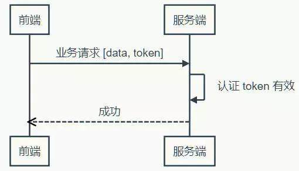

CSRF（Cross Site Request Forgery, 跨站域请求伪造）简而言之伪造用户对目标网站请求达到骗取网站信任而执行操作或者获得数据的一种攻击方式。

这利用了web中用户身份验证的一个漏洞：**简单的身份验证只能保证请求发自某个用户的浏览器，却不能保证请求本身是用户自愿发出的**。

CSRF 攻击可以在受害者毫不知情的情况下以受害者名义伪造请求发送给受攻击站点，从而在并未授权的情况下执行在权限保护之下的操作。比如说，受害者 Bob 在银行有一笔存款，通过对银行的网站发送请求 http://bank.example/withdraw?account=bob&amount=1000000&for=bob2 可以使 Bob 把 1000000 的存款转到 bob2 的账号下。通常情况下，该请求发送到网站后，服务器会先验证该请求是否来自一个合法的 session，并且该 session 的用户 Bob 已经成功登陆。黑客 Mallory 自己在该银行也有账户，他知道上文中的 URL 可以把钱进行转帐操作。Mallory 可以自己发送一个请求给银行：http://bank.example/withdraw?account=bob&amount=1000000&for=Mallory。但是这个请求来自 Mallory 而非 Bob，他不能通过安全认证，因此该请求不会起作用。这时，Mallory 想到使用 CSRF 的攻击方式，他先自己做一个网站，在网站中放入如下代码： src=”http://bank.example/withdraw?account=bob&amount=1000000&for=Mallory ”，并且通过广告等诱使 Bob 来访问他的网站。当 Bob 访问该网站时，上述 url 就会从 Bob 的浏览器发向银行，而这个请求会附带 Bob 浏览器中的 cookie 一起发向银行服务器。大多数情况下，该请求会失败，因为他要求 Bob 的认证信息。但是，如果 Bob 当时恰巧刚访问他的银行后不久，他的浏览器与银行网站之间的 session 尚未过期，浏览器的 cookie 之中含有 Bob 的认证信息。这时，悲剧发生了，这个 url 请求就会得到响应，钱将从 Bob 的账号转移到 Mallory 的账号，而 Bob 当时毫不知情。等以后 Bob 发现账户钱少了，即使他去银行查询日志，他也只能发现确实有一个来自于他本人的合法请求转移了资金，没有任何被攻击的痕迹。而 Mallory 则可以拿到钱后逍遥法外。

## CSRF 攻击的对象

在讨论如何抵御 CSRF 之前，先要明确 CSRF 攻击的对象，也就是要保护的对象。从以上的例子可知，CSRF 攻击是黑客借助受害者的 cookie 骗取服务器的信任，但是黑客并不能拿到 cookie，也看不到 cookie 的内容。另外，对于服务器返回的结果，由于浏览器同源策略的限制，黑客也无法进行解析。因此，黑客无法从返回的结果中得到任何东西，他所能做的就是给服务器发送请求，以执行请求中所描述的命令，在服务器端直接改变数据的值，而非窃取服务器中的数据。所以，我们要保护的对象是那些可以直接产生数据改变的服务，而对于读取数据的服务，则不需要进行 CSRF 的保护。比如银行系统中转账的请求会直接改变账户的金额，会遭到 CSRF 攻击，需要保护。而查询余额是对金额的读取操作，不会改变数据，CSRF 攻击无法解析服务器返回的结果，无需保护。

## 当前防御 CSRF 的几种策略

在业界目前防御 CSRF 攻击主要有三种策略：验证 HTTP Referer 字段；在请求地址中添加 token 并验证；在 HTTP 头中自定义属性并验证。下面就分别对这三种策略进行详细介绍。

### 添加 token 并验证

Token 是在服务端产生的。如果前端使用**用户名/密码**向服务端请求认证，**服务端认证成功**，那么在服务端会返回 **Token 给前端**。前端可以在**每次请求的时候带上 Token** 证明自己的合法地位

1. Token 完全由应用管理，所以它可以避开同源策略
2. Token 可以避免 CSRF 攻击(http://dwz.cn/7joLzx)
3. Token 可以是无状态的，可以在多个服务间共享

CSRF 攻击之所以能够成功，是因为黑客可以完全伪造用户的请求，该请求中所有的用户验证信息都是存在于 cookie 中，因此黑客可以在不知道这些验证信息的情况下直接利用用户自己的 cookie 来通过安全验证。要抵御 CSRF，关键在于在请求中放入**黑客所不能伪造**的信息，并且该信息不存在于 cookie 之中。可以在 HTTP 请求中以参数的形式加入一个**随机产生的 token**，并在**服务器端**建立一个**拦截器来验证这个 token**，如果请求中没有 token 或者 token 内容不正确，则认为可能是 CSRF 攻击而拒绝该请求。

这种方法要比检查 Referer 要安全一些，**token 可以在用户登陆后产生并放于 session 之中，然后在每次请求时把 token 从 session 中拿出，与请求中的 token 进行比对**，但这种方法的难点在于如何把 token 以参数的形式加入请求。对于 GET 请求，token 将附在请求地址之后，这样 URL 就变成 http://url?csrftoken=tokenvalue。 而对于 POST 请求来说，要在 form 的最后加上 <input type="hidden" name="csrftoken" value="tokenvalue"/>，这样就把 token 以参数的形式加入请求了。但是，在一个网站中，可以接受请求的地方非常多，要对于每一个请求都加上 token 是很麻烦的，并且很容易漏掉，通常使用的方法就是在每次页面加载时**，使用 javascript 遍历整个 dom 树，对于 dom 中所有的 a 和 form 标签后加入 token。**这样可以解决大部分的请求，但是对于在页面加载之后动态生成的 html 代码，这种方法就没有作用，还需要程序员在编码时手动添加 token。

该方法还有一个缺点是**难以保证 token 本身的安全**。特别是在一些论坛之类支持用户自己发表内容的网站，黑客可以在上面发布自己个人网站的地址。由于系统也会在这个地址后面加上 token，黑客可以在自己的网站上得到这个 token，并马上就可以发动 CSRF 攻击。为了避免这一点，系统可以在添加 token 的时候增加一个判断，如果这个链接是链到自己本站的，就在后面添加 token，如果是通向外网则不加。不过，即使这个 csrftoken 不以参数的形式附加在请求之中，黑客的网站也同样可以通过 Referer 来得到这个 token 值以发动 CSRF 攻击。这也是一些用户喜欢手动关闭浏览器 Referer 功能的原因。

#### **需要设置有效期吗？**

对于这个问题，我们不妨先看两个例子。一个例子是登录密码，一般要求定期改变密码，以防止泄漏，所以密码是有有效期的；另一个例子是安全证书。SSL 安全证书都有有效期，目的是为了解决吊销的问题，对于这个问题的详细情况，来看看知乎的回答(http://dwz.cn/7joMhq)。所以无论是从安全的角度考虑，还是从吊销的角度考虑，Token 都需要设有效期。

##### 那么有效期多长合适呢？

只能说，根据系统的安全需要，尽可能的短，但也不能短得离谱——想像一下手机的自动熄屏时间，如果设置为 10 秒钟无操作自动熄屏，再次点亮需要输入密码，会不会疯？如果你觉得不会，那就亲自试一试，设置成可以设置的最短时间，坚持一周就好（不排除有人适应这个时间，毕竟手机厂商也是有用户体验研究的）。

然后新问题产生了，如果用户在正常操作的过程中，Token 过期失效了，要求用户重新登录……用户体验岂不是很糟糕？

为了解决在操作过程不能让用户感到 Token 失效这个问题，有一种方案是在服务器端保存 Token 状态，用户每次操作都会自动刷新（推迟） Token 的过期时间——Session 就是采用这种策略来保持用户登录状态的。然而仍然存在这样一个问题，在前后端分离、单页 App 这些情况下，每秒种可能发起很多次请求，每次都去刷新过期时间会产生非常大的代价。如果 Token 的过期时间被持久化到数据库或文件，代价就更大了。所以通常为了提升效率，减少消耗，会把 Token 的过期时保存在缓存或者内存中。

还有另一种方案，使用 Refresh Token，它可以避免频繁的读写操作。这种方案中，服务端不需要刷新 Token 的过期时间，一旦 Token 过期，就反馈给前端，前端使用 Refresh Token 申请一个全新 Token 继续使用。这种方案中，服务端只需要在客户端请求更新 Token 的时候对 Refresh Token 的有效性进行一次检查，大大减少了更新有效期的操作，也就避免了频繁读写。当然 Refresh Token 也是有有效期的，但是这个有效期就可以长一点了，比如，以天为单位的时间。

#### **时序图表示**

 

使用 Token 和 Refresh Token 的时序图如下：

 

**1）登录**


**2）业务请求**

 

**3）Token 过期，刷新 Token**


上面的时序图中并未提到 Refresh Token 过期怎么办。不过很显然，Refresh Token 既然已经过期，就该要求用户重新登录了。

当然还可以把这个机制设计得更复杂一些，比如，Refresh Token 每次使用的时候，都更新它的过期时间，直到与它的创建时间相比，已经超过了非常长的一段时间（比如三个月），这等于是在相当长一段时间内允许 Refresh Token 自动续期。

到目前为止，Token 都是有状态的，即在服务端需要保存并记录相关属性。那说好的无状态呢，怎么实现？

##### **无状态 Token**

如果我们把所有状态信息都附加在 Token 上，服务器就可以不保存。但是服务端仍然需要认证 Token 有效。不过只要服务端能确认是自己签发的 Token，而且其信息未被改动过，那就可以认为 Token 有效——“签名”可以作此保证。平时常说的签名都存在一方签发，另一方验证的情况，所以要使用非对称加密算法。但是在这里，签发和验证都是同一方，所以对称加密算法就能达到要求，而对称算法比非对称算法要快得多（可达数十倍差距）。

更进一步思考，对称加密算法除了加密，还带有还原加密内容的功能，而这一功能在对 Token 签名时并无必要——既然不需要解密，摘要（散列）算法就会更快。可以指定密码的散列算法，自然是 HMAC。

上面说了这么多，还需要自己去实现吗？不用！JWT 已经定义了详细的规范，而且有各种语言的若干实现。

不过在使用无状态 Token 的时候在服务端会有一些变化，服务端虽然不保存有效的 Token 了，却需要保存未到期却已注销的 Token。如果一个 Token 未到期就被用户主动注销，那么服务器需要保存这个被注销的 Token，以便下次收到使用这个仍在有效期内的 Token 时判其无效。有没有感到一点沮丧？

在前端可控的情况下（比如前端和服务端在同一个项目组内），可以协商：前端一但注销成功，就丢掉本地保存（比如保存在内存、LocalStorage 等）的 Token 和 Refresh Token。基于这样的约定，服务器就可以假设收到的 Token 一定是没注销的（因为注销之后前端就不会再使用了）。

如果前端不可控的情况，仍然可以进行上面的假设，但是这种情况下，需要尽量缩短 Token 的有效期，而且必须在用户主动注销的情况下让 Refresh Token 无效。这个操作存在一定的安全漏洞，因为用户会认为已经注销了，实际上在较短的一段时间内并没有注销。如果应用设计中，这点漏洞并不会造成什么损失，那采用这种策略就是可行的。

在使用无状态 Token 的时候，有两点需要注意：

1. Refresh Token 有效时间较长，所以它应该在服务器端有状态，以增强安全性，确保用户注销时可控
2. 应该考虑使用二次认证来增强敏感操作的安全性

到此，关于 Token 的话题似乎差不多了——然而并没有，上面说的只是认证服务和业务服务集成在一起的情况，如果是分离的情况呢？

##### **分离认证服务**

当 Token 无状态之后，单点登录就变得容易了。前端拿到一个有效的 Token，它就可以在任何同一体系的服务上认证通过——只要它们使用同样的密钥和算法来认证 Token 的有效性。就样这样：


当然，如果 Token 过期了，前端仍然需要去认证服务更新 Token：


可见，虽然认证和业务分离了，实际即并没产生多大的差异。当然，这是建立在认证服务器信任业务服务器的前提下，因为认证服务器产生 Token 的密钥和业务服务器认证 Token 的密钥和算法相同。换句话说，业务服务器同样可以创建有效的 Token。

如果业务服务器不能被信任，该怎么办？

##### **不受信的业务服务器**

遇到不受信的业务服务器时，很容易想到的办法是使用不同的密钥。认证服务器使用密钥1签发，业务服务器使用密钥2验证——这是典型非对称加密签名的应用场景。认证服务器自己使用私钥对 Token 签名，公开公钥。信任这个认证服务器的业务服务器保存公钥，用于验证签名。幸好，JWT 不仅可以使用 HMAC 签名，也可以使用 RSA（一种非对称加密算法）签名。

不过，当业务服务器已经不受信任的时候，多个业务服务器之间使用相同的 Token 对用户来说是不安全的。因为任何一个服务器拿到 Token 都可以仿冒用户去另一个服务器处理业务……悲剧随时可能发生。

为了防止这种情况发生，就需要在认证服务器产生 Token 的时候，把使用该 Token 的业务服务器的信息记录在 Token 中，这样当另一个业务服务器拿到这个 Token 的时候，发现它并不是自己应该验证的 Token，就可以直接拒绝。

现在，认证服务器不信任业务服务器，业务服务器相互也不信任，但前端是信任这些服务器的——如果前端不信任，就不会拿 Token 去请求验证。那么为什么会信任？可能是因为这些是同一家公司或者同一个项目中提供的若干服务构成的服务体系。

但是，前端信任不代表用户信任。如果 Token 不没有携带用户隐私（比如姓名），那么用户不会关心信任问题。但如果 Token 含有用户隐私的时候，用户得关心信任问题了。这时候认证服务就不得不再啰嗦一些，当用户请求 Token 的时候，问上一句，你真的要授权给某某某业务服务吗？而这个“某某某”，用户怎么知道它是不是真的“某某某”呢？用户当然不知道，甚至认证服务也不知道，因为公钥已经公开了，任何一个业务都可以声明自己是“某某某”。

为了得到用户的信任，认证服务就不得不帮助用户来甄别业务服务。所以，认证服器决定不公开公钥，而是要求业务服务先申请注册并通过审核。只有通过审核的业务服务器才能得到认证服务为它创建的，仅供它使用的公钥。如果该业务服务泄漏公钥带来风险，由该业务服务自行承担。现在认证服务可以清楚的告诉用户，“某某某”服务是什么了。如果用户还是不够信任，认证服务甚至可以问，某某某业务服务需要请求  A、B、C 三项个人数据，其中 A 是必须的，不然它不工作，是否允许授权？如果你授权，我就把你授权的几项数据加密放在 Token 中……

废话了这么多，有没有似曾相识……对了，这类似开放式 API 的认证过程。开发式 API 多采用 OAuth 认证，而关于 OAuth 的探讨资源非常丰富，这里就不深究了。


### 验证 Referer 字段

根据 HTTP 协议，在 HTTP 头中有一个字段叫 Referer，它记录了该 HTTP 请求的来源地址。在通常情况下，访问一个安全受限页面的请求来自于同一个网站，比如需要访问 http://bank.example/withdraw?account=bob&amount=1000000&for=Mallory，用户必须先登陆 bank.example，然后通过点击页面上的按钮来触发转账事件。这时，该转帐请求的 Referer 值就会是转账按钮所在的页面的 URL，通常是以 bank.example 域名开头的地址。而如果黑客要对银行网站实施 CSRF 攻击，他只能在他自己的网站构造请求，当用户通过黑客的网站发送请求到银行时，该请求的 Referer 是指向黑客自己的网站。因此，要防御 CSRF 攻击，银行网站只需要对于每一个转账请求验证其 Referer 值，如果是以 bank.example 开头的域名，则说明该请求是来自银行网站自己的请求，是合法的。如果 Referer 是其他网站的话，则有可能是黑客的 CSRF 攻击，拒绝该请求。

这种法的显而易见的好处就是简单易行，网站的普通开发人员不需要操心 CSRF 的漏洞，只需要在最后给所有安全敏感的请求统一增加一个拦截器来检查 Referer 的值就可以。特别是对于当前现有的系统，不需要改变当前系统的任何已有代码和逻辑，没有风险，非常便捷。

然而，这种方法并非万无一失。Referer 的值是由浏览器提供的，虽然 HTTP 协议上有明确的要求，但是每个浏览器对于 Referer 的具体实现可能有差别，并不能保证浏览器自身没有安全漏洞。使用验证 Referer 值的方法，就是把安全性都依赖于第三方（即浏览器）来保障，从理论上来讲，这样并不安全。事实上，对于某些浏览器，比如 IE6 或 FF2，目前已经有一些方法可以篡改 Referer 值。如果 bank.example 网站支持 IE6 浏览器，黑客完全可以把用户浏览器的 Referer 值设为以 bank.example 域名开头的地址，这样就可以通过验证，从而进行 CSRF 攻击。

即便是使用最新的浏览器，黑客无法篡改 Referer 值，这种方法仍然有问题。因为 Referer 值会记录下用户的访问来源，有些用户认为这样会侵犯到他们自己的隐私权，特别是有些组织担心 Referer 值会把组织内网中的某些信息泄露到外网中。因此，用户自己可以设置浏览器使其在发送请求时不再提供 Referer。当他们正常访问银行网站时，网站会因为请求没有 Referer 值而认为是 CSRF 攻击，拒绝合法用户的访问。


### 在 HTTP 头中自定义属性并验证

这种方法也是使用 token 并进行验证，和上一种方法不同的是，这里并不是把 token 以参数的形式置于 HTTP 请求之中，而是把它放到 HTTP 头中自定义的属性里。通过 XMLHttpRequest 这个类，可以一次性给所有该类请求加上 csrftoken 这个 HTTP 头属性，并把 token 值放入其中。这样解决了上种方法在请求中加入 token 的不便，同时，通过 XMLHttpRequest 请求的地址不会被记录到浏览器的地址栏，也不用担心 token 会透过 Referer 泄露到其他网站中去。

然而这种方法的局限性非常大。XMLHttpRequest 请求通常用于 Ajax 方法中对于页面局部的异步刷新，并非所有的请求都适合用这个类来发起，而且通过该类请求得到的页面不能被浏览器所记录下，从而进行前进，后退，刷新，收藏等操作，给用户带来不便。另外，对于没有进行 CSRF 防护的遗留系统来说，要采用这种方法来进行防护，要把所有请求都改为 XMLHttpRequest 请求，这样几乎是要重写整个网站，这代价无疑是不能接受的。

## *Token实际运用和跨域

Token的前后端传递过程如下：

### 服务端端返回

用户输入账号和密码登录后，服务端会通过加密或者其他逻辑，生成一串标示用户身份的令牌字符串，它就是Token，并返回客户端。

前端获取到后，可以手动存到浏览器的cookie或者localStorage中。

### 前端携带

登录后，接下来前端在页面的http请求，有些需要让服务端知道你是谁，那么就需要在请求接口时，带上之前存的Token。

那么下面看看传递的方式有哪些：

#### 1.通过url参数传递

```
//网络请求函数：
function () {
    //...
    let token = Utils.getCookie(Const.TOKEN);
    url += `?_security_token=${token}`;
    return ajax(url, payload);
}
```


#### 2.通过Form Data参数传递

```
function (params) {
            params.opts = params.opts || {};
            // 可以做一些token之类的操作
            if (store.getters.getToken) {
                params.opts.token = store.getters.getToken || '';
            }
            //...
            return ajax(url, payload);
        };
```


#### 3.通过HTTP Request Headers 头部传入到服务器

```
//axios的处理
axios.interceptors.request.use(config => {
  const token = Cookie.get('_security_token') || Cookie.get('_security_token_inc') || '';
  config.headers.common["Security-Token"] = token;
  return config;
});
//或者自己的网络库
function() {
    //...
    return ajax(host + params.url, {
                data: params.opts,
                method: params.method,
                contentType,
                headers: {_security_token: '02_zMKe_99eah5s0G1'}
    });
}
```


#### 4.通过Cookie（这里就要涉及跨域问题啦）

##### （1）同域

如果客户端发送的http请求是同域的，那很easy，**浏览器**会**自动**帮我们把**同域**下的cookie添加到请求的**request header**中**Cookie字段**中，服务端就会从接收到的request header中提取cookie中的token


##### （2）跨域

- **CORS**

如果此时你想到的是用CORS解决跨域问题，该如何解决呢？

一般我们可能会简单粗暴地让服务端将Access-Control-Allow-Origin设为*，但此处没那么简单。

这里需要**三部曲**：

因为**CORS请求默认不发送Cookie和HTTP认证信息**，所以如果要把Cookie发到服务器，前后端需要一起配置：

**前端**需要在ajax请求中**将withCredentials设为true**，表示允许浏览器携带身份凭证，发送Cookie：

```
var xhr = new XMLHttpRequest();
xhr.withCredentials = true;
复制代码
```

同时**服务端**需要设置**同意发送Cookie**：

```
Access-Control-Allow-Credentials: true
复制代码
```

最后要注意的是，**服务端的Access-Control-Allow-Origin不能设为星号**，只能设为**请求的来源域**，否则前面的设置都无效。因为设置星号情况下，浏览器是不会发送cookie的。

CORS部分参考[阮一峰老师的跨域资源共享 CORS 详解](http://www.ruanyifeng.com/blog/2016/04/cors.html)

- **Nginx反向代理**

知道通过配置代理可以解决cookie跨域的问题，但是还没有亲自尝试过，自己只是在纯粹跨域的问题中用过代理解决。

比如用vue开发时，在config 文件夹下的 index.js 文件中配置proxyTable属性即可。

```
proxyTable: {
    '/':{
        target:'http://xxx.xxx.xxx',//目标接口域名
        changeOrigin: true //是否跨域
    }
}
复制代码
```

作用就是将本地域名的一个请求代理到了目标接口域名下，转发请求。

OAuth2.0协议原理与实现系列

- [（一） 协议原理](https://my.oschina.net/wangzhenchao/blog/851773)
- **（二） TOKEN生成算法**
- [（三） 协议实现](https://my.oschina.net/wangzhenchao/blog/862094)

------

  OAuth2.0协议定义了授权详细流程，并最终以token的形式作为用户授权的凭证下发给客户端，客户端后续可以带着token去请求资源服务器，获取token权限范围内的用户资源。

  对于token的描述，OAuth2.0协议只是一笔带过的说它是一个字符串，用于表示特定的权限、生命周期等，但是却没有明确阐述token的生成策略，以及如何去验证一个token。[RFC6749](https://tools.ietf.org/html/rfc6749)对于access token的描述：

> The client obtains an access token -- a string denoting a specific scope, lifetime, and other access attributes.

  协议不去详细阐述token的生成和验证过程，个人觉得是因为这一块各个业务都有自己的特点，无法完全做到抽象，并且在这一块去做详细的规定，其意义并不大。Token本质上就是对用户授权这一操作在时间和权限范围两个维度上的一个表征，协议可以对token的传递和基本验证做相应规定，但是具体的一个token包含哪些元素，采用什么样的生成算法还是需要由自己去把握。

  本文主要讲解自己对于token生成的一些思考，以及介绍两种类型的token：BEARER类型和MAC类型。

## OAuth2.0协议原理与实现：TOKEN生成算法

### **一. TOKEN的基本构成**

  Token表征了用户授权这一操作，授权服务器通过下发token来给客户端颁发获取用户受保护资源的资格，且不会因此而泄露用户的登录凭证信息。Token对于客户端应该是非透明的，客户端只知道这是一个字符串，能够用它来获取用户的受保护资源，对于字符串内部所含的信息应该无从知晓，也不能通过其它方法去解密其中的信息。所以token应该是一类对称加密得到的字符串，并且只有授权服务器持有对称密钥，用于对生成的token进行加密和验证。

对于构成token的元素，各个业务都有自己的需求，不过仍然存在一些基本通用的元素，比如：

> 1. clientId：客户端ID，当前token隶属的客户端
> 2. userId：用户的ID，表示当前token来自哪个用户授权
> 3. scope: 权限范围，该token允许换取的用户受保护资源范围
> 4. issueTime： 下发时间，用于控制token的生命周期
> 5. tokenType： token的类型，不同类型可能会采用不同的验证措施

以上是我个人根据经验总结的一些基础的token组成元素，具体业务还可以根据具体的需求添加一些其他的元素。

### **二. Bearer Type Access Token**

  BEARER类型的token是在[RFC6750](https://tools.ietf.org/html/rfc6750)中定义的一种token类型，OAuth2.0协议[RFC6749](https://tools.ietf.org/html/rfc6749)对其也有所提及，算是对[RFC6749](https://tools.ietf.org/html/rfc6749)的一个补充。BEARER类型token是建立在[HTTP/1.1](https://tools.ietf.org/html/rfc2616)版本之上的token类型，需要[TLS（Transport Layer Security）](https://tools.ietf.org/html/rfc5246)提供安全支持，该协议主要规定了BEARER类型token的客户端请求和服务端验证的具体细节。

#### **2.1 客户端请求**

  客户端在携带token请求用户的受保护资源时，需要保证token的安全性，以防止token被窃取或篡改，从而损害用户数据安全。BEARER类型token定义了三种token传递策略，客户端在传递token时必须使用其中的一种，且最多一种。

##### **2.1.1 放在Authorization请求首部**

> Authorization首部说明
>
> Authorization首部是由客户端发送，以向服务器回应自己的身份验证信息，客户端在收到服务器的401 Authentication Required响应之后，需要在请求中包含该首部。
>
> 基本用法：Authorization: <authentication-scheme> <authentication-param>

在传输时，`Authorization`首部的`authentication-scheme`需要设置为`Bearer`，请求示例：

```
GET /resource HTTP/1.1
Host: server.example.com
Authorization: Bearer mF_9.B5f-4.1JqM
```

##### **2.1.2 放在请求实体中**

  Token需放置在`access_token`参数后面，且`Content-Type`需要设置为`application/x-www-form-urlencoded`，请求示例如下：

```
POST /resource HTTP/1.1
Host: server.example.com
Content-Type: application/x-www-form-urlencoded
access_token=mF_9.B5f-4.1JqM
```

协议推荐使用第一种方式，对于该请求方式，必须在满足如下条件时才允许使用：

> 1. The HTTP request entity-header includes the "Content-Type" header field set to "application/x-www-form-urlencoded".
> 2. The entity-body follows the encoding requirements of the "application/x-www-form-urlencoded" content-type as defined by HTML 4.01.
> 3. The HTTP request entity-body is single-part.
> 4. The content to be encoded in the entity-body MUST consist entirely of ASCII characters.
> 5. The HTTP request method is one for which the request-body has defined semantics. In particular, this means that the "GET" method MUST NOT be used.

##### **2.1.3 放在URI请求参数中**

  该方式通过在请求URl后面添加`access_token`参数来传递token，请求示例如下：

```
GET /resource?access_token=mF_9.B5f-4.1JqM HTTP/1.1
Host: server.example.com
```

  客户端在请求时需要设置`Cache-Control: no-store`，服务端在成功响应时也需要设置`Cache-Control: private`。

  由于很多服务都会以日志方式去记录用户的请求，此类方式存在较大的安全隐患，所以一般不推荐使用，除非前两种方案均不可用。

#### **2.2 服务端验证**

  如果服务端拒绝客户端的访问请求，则需要在响应中添加`WWW-Authenticate`首部，响应示例如下：

```
HTTP/1.1 401 Unauthorized
WWW-Authenticate: Bearer realm="example"
```

> WWW-Authenticate首部说明
>
> WWW-Authenticate首部用于401 Unauthorized响应，用于向客户端发送一个质询认证方案。
>
> 基本用法：WWW-Authenticate：<auth-scheme> <challenge>

  这里的响应，其中`auth-scheme`必须设置为`Bearer`，如果客户端携带了无效的token，那么按照上一篇[《OAuth2.0协议原理与实现：协议原理》](http://www.zhenchao.org/2017/03/04/oauth-v2-principle/)讲解的，OAuth2.0协议要求错误响应中必须携带`error`字段，并选择性携带`error_description`和`error_uri`，具体释义请参考上一篇，响应示例如下：

```
HTTP/1.1 401 Unauthorized
WWW-Authenticate: Bearer realm="example",
                  error="invalid_token",
                  error_description="The access token expired"
```

### **三. MAC Type Access Token**

  前面介绍了BEARER类型的token，[RFC6750](https://tools.ietf.org/html/rfc6750)明确说明该类型token需要[TLS（Transport Layer Security）](https://tools.ietf.org/html/rfc5246)提供安全支持。虽然现今大部分站点都已经或正在由HTTP向HTTPS迁移，但是仍然会有站点继续在使用HTTP，在这类站点中BEARER类型的token存在安全隐患，这个时候MAC类型的token正是用武之地，MAC类型的token设计的主要目的就是为了应对不可靠的网络环境。

  MAC类型相对于BEARER类型对于用户资源请求的区别在于，BEARER类型只需要携带授权服务器下发的token即可，而对于MAC类型来说，除了携带授权服务器下发的token，客户端还要携带时间戳，nonce，以及在客户端计算得到的mac值等信息，并通过这些额外的信息来保证传输的可靠性。

#### **3.1 下发MAC类型令牌**

  OAuth2.0协议在规定下发accessToken时，包含`access_token`，`token_type`，`expires_in`、`refresh_token`，以及`scope`字段，其中部分字段可选，具体参见上一篇[《OAuth2.0协议原理与实现：协议原理》](http://www.zhenchao.org/2017/03/04/oauth-v2-principle/)，示例如下：

```
HTTP/1.1 200 OK
Content-Type: application/json;charset=UTF-8
Cache-Control: no-store
Pragma: no-cache

{
    "access_token":"2YotnFZFEjr1zCsicMWpAA",
    "token_type":"example",
    "expires_in":3600,
    "refresh_token":"tGzv3JOkF0XG5Qx2TlKWIA",
    "example_parameter":"example_value"
}
```

  响应字段是可扩展的，对于MAC类型token则增加了`mac_key`和`mac_algorithm`两个字段，`mac_key`是一个客户端和服务端共享的对称密钥，`mac_algorithm`则指明了加密算法（比如hmac-sha-1，hmac-sha-256），示例响应如下：

```
HTTP/1.1 200 OK
Content-Type: application/json
Cache-Control: no-store
Pragma: no-cache

{
    "access_token":"SlAV32hkKG",
    "token_type":"mac",
    "expires_in":3600,
    "refresh_token":"8xLOxBtZp8",
    "mac_key":"adijq39jdlaska9asud",
    "mac_algorithm":"hmac-sha-256"
}
```

#### **3.2 构造MAC类型请求**

  一些开放API接口可能会强制要求以MAC类型令牌来请求，这个时候就需要在客户端构造合法的请求，一个标准的请求示例如下：

```
GET /resource/1?b=1&a=2 HTTP/1.1
Host: example.com
Authorization: MAC id="h480djs93hd8",
                   ts="1336363200",
                   nonce="dj83hs9s",
                   mac="bhCQXTVyfj5cmA9uKkPFx1zeOXM="
```

请求参数说明：

| 参数名 | 必须 | 描述信息                                                     |
| ------ | ---- | ------------------------------------------------------------ |
| id     | 必须 | 访问令牌                                                     |
| ts     | 必须 | 时间戳                                                       |
| nonce  | 必须 | 客户端生成的字符串，对于相同token和timespan的请求nonce必须相同 |
| ext    | 可选 | 扩展信息                                                     |
| mac    | 必须 | 根据MAC key和MAC algorithm计算出来的值                       |

  通过添加`id、ts、nonce、mac`字段到`Authorization`请求首部以发起对用户资源的请求，这里的`id`就是授权服务器下发的accessToken；`ts`则是时间戳，由客户端生成，以秒为单位；`nonce`是客户端生成的一个字符串形式的签名，是对ts和id两个维度的唯一、可重复性标识；而`mac`则是整个客户端构造最核心和复杂的部分，可以看做是对本次请求参数的一个签名，1.2.3小节专门讲解。此外客户端还以用`ext`字段来携带一些扩展数据。

#### **3.3 mac值算法**

  mac值可以看作是对本次请求参数的一个签名，通过对请求数据进行本地加密计算得到，用于防止请求过程中参数被更改。服务器端收到请求之后，会以相同的算法和密钥重新计算一遍mac值，并与客户端传递过来的作比较，如果不一致则拒绝该请求。因为密钥仅保存在客户端和服务端本地，所以无需担心mac值被更改或伪造，从而确保在没有TLS保证的环境下可靠传输，实际上这里可以看做是MAC类型请求自己实现了一遍TLS。

mac值对于相同的请求参数必须是一致和可再计算的，对于参与计算元素的选择，协议选取了如下元素：

> 1. The timestamp value calculated for the request.
> 2. The nonce value generated for the request.
> 3. The HTTP request method in upper case. For example: HEAD, GET, POST, etc.
> 4. The HTTP request-URI as defined by RFC2616 section 5.1.2.
> 5. The hostname included in the HTTP request using the Host request header field in lower case.
> 6. The port as included in the HTTP request using the Host request header field. If the header field does not include a port, the default value for the scheme MUST be used (e.g. 80 for HTTP and 443 for HTTPS).
> 7. The value of the ext Authorization request header field attribute if one was included in the request, otherwise, an empty string.

  通过对这些元素按照顺序组织，并以换行符`\n`作分隔（最后一行也需要包含一个`\n`），利用`mac_algorithm`指定的算法和`mac_key`指定的密钥对组织好的数据进行加密计算得到mac值。

**计算示例：**

假设有一个请求：

```
POST /request?b5=%3D%253D&a3=a&c%40=&a2=r%20b&c2&a3=2+q HTTP/1.1
Host: example.com

Hello World!
```

其中ts=`264095:7d8f3e4a`，nonce=`7d8f3e4a`，ext=`a,b,c`。

对该请求按照之前的说明进行组织，以`\n`分隔得到：

```
264095\n
7d8f3e4a\n
POST\n
/request?b5=%3D%253D&a3=a&c%40=&a2=r%20b&c2&a3=2+q\n
example.com\n
80\n
a,b,c\n
```

其中`\n`仅仅是为了展示，实际中以ASCII码`%x0A`的意义表示，不要忘了最后一行的`\n`。假设授权服务器指定的`mac_algorithm`为hmac-sha-1，令`text`表示上面的字符串，那么最后的mac值得计算方式如下：

> mac = hmac-sha-1(mac_key, text)

#### **3.4 服务端验证**

服务器端在收到客户端的请求之后，需要做如下验证：

> 1. 重新计算mac值，并与客户端传递的值进行比较
> 2. 确保(timestam, nonce, token)三个维度之前没有被请求过，以防止重放攻击
> 3. 验证scope，以及token

如果服务端拒绝客户端的请求，则需要指定`WWW- Authenticate`响应首部，例如客户端携带了无效的授权信息，则服务器响应示例如下：

```
HTTP/1.1 401 Unauthorized
WWW-Authenticate: MAC error="The MAC credentials expired"
```

### **四. 本篇小结**

  本篇主要介绍了两种token类型，基本可以覆盖实际应用中的各种场景。Token是对用户授权操作的一类凭证，一旦下发到客户端，其安全性就需要客户端去保证，为了尽量在保护用户数据和提升用户体验上寻找一个平衡点，token的生命周期不应该设置的太短或太长，一般可以以月为单位，并推荐走授权码授权，请求下发刷新令牌，刷新令牌的生成和验证也可以参考本文的两种类型。

## Token存储位置

### 服务端

redis最常见

服务器上的token存储到数据库中，每次查询会不会很费时。如果不存储到数据库，应该存储到哪里呢。 

客户端得到的token肯定要加密存储的，发送token的时候再解密。存储到数据库还是配置文件好呢

token是个易失数据，丢了无非让用户重新登录一下，可以放到 MSSQL/MySQL 的内存表里（不过据说mysql的内存表性能提升有限），可以放到 Memcache里，可以放到redis里，放到 OpenResty 的变量字典里（只要你有信心不爆内存）。

你认为用数据库来保持token查询时间太长，会成为你系统的瓶颈或者隐患，可以放在内存当中。 

比如memcached、redis，KV方式很适合你对token查询的需求。 

这个不会太占内存，比如你的token是32位字符串，要是你的用户量在百万级或者千万级，那才多少内存。 

要是数据量真的大到单机内存扛不住，或者觉得一宕机全丢风险大，只要这个token生成是足够均匀的，高低位切一下分到不同机器上就行，内存绝对不会是问题。

### **传统身份验证（session）**

HTTP 是一种没有状态的协议，也就是它并不知道是谁是访问应用。这里我们把用户看成是客户端，客户端使用用户名还有密码通过了身份验证，不过下回这个客户端再发送请求时候，还得再验证一下。

 解决的方法就是，当用户请求登录的时候，如果没有问题，我们在服务端生成一条记录，这个记录里可以说明一下登录的用户是谁，然后把这条记录的 ID 号发送给客户端，客户端收到以后把这个 ID 号存储在 Cookie 里，

 下次这个用户再向服务端发送请求的时候，可以带着这个 Cookie ，这样服务端会验证一个这个 Cookie 里的信息，看看能不能在服务端这里找到对应的记录，如果可以，说明用户已经通过了身份验证，就把用户请求的数据返回给客户端。

 上面说的就是 Session，我们需要在服务端存储为登录的用户生成的 Session ，这些 Session 可能会存储在内存，磁盘，或者数据库里。我们可能需要在服务端定期的去清理过期的 Session

