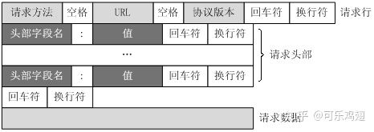
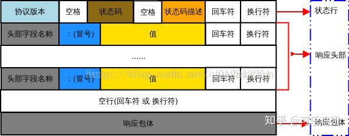
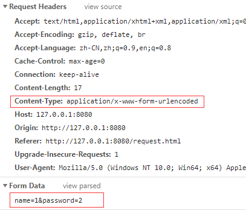
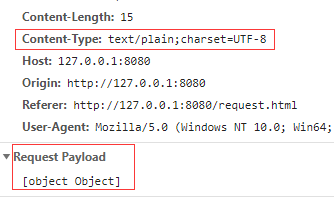
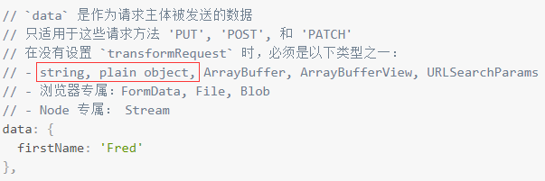
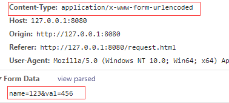
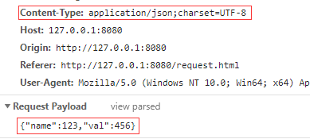

## HTTP 的特性

- HTTP 协议构建于 TCP/IP 协议之上，是一个应用层协议，默认端口号是 80
- HTTP 是**无连接无状态**的

HTTP 报文有 **请求报文** 和 **响应报文** 两种。
 **请求报文**：从客户向服务器发送请求报文。
 **响应报文**：从服务端到客户的回答。

由于 HTTP 是**面向文本的**，因此在报文中的每一个字段都是一些 ASCII 码串，因此各个字段的长度是不确定的。
 这也造成了 HTTP 报文结构的统一性，不然无法解析出数据。

HTTP的这两种报文都由三部分组成：**开始行**、**首部行**、**实体主体**。

## ** 请求报文有以下几部分组成：**

> 请求行（request line）
> 请求头部（header）
> 空行
> 请求数据

如下所示：




### Request header（请求头）又是由以下几个字段组成：

> 请求方法字段、URL字段、HTTP 协议版本(三者之间由空格分开)

GET：获取数据

POST：创建资源

PUT: 更新资源

方法字段会有GET POST HEAD PUT DELETE OPTIONS TRACE CONNECT 等几种方法，以下是GET方法的的请求报文：

```text
GET /search?hl=zh-CN&source=hp&q=domety&aq=f&oq= HTTP/1.1  
Accept: image/gif, image/x-xbitmap, image/jpeg, image/pjpeg, application/vnd.ms-excel, application/vnd.ms-powerpoint, 
application/msword, application/x-silverlight, application/x-shockwave-flash, */*  
Referer: <a href="http://www.google.cn/">http://www.google.cn/</a>  
Accept-Language: zh-cn  
Accept-Encoding: gzip, deflate  
User-Agent: Mozilla/4.0 (compatible; MSIE 6.0; Windows NT 5.1; SV1; .NET CLR 2.0.50727; TheWorld)  
Host: <a href="http://www.google.cn">www.google.cn</a>  
Connection: Keep-Alive  
Cookie: PREF=ID=80a06da87be9ae3c:U=f7167333e2c3b714:NW=1:TM=1261551909:LM=1261551917:S=ybYcq2wpfefs4V9g; 
NID=31=ojj8d-IygaEtSxLgaJmqSjVhCspkviJrB6omjamNrSm8lZhKy_yMfO2M4QMRKcH1g0iQv9u-2hfBW7bUFwVh7pGaRUb0RnHcJU37y-
FxlRugatx63JLv7CWMD6UB_O_r  
```

对于首部：格式为 首部名：(空格)首部值(回车换行)

- 空行：空行标识请求头部的结束
- 主体：**请求主体，在GET方法中这里一般会是空。**

### **1.Accept**

- **Accept: text/html**  浏览器可以接受服务器回发的类型为 text/html。
- **Accept: \*/\***   代表浏览器可以处理所有类型,(一般浏览器发给服务器都是发这个)。

### 2.Accept-Encoding

- **Accept-Encoding: gzip, deflate** 浏览器申明自己接收的编码方法，通常指定压缩方法，是否支持压缩，支持什么压缩方法（gzip，deflate），（注意：这不是只字符编码）。

### 3.Accept-Language

- **Accept-Language:zh-CN,zh;q=0.9**  浏览器申明自己接收的语言。

### 4.Connection

- **Connection: keep-alive**  当一个网页打开完成后，客户端和服务器之间用于传输HTTP数据的TCP连接不会关闭，如果客户端再次访问这个服务器上的网页，会继续使用这一条已经建立的连接。
-  **Connection: close** 代表一个Request完成后，客户端和服务器之间用于传输HTTP数据的TCP连接会关闭， 当客户端再次发送Request，需要重新建立TCP连接。

### 5.Host（发送请求时，该报头域是必需的）

- **Host:www.baidu.com** 请求报头域主要用于指定被请求资源的Internet主机和端口号，它通常从HTTP URL中提取出来的。

### 6.Referer

- **Referer:https://www.baidu.com/?tn=62095104_8_oem_dg** 当浏览器向web服务器发送请求的时候，一般会带上Referer，告诉服务器我是从哪个页面链接过来的，服务器籍此可以获得一些信息用于处理。

- 表示这个请求是从哪个URL过来的，假如你通过google搜索出一个商家的广告页面，你对这个广告页面感兴趣，鼠标一点发送一个请求报文到商家的网站，这个请求报文的Referer报文头属性值就是http://www.google.com。 

  

### 7.User-Agent

- **User-Agent:Mozilla/5.0 (Windows NT 6.1; Win64; x64) AppleWebKit/537.36 (KHTML, like Gecko) Chrome/70.0.3538.110 Safari/537.36** 告诉HTTP服务器， 客户端使用的操作系统和浏览器的名称和版本。

### 8.Cache-Control

- **Cache-Control:private** 默认为private  响应只能够作为私有的缓存，不能再用户间共享
- **Cache-Control:public** 响应会被缓存，并且在多用户间共享。正常情况, 如果要求HTTP认证,响应会自动设置为 private.
- **Cache-Control:must-revalidate**  响应在特定条件下会被重用，以满足接下来的请求，但是它必须到服务器端去验证它是不是仍然是最新的。
- **Cache-Control:no-cache**  响应不会被缓存,而是实时向服务器端请求资源。
- **Cache-Control:max-age=10** 设置缓存最大的有效时间，但是这个参数定义的是时间大小（比如：60）而不是确定的时间点。单位是[秒 seconds]。
- **Cache-Control:no-store** 在任何条件下，响应都不会被缓存，并且不会被写入到客户端的磁盘里，这也是基于安全考虑的某些敏感的响应才会使用这个。

### 9.Cookie

Cookie是用来存储一些用户信息以便让服务器辨别用户身份的（大多数需要登录的网站上面会比较常见），比如cookie会存储一些用户的用户名和密码，当用户登录后就会在客户端产生一个cookie来存储相关信息，这样浏览器通过读取cookie的信息去服务器上验证并通过后会判定你是合法用户，从而允许查看相应网页。当然cookie里面的数据不仅仅是上述范围，还有很多信息可以存储是cookie里面，比如sessionid等。

### 10.Range（用于断点续传）

- **Range:bytes=0-5** 指定第一个字节的位置和最后一个字节的位置。用于告诉服务器自己想取对象的哪部分。

### 11.Origin

只要是跨域或者`POST`请求都会带上`Origin`字段

### 13.Authorization

Authorization: Basic YWRtaW46YWRtaW4= //笔者注释，Authorization: "Basic 用户名和密码的[base64](http://www.seotest.cn/jishu/35764.html)加密字符串"   在线编解码[工具](http://www.seotest.cn/wenzhang/gongju/)

## 请求体常见格式

### application/x-www-form-urlencoded

这应该是最常见的 POST 提交数据的方式了。浏览器的原生 <form> 表单，如果不设置 `enctype` 属性，那么最终就会以 application/x-www-form-urlencoded 方式提交数据。请求类似于下面这样（无关的请求头在本文中都省略掉了）：

```bash
BASHPOST http://www.example.com HTTP/1.1
Content-Type: application/x-www-form-urlencoded;charset=utf-8

title=test&sub%5B%5D=1&sub%5B%5D=2&sub%5B%5D=3
```

首先，Content-Type 被指定为 application/x-www-form-urlencoded；其次，提交的数据按照 key1=val1&key2=val2 的方式进行编码，key 和 val 都进行了 URL 转码。大部分服务端语言都对这种方式有很好的支持。例如 PHP 中，$_POST['title'] 可以获取到 title 的值，$_POST['sub'] 可以得到 sub 数组。

很多时候，我们用 Ajax 提交数据时，也是使用这种方式。例如 [JQuery](http://jquery.com/) 和 [QWrap](http://www.qwrap.com/) 的 Ajax，Content-Type 默认值都是「application/x-www-form-urlencoded;charset=utf-8」。

### multipart/form-data

这又是一个常见的 POST 数据提交的方式。我们使用表单上传文件时，必须让 <form> 表单的 `enctype` 等于 multipart/form-data。直接来看一个请求示例：

```bash
BASHPOST http://www.example.com HTTP/1.1
Content-Type:multipart/form-data; boundary=----WebKitFormBoundaryrGKCBY7qhFd3TrwA

------WebKitFormBoundaryrGKCBY7qhFd3TrwA
Content-Disposition: form-data; name="text"

title
------WebKitFormBoundaryrGKCBY7qhFd3TrwA
Content-Disposition: form-data; name="file"; filename="chrome.png"
Content-Type: image/png

PNG ... content of chrome.png ...
------WebKitFormBoundaryrGKCBY7qhFd3TrwA--
```

这个例子稍微复杂点。首先生成了一个 boundary 用于分割不同的字段，为了避免与正文内容重复，boundary 很长很复杂。然后 Content-Type 里指明了数据是以 multipart/form-data 来编码，本次请求的 boundary 是什么内容。消息主体里按照字段个数又分为多个结构类似的部分，每部分都是以 `--boundary` 开始，紧接着是内容描述信息，然后是回车，最后是字段具体内容（文本或二进制）。如果传输的是文件，还要包含文件名和文件类型信息。消息主体最后以 `--boundary--` 标示结束。关于 multipart/form-data 的详细定义，请前往 [rfc1867](http://www.ietf.org/rfc/rfc1867.txt) 查看。

这种方式一般用来上传文件，各大服务端语言对它也有着良好的支持。

上面提到的这两种 POST 数据的方式，都是浏览器原生支持的，而且现阶段标准中原生 <form> 表单也[只支持这两种方式](http://www.w3.org/TR/html401/interact/forms.html#h-17.13.4)（通过 <form> 元素的 `enctype` 属性指定，默认为 `application/x-www-form-urlencoded`。其实 `enctype` 还支持 `text/plain`，不过用得非常少）。

随着越来越多的 Web 站点，尤其是 WebApp，全部使用 Ajax 进行数据交互之后，我们完全可以定义新的数据提交方式，给开发带来更多便利。

### application/json

application/json 这个 Content-Type 作为响应头大家肯定不陌生。实际上，现在越来越多的人把它作为请求头，用来告诉服务端消息主体是序列化后的 JSON 字符串。由于 JSON 规范的流行，除了低版本 IE 之外的各大浏览器都原生支持 JSON.stringify，服务端语言也都有处理 JSON 的函数，使用 JSON 不会遇上什么麻烦。

JSON 格式支持比键值对复杂得多的结构化数据，这一点也很有用。记得我几年前做一个项目时，需要提交的数据层次非常深，我就是把数据 JSON 序列化之后来提交的。不过当时我是把 JSON 字符串作为 val，仍然放在键值对里，以 x-www-form-urlencoded 方式提交。

Google 的 [AngularJS](http://angularjs.org/) 中的 Ajax 功能，默认就是提交 JSON 字符串。例如下面这段代码：

```js
JSvar data = {'title':'test', 'sub' : [1,2,3]};
$http.post(url, data).success(function(result) {
    ...
});
```

最终发送的请求是：

```bash
BASHPOST http://www.example.com HTTP/1.1 
Content-Type: application/json;charset=utf-8

{"title":"test","sub":[1,2,3]}
```

这种方案，可以方便的提交复杂的结构化数据，特别适合 RESTful 的接口。各大抓包工具如 Chrome 自带的开发者工具、Firebug、Fiddler，都会以树形结构展示 JSON 数据，非常友好。但也有些服务端语言还没有支持这种方式，例如 php 就无法通过 $_POST 对象从上面的请求中获得内容。这时候，需要自己动手处理下：在请求头中 Content-Type 为 application/json 时，从 `php://input` 里获得原始输入流，再 `json_decode` 成对象。一些 php 框架已经开始这么做了。

当然 AngularJS 也可以配置为使用 x-www-form-urlencoded 方式提交数据。如有需要，可以参考[这篇文章](http://victorblog.com/2012/12/20/make-angularjs-http-service-behave-like-jquery-ajax/)。

### text/xml

我的博客之前[提到过 XML-RPC](http://www.imququ.com/post/64.html)（XML Remote Procedure Call）。它是一种使用 HTTP 作为传输协议，XML 作为编码方式的远程调用规范。典型的 XML-RPC 请求是这样的：

```xml
HTMLPOST http://www.example.com HTTP/1.1 
Content-Type: text/xml

<?xml version="1.0"?>
<methodCall>
    <methodName>examples.getStateName</methodName>
    <params>
        <param>
            <value><i4>41</i4></value>
        </param>
    </params>
</methodCall>
```

XML-RPC 协议简单、功能够用，各种语言的实现都有。它的使用也很广泛，如 WordPress 的 [XML-RPC Api](http://codex.wordpress.org/XML-RPC_WordPress_API)，搜索引擎的 [ping 服务](http://help.baidu.com/question?prod_en=master&class=476&id=1000423)等等。JavaScript 中，也有[现成的库](http://plugins.jquery.com/xmlrpc/)支持以这种方式进行数据交互，能很好的支持已有的 XML-RPC 服务。不过，我个人觉得 XML 结构还是过于臃肿，一般场景用 JSON 会更灵活方便。


## **响应报文有以下几部分组成：**

> 状态行
> 空行
> 请求数据



状态行：协议版本(空格)状态码(空格)短语
状态码：是由三位数字组成，第一位：响应的类型，常使用的有5大类型：

> 1xx: 服务器接收客户端请求，客户端可以继续发送请求
> 2xx: 服务器接收客户端请求并进行处理
> 3xx: 服务器要求客户端重定向：要求用户进一步细化请求
> 4xx: 客户端请求非法：客户错误
> 5xx: 服务器未能正常处理客户端的请求而出现意外：服务器发生错误

2xx: 服务器接收请求，并进行处理

```text
200：ok 客户端的请求成功收到、解析、接收
201：created 请求已经完成，并且一个新的返回资源被创建,被创建的资源可能是一个URI资源，通常URI资源在Location头指定。
202：Accepted 请求被接收用来处理，但是处理并没有完成，请求可能或者根本没有遵照执行
204：No Content 服务器已经接受请求并且没必要返回实体数据，可能需要返回更新信息
```

3xx：Redirection

```text
300 Multiple Choices 请求资源符合任何一个呈现方式。
01 Moved Permanently 请求的资源已经被赋予一个新的URI。

302 Found 通过不同的URI请求资源的临时文件。
303 See Other
```

4xx Client Error请求客户端错误

```text
400 Bad Request：表示客户端请求有语法错误，不能被服务器所理解;
401 Unauthonzed：表示请求未经授权，该状态代码必须与 WWW-Authenticate 报头域一  起使用;
403 Forbidden：表示服务器收到请求，但是拒绝提供服务，通常会在响应正文中给出不提供服务的原因;
404 Not Found：请求的资源不存在，例如，输入了错误的URL;
```

5xx 服务器错误

```text
500 Internal Server Error：表示服务器发生不可预期的错误，导致无法完成客户端的请求;
503 Service Unavailable：表示服务器当前不能够处理客户端的请求，在一段时间之后，服务器可能会恢复正常;
502 Bad Gateway
501 Not Implemented 服务器没有相应的执行动作来完成当前请求。
503 Service Unavailable 因为临时文件超载导致服务器不能处理当前请求。
```

如下为一个响应的报文例子

```text
HTTP/1.1 200 OK                             //http协议版本  客户端响应成功
Date: Sat, 31 Dec 2005 23:59:59 GMT
Content-Type: text/html;charset=ISO-8859-1  //返回文档类型
Content-Length: 122                         //返回文档长度

＜html＞                                    //服务器返回给客户端的文本信息
＜head＞
＜title＞Wrox Homepage＜/title＞
＜/head＞
＜body＞
＜!-- body goes here --＞
＜/body＞
＜/html＞
```

有时候响应头中还会有：

> Location： 用于重定向接受者到一个新的位置,例如：客户端所请求的页面已不存在原先的位置，为了让客户端重定向到这个页面新的位置
> Connection: close(连接已经关闭); keepalive(连接保持着，在等待本次连接的后续请求); Keep-Alive：如果浏览器请求保持连接，则该头部表明希望WEB 服务器保持连接多长时间(秒);例如：Keep-Alive：300;

## 常用的http响应头

### 1.Cache-Control（对应请求中的Cache-Control）

- **Cache-Control:private** 默认为private  响应只能够作为私有的缓存，不能再用户间共享
- **Cache-Control:public** 浏览器和缓存服务器都可以缓存页面信息。
- **Cache-Control:must-revalidate**  对于客户机的每次请求，代理服务器必须想服务器验证缓存是否过时。
- **Cache-Control:no-cache**  浏览器和缓存服务器都不应该缓存页面信息。
- **Cache-Control:max-age=10**  是通知浏览器10秒之内不要烦我，自己从缓冲区中刷新。
- **Cache-Control:no-store** 请求和响应的信息都不应该被存储在对方的磁盘系统中。

### 2.Content-Type

- **Content-Type：text/html;charset=UTF-8** 告诉客户端，资源文件的类型，还有字符编码，客户端通过utf-8对资源进行解码，然后对资源进行html解析。通常我们会看到有些网站是乱码的，往往就是服务器端没有返回正确的编码。

### 3.Content-Encoding


- **Content-Encoding:gzip** 告诉客户端，服务端发送的资源是采用gzip编码的，客户端看到这个信息后，应该采用gzip对资源进行解码。


### 4.Date

- **Date: Tue, 03 Apr 2018 03:52:28 GMT** 这个是服务端发送资源时的服务器时间，GMT是格林尼治所在地的标准时间。http协议中发送的时间都是GMT的，这主要是解决在互联网上，不同时区在相互请求资源的时候，时间混乱问题。

### 5.Server


- **Server：Tengine/1.4.6**  这个是服务器和相对应的版本，只是告诉客户端服务器信息**。**


### 6.Transfer-Encoding


- **Transfer-Encoding：chunked** 这个响应头告诉客户端，服务器发送的资源的方式是分块发送的。一般分块发送的资源都是服务器动态生成的，在发送时还不知道发送资源的大小，所以采用分块发送，每一块都是独立的，独立的块都能标示自己的长度，最后一块是0长度的，当客户端读到这个0长度的块时，就可以确定资源已经传输完了。


### 

### 7.Expires


- **Expires:Sun, 1 Jan 2000 01:00:00 GMT** 这个响应头也是跟缓存有关的，告诉客户端在这个时间前，可以直接访问缓存副本，很显然这个值会存在问题，因为客户端和服务器的时间不一定会都是相同的，如果时间不同就会导致问题。所以这个响应头是没有Cache-Control：max-age=*这个响应头准确的，因为max-age=date中的date是个相对时间，不仅更好理解，也更准确。

### 8.Last-Modified


- **Last-Modified: Dec, 26 Dec 2015 17:30:00 GMT** 所请求的对象的最后修改日期(按照 RFC 7231 中定义的“超文本传输协议日期”格式来表示)


### 9.Connection

- **Connection：keep-alive** 这个字段作为回应客户端的Connection：keep-alive，告诉客户端服务器的tcp连接也是一个长连接，客户端可以继续使用这个tcp连接发送http请求。

### **10.Etag**


- **ETag: "737060cd8c284d8af7ad3082f209582d"** 就是一个对象（比如URL）的标志值，就一个对象而言，比如一个html文件，如果被修改了，其Etag也会别修改，所以，ETag的作用跟Last-Modified的作用差不多，主要供WEB服务器判断一个对象是否改变了。比如前一次请求某个html文件时，获得了其 ETag，当这次又请求这个文件时，浏览器就会把先前获得ETag值发送给WEB服务器，然后WEB服务器会把这个ETag跟该文件的当前ETag进行对比，然后就知道这个文件有没有改变了。

### 11.Refresh


- **Refresh: 5; url=http://baidu.com**  用于重定向，或者当一个新的资源被创建时。默认会在5秒后刷新重定向。


### 12.Access-Control-Allow-Origin 

- **Access-Control-Allow-Origin: \***   *号代表所有网站可以跨域资源共享，如果当前字段为*那么Access-Control-Allow-Credentials就不能为true
- **Access-Control-Allow-Origin: www.baidu.com** 指定哪些网站可以跨域资源共享

### 13.Access-Control-Allow-Methods

- **Access-Control-Allow-Methods：GET,POST,PUT,DELETE**  允许哪些方法来访问

### 14.Access-Control-Allow-Credentials


- **Access-Control-Allow-Credentials: true**  是否允许发送cookie。默认情况下，Cookie不包括在CORS请求之中。设为true，即表示服务器明确许可，Cookie可以包含在请求中，一起发给服务器。这个值也只能设为true，如果服务器不要浏览器发送Cookie，删除该字段即可。如果access-control-allow-origin为*，当前字段就不能为true


### **15.Content-Range**

- **Content-Range: bytes 0-5/7877** 指定整个实体中的一部分的插入位置，他也指示了整个实体的长度。在服务器向客户返回一个部分响应，它必须描述响应覆盖的范围和整个实体长度。


## 前后端联调之Form Data与Request Payload，你真的了解吗？

`Request Payload`更准确的说是`http request的payload body`。一般用在数据通过`POST`请求或者`PUT`请求。它是`HTTP`请求中*空行*的后面那部分。（PS:这里涉及一个http常被问到的问题，http请求由哪几部分组成，一般是请求行，请求头，空行，请求体。payload body应该是对应请求体。）

一个请求伴随着header设置为`Content-Type: application/json`时候，看起来可能像这样：

```
POST /some-path HTTP/1.1
Content-Type: application/json

{ "foo" : "bar", "name" : "John" }
```

如果你正常请求一个ajax。浏览器会简单的将你提交的内容作为`payload`展示出来，这就是它所能做的，因为它不知道数据来自哪里。

如果你提交了一个html表单并且配置上了`method="post"`，并且设置了`Content-Type: application/x-www-form-urlencoded`或者`Content-Type: multipart/form-data`。那么你的请求可能长这个样：

```
POST /some-path HTTP/1.1
Content-Type: application/x-www-form-urlencoded

foo=bar&name=John
```

这里的`form-data`就是`request payload`。在这里，浏览器知道更多：它知道bar是提交表单的输入字段foo的值。这就是它向你展示的。

所以区别就是，他们只是因为`Content-Type`设置的不同，并不是数据提交方式的不同，这两种提交都会将数据放在`message-body`中。但是chrome浏览器的开发者工具会根据这个ContentType区分显示方式。

#### 细节

好了，到这里我们知道了，其实都是放到了payload中。那么具体有什么区别呢？为什么有时候后端拿不到值呢？这就不得不说对payload的解析方式了。我们以几个chrome下的测试案例，来理一理这个逻辑。

#### 传统的Form表单提交

```
<form action="/" method="POST">
    <input name="name" type="text">
    <input name="password" type="text">
    <button>提交</button>
</form>
```

如果我这里点击提交按钮，就会触发浏览器的提交功能，那结果是什么样呢？



注意点

可以看到`Content-Type`为`application/x-www-form-urlencoded`。
值得形式是以`key1=value1&key2=value2`的形式提交的。

#### 传统的ajax提交

```
function submit2() {
    var xhr = new XMLHttpRequest();
    xhr.timeout = 3000;
    var obj = {a: 1, b: 2};
    xhr.open('POST', '/');
    xhr.send(obj);
}
```

首先我们构造一个简单的函数，然后触发它。通过chrome反馈来看：



注意点

1.默认的`Content-Type`为`text/plain`。
2.Request Payload会对非字符串做字符串转换。
3.通过`xhr.send(JSON.stringify(obj));`可修正要发的内容

#### axios方式提交

由于axios已经是vue、react的准标配请求方式了，所以这里探究一下它。
首先我门看axios的文档，当post提交时候可以传递什么类型参数：



注意这个类型，我们分别构造两个场景。对应它。

```
function submit3() {
    var sence1 = 'name=123&val=456';
    var sence2 = {name: 123, val: 456};
    axios.post('/', sence1)
}
```

分别传递字符串与对象，提交post请求，然后观察结果:

场景1——传递字符串时候的结果：


场景2——传递对象的结果：


注意点

1.当我们传递字符串的时候，`Content-Type`自动转为`xxx-form-xxx`的形式。当为对象的时候，自动转化为`xxx/json`。
2.字符串的时候以`key1=val1&key2=val2`的形式体现，对象以**JSON字符串**形式体现。

#### 总结

探索了这么多种情况之后，那么我们回顾一下：

##### Content-Type的差异

1.传统的ajax请求时候，`Content-Type`默认为"文本"类型。
2.传统的form提交的时候，`Content-Type`默认为"Form"类型。
3.axios传递字符串的时候，`Content-Type`默认为"Form"类型。
4.axios传递对象的时候，`Content-Type`默认为"JSON"类型

##### Content-Type的值，Form与非Form时，payload的区别。

1.都只支持字符串类型(以上探究的几种情况)
2.Form需要传递的格式为`key1=value1&key2=value2`,类似`GET`请求的`QueryString`格式
3.非Form一般为`JSON.stringify(formDataObject)`形式

##### 后端取不到值？

无论何种形式传递，后端解析表单信息的时候，会考虑`Content-Type`。如果是JSON字符串的话，后端解析payload的内容时候，肯定要去解析JSON啦。如果是`key1=value1&key2=value2`的形式，则需要去分割字符串。

当然这些事情一般后端使用的框架会去处理，但是框架给后端提供取值接口有可能是不同的，所以前端的小伙伴在处理请求问题时，一定要跟后端小伙伴商量好，是用`JSON`还是`FormData`哈。