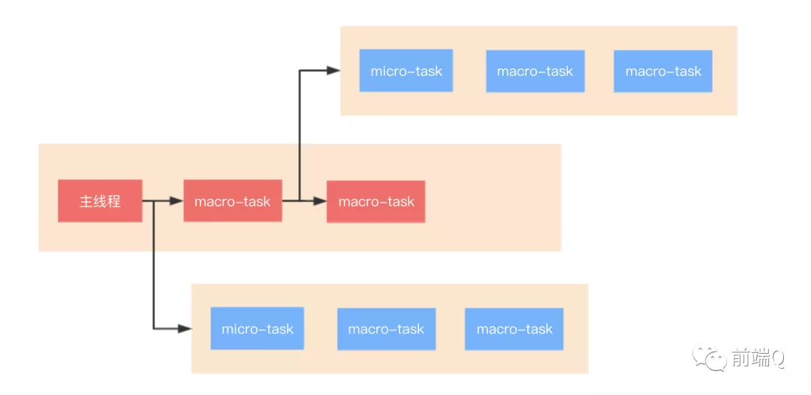
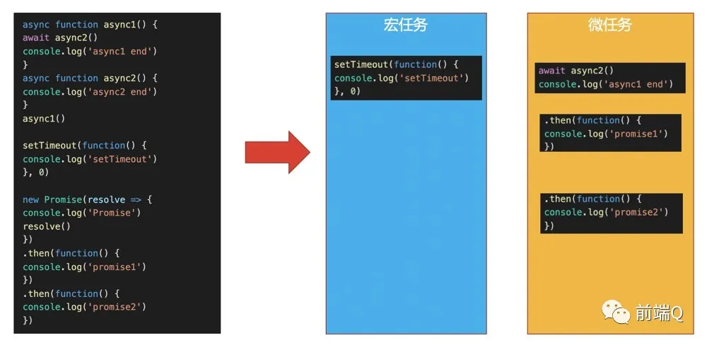
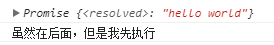

**答题大纲**

1. 先说基本知识点，宏任务、微任务有哪些
2. 说事件循环机制过程，边说边画图出来
3. 说async/await执行顺序注意，可以把 chrome 的优化，做法其实是违反了规范的，V8 团队的PR这些自信点说出来，显得你很好学，理解得很详细，很透彻。
4. 把node的事件循环也说一下，重复1、2、3点，node中的第3点要说的是node11前后的事件循环变动点。

- 

### 二、同步任务和异步任务

- 同步和异步任务在不同的执行"场所"，同步的进入主线程，异步的进入Event Table**执行**并注册函数。
- **当指定的异步事情完成时，Event Table会将这个函数移入Event Queue**。
- 主线程内的任务执行完毕为空，会去Event Queue读取对应的函数，推入主线程执行。
- js引擎的monitoring process进程会持续不断的检查主线程执行栈是否为空，一旦为空，就会去Event Queue那里检查是否有等待被调用的函数。上述过程会不断重复，也就是常说的Event Loop(事件循环)。

javascript是单线程。单线程就意味着，所有任务需要排队，前一个任务结束，才会执行后一个任务。如果前一个任务耗时很长，后一个任务就不得不一直等着。
 于是js所有任务分为两种：同步任务，异步任务
 **同步任务**是调用立即得到结果的任务，同步任务在主线程上排队执行的任务，只有前一个任务执行完毕，才能执行后一个任务；

**异步任务**是调用无法立即得到结果，需要额外的操作才能预期结果的任务，异步任务不进入主线程、而进入"任务队列"（task queue）的任务，只有"任务队列"通知主线程，某个异步任务可以执行了，该任务才会进入主线程执行。

 JS引擎遇到异步任务（DOM事件监听、网络请求、setTimeout计时器等），会交给相应的线程单独去维护异步任务，等待某个时机（计时器结束、网络请求成功、用户点击DOM），然后由 事件触发线程 将异步对应的 回调函数 加入到消息队列中，消息队列中的回调函数等待被执行。

```
let data = [];
$.ajax({
    url:www.javascript.com,
    data:data,
    success:() => {
        console.log('发送成功!');
    }
})
console.log('代码执行结束');
```

- ajax（异步任务）进入Event Table，注册回调函数success。
- 执行console.log('代码执行结束')。（同步任务在主线程执行）
- ajax事件完成，回调函数success进入Event Queue。
- 主线程从Event Queue读取回调函数success并执行。

**具体来说，异步运行机制如下：**

- （1）所有同步任务都在主线程上执行，形成一个[执行栈]
- （2）主线程之外，还存在一个"任务队列"（task queue）。只要异步任务有了运行结果，就在"任务队列"之中放置一个事件。
- （3）一旦"执行栈"中的所有同步任务执行完毕，系统就会读取"任务队列"，看看里面有哪些事件。那些对应的异步任务，于是结束等待状态，进入执行栈，开始执行。
- （4）主线程不断重复上面的第三步。

主线程从"任务队列"中读取事件，这个过程是循环不断的，所以整个的这种运行机制又称为Event Loop（事件循环）


**举个例子**


```jsx
console.log('script start')

setTimeout(() => {
  console.log('timer 1 over')
}, 1000)

setTimeout(() => {
  console.log('timer 2 over')
}, 0)

console.log('script end')

// script start
// script end
// timer 2 over
// timer 1 over
```

`timer 2 over`0毫秒后添加到任务队列队尾，`timer 1 over`1秒添加到任务队列队尾，**等待主线程任务执行完**，**从队头依次执行任务队列中的任务**


### 浏览器中的事件循环

Event Loop即事件循环，是解决javaScript单线程运行阻塞的一种机制。

JavaScript代码的执行过程中，除了依靠函数调用栈来搞定函数的执行顺序外，还依靠任务队列(task queue)来搞定另外一些代码的执行。整个执行过程，我们称为事件循环过程。一个线程中，事件循环是唯一的，但是任务队列可以拥有多个。任务队列又分为macro-task（宏任务）与micro-task（微任务），在最新标准中，它们被分别称为task与jobs。

**除了广义的同步任务和异步任务，我们对任务有更精细的定义：**

macro-task大概包括：

- script(整体代码)
- setTimeout
- setInterval
- setImmediate
- I/O
- UI render

micro-task大概包括:

- process.nextTick
- **Promise**
- **Async/Await(实际就是promise)**
- MutationObserver(html5新特性)

整体执行，我画了一个流程图：

GitHub

总的结论就是，**执行宏任务，然后执行该宏任务产生的微任务，若微任务在执行过程中产生了新的微任务，则继续执行微任务，微任务执行完毕后，再回到宏任务中进行下一轮循环**。举个例子：

结合流程图理解，答案输出为：async2 end => Promise => async1 end => promise1 => promise2 => setTimeout 但是，对于async/await ，我们有个细节还要处理一下。如下：

## async 和 await 在干什么

任意一个名称都是有意义的，先从字面意思来理解。async 是“异步”的简写，而 await 可以认为是 async wait 的简写。所以应该很好理解 async 用于申明一个 function 是异步的，而 await 用于等待一个异步方法执行完成。

另外还有一个很有意思的语法规定，await 只能出现在 async 函数中。然后细心的朋友会产生一个疑问，如果 await 只能出现在 async 函数中，那这个 async 函数应该怎么调用？

如果需要通过 await 来调用一个 async 函数，那这个调用的外面必须得再包一个 async 函数，然后……进入死循环，永无出头之日……

如果 async 函数不需要 await 来调用，那 async 到底起个啥作用？

### async 起什么作用

### 作个简单的比较

　　async 函数 timeout  调用了，但是没有任何输出，它不是应该返回 'hello world',  先不要着急， 看一看timeout()执行返回了什么？ 把上面的 timeout() 语句改为console.log(timeout())

```javascript
async function timeout() {
    return 'hello world'
}
console.log(timeout());
console.log('虽然在后面，但是我先执行');
```

　　继续看控制台

```
Promise { 'hello world' }
```



　　原来async 函数返回的是一个promise 对象，如果要获取到promise 返回值，我们应该用then 方法， 继续修改代码

```javascript
async function timeout() {
    return 'hello world'
}
timeout().then(result => {
    console.log(result);
})
console.log('虽然在后面，但是我先执行');
```

　　看控制台

### 作个简单的比较

　　async 函数 timeout  调用了，但是没有任何输出，它不是应该返回 'hello world',  先不要着急， 看一看timeout()执行返回了什么？ 把上面的 timeout() 语句改为console.log(timeout())

```javascript
async function timeout() {
    return 'hello world'
}
console.log(timeout());
console.log('虽然在后面，但是我先执行');
```

　　继续看控制台


　　原来async 函数返回的是一个promise 对象，如果要获取到promise 返回值，我们应该用then 方法， 继续修改代码

```javascript
async function timeout() {
    return 'hello world'
}
timeout().then(result => {
    console.log(result);
})
console.log('虽然在后面，但是我先执行');
```

　　看控制台

```
虽然在后面，但是我先执行
hello world
```

　　我们获取到了"hello world',  同时timeout 的执行也没有阻塞后面代码的执行，和 我们刚才说的一致。

　　这时，你可能注意到控制台中的Promise 有一个resolved，这是async 函数内部的实现原理。如果async 函数中有返回一个值 ,当调用该函数时，内部会调用Promise.solve() 方法把它转化成一个promise 对象作为返回，但如果timeout 函数内部抛出错误呢？ 那么就会调用Promise.reject() 返回一个promise 对象， 这时修改一下timeout 函数


这个问题的关键在于，async 函数是怎么处理它的返回值的！

我们当然希望它能直接通过 `return` 语句返回我们想要的值，但是如果真是这样，似乎就没 await 什么事了。所以，写段代码来试试，看它到底会返回什么：

```javascript
async function testAsync() {
    return "hello async";
}

const result = testAsync();
console.log(result);
```

看到输出就恍然大悟了——输出的是一个 Promise 对象。

```
c:\var\test> node --harmony_async_await .
Promise { 'hello async' }
```

所以，async 函数返回的是一个 Promise 对象。从[文档](https://developer.mozilla.org/docs/Web/JavaScript/Reference/Statements/async_function)中也可以得到这个信息。async 函数（包含函数语句、函数表达式、Lambda表达式）会返回一个 Promise 对象，如果在函数中 `return` 一个直接量，async 会把这个直接量通过 `Promise.resolve()` 封装成 Promise 对象。

async 函数返回的是一个 Promise 对象，所以在最外层不能用 await 获取其返回值的情况下，我们当然应该用原来的方式：`then()` 链来处理这个 Promise 对象，就像这样

```javascript
testAsync().then(v => {
    console.log(v);    // 输出 hello async
});
```

现在回过头来想下，如果 async 函数没有返回值，又该如何？很容易想到，它会返回 `Promise.resolve(undefined)`。

联想一下 Promise 的特点——无等待**，所以在没有 `await` 的情况下执行 async 函数，它会立即执行**，返回一个 Promise 对象，并且，**绝不会阻塞后面的语句。**这和普通返回 Promise 对象的函数并无二致。

那么下一个关键点就在于 await 关键字了。

### await 到底在等啥

一般来说**，都认为 await 是在等待一个 async 函数完**成。不过按[语法说明](https://developer.mozilla.org/docs/Web/JavaScript/Reference/Operators/await)，await 等待的是一个表达式，这个表达式的计算结果是 Promise 对象或者其它值（换句话说，就是没有特殊限定）。

因为 async 函数返回一个 Promise 对象，所以 await 可以用于等待一个 async 函数的返回值——这也可以说是 await 在等 async 函数，但要清楚，它等的实际是一个返回值。注意到 await 不仅仅用于等 Promise 对象，它可以等任意表达式的结果，所以，await 后面实际是可以接普通函数调用或者直接量的。所以下面这个示例完全可以正确运行

```javascript
function getSomething() {
    return "something";
}

async function testAsync() {
    return Promise.resolve("hello async");
}

async function test() {
    const v1 = await getSomething();
    const v2 = await testAsync();
    console.log(v1, v2);
}

test();
```

### await 等到了要等的，然后呢

await 等到了它要等的东西，一个 Promise 对象，或者其它值，然后呢？我不得不先说，`await` 是个运算符，用于组成表达式，await 表达式的运算结果取决于它等的东西。

**如果它等到的不是一个 Promise 对象，那 await 表达式的运算结果就是它等到的东西。**

如果它**等到的是一个 Promise 对象，await 就忙起来了**，它会**阻塞后面的代码，等着 Promise 对象 resolve**，然后得到 resolve 的值，作为 await 表达式的运算结果。

> 看到上面的阻塞一词，心慌了吧……放心，**这就是 await 必须用在 async 函数中的原因。async 函数调用不会造成阻塞，它内部所有的阻塞都被封装在一个 Promise 对象中异步执行**。

## async/await 帮我们干了啥


上面已经说明了 async 会将其后的函数（函数表达式或 Lambda）的返回值封装成一个 Promise 对象，而 await 会等待这个 Promise 完成，并将其 resolve 的结果返回出来。

现在举例，用 `setTimeout` 模拟耗时的异步操作，先来看看不用 async/await 会怎么写

```
function takeLongTime() {
    return new Promise(resolve => {
        setTimeout(() => resolve("long_time_value"), 1000);
    });
}

takeLongTime().then(v => {
    console.log("got", v);
});
```

如果改用 async/await 呢，会是这样

```
function takeLongTime() {
    return new Promise(resolve => {
        setTimeout(() => resolve("long_time_value"), 1000);
    });
}

async function test() {
    const v = await takeLongTime();
    console.log(v);
}

test();
```

**眼尖的同学已经发现 `takeLongTime()` 没有申明为 `async`。实际上，`takeLongTime()` 本身就是返回的 Promise 对象，加不加 `async` 结果都一样，如果没明白，请回过头再去看看上面的“async 起什么作用”。**

又一个疑问产生了，这两段代码，两种方式对异步调用的处理（实际就是对 Promise 对象的处理）差别并不明显，甚至使用 async/await 还需要多写一些代码，那它的优势到底在哪？

### async/await 的优势在于处理 then 链

单一的 Promise 链并不能发现 async/await 的优势，但是，如果需要处理由多个 Promise 组成的 then 链的时候，优势就能体现出来了（很有意思，Promise 通过 then 链来解决多层回调的问题，现在又用 async/await 来进一步优化它）。

**假设一个业务，分多个步骤完成，每个步骤都是异步的，而且依赖于上一个步骤的结果。我们仍然用 `setTimeout` 来模拟异步操作：**

```
/**
 * 传入参数 n，表示这个函数执行的时间（毫秒）
 * 执行的结果是 n + 200，这个值将用于下一步骤
 */
function takeLongTime(n) {
    return new Promise(resolve => {
        setTimeout(() => resolve(n + 200), n);
    });
}

function step1(n) {
    console.log(`step1 with ${n}`);
    return takeLongTime(n);
}

function step2(n) {
    console.log(`step2 with ${n}`);
    return takeLongTime(n);
}

function step3(n) {
    console.log(`step3 with ${n}`);
    return takeLongTime(n);
}
```

现在用 Promise 方式来实现这三个步骤的处理

```
function doIt() {
    console.time("doIt");
    const time1 = 300;
    step1(time1)
        .then(time2 => step2(time2))
        .then(time3 => step3(time3))
        .then(result => {
            console.log(`result is ${result}`);
            console.timeEnd("doIt");
        });
}

doIt();

// c:\var\test>node --harmony_async_await .
// step1 with 300
// step2 with 500
// step3 with 700
// result is 900
// doIt: 1507.251ms
```

输出结果 `result` 是 `step3()` 的参数 `700 + 200` = `900`。`doIt()` 顺序执行了三个步骤，一共用了 `300 + 500 + 700 = 1500` 毫秒，和 `console.time()/console.timeEnd()` 计算的结果一致。

如果用 async/await 来实现呢，会是这样

```
async function doIt() {
    console.time("doIt");
    const time1 = 300;
    const time2 = await step1(time1);
    const time3 = await step2(time2);
    const result = await step3(time3);
    console.log(`result is ${result}`);
    console.timeEnd("doIt");
}

doIt();
```

结果和之前的 Promise 实现是一样的，但是这个代码看起来是不是清晰得多，几乎跟同步代码一样

### 还有更酷的

现在把业务要求改一下，仍然是三个步骤，但每一个步骤都需要之前每个步骤的结果。

```
function step1(n) {
    console.log(`step1 with ${n}`);
    return takeLongTime(n);
}

function step2(m, n) {
    console.log(`step2 with ${m} and ${n}`);
    return takeLongTime(m + n);
}

function step3(k, m, n) {
    console.log(`step3 with ${k}, ${m} and ${n}`);
    return takeLongTime(k + m + n);
}
```

这回先用 async/await 来写：

```
async function doIt() {
    console.time("doIt");
    const time1 = 300;
    const time2 = await step1(time1);
    const time3 = await step2(time1, time2);
    const result = await step3(time1, time2, time3);
    console.log(`result is ${result}`);
    console.timeEnd("doIt");
}

doIt();

// c:\var\test>node --harmony_async_await .
// step1 with 300
// step2 with 800 = 300 + 500
// step3 with 1800 = 300 + 500 + 1000
// result is 2000
// doIt: 2907.387ms
```

除了觉得执行时间变长了之外，似乎和之前的示例没啥区别啊！别急，认真想想如果把它写成 Promise 方式实现会是什么样子？

```
function doIt() {
    console.time("doIt");
    const time1 = 300;
    step1(time1)
        .then(time2 => {
            return step2(time1, time2)
                .then(time3 => [time1, time2, time3]);
        })
        .then(times => {
            const [time1, time2, time3] = times;
            return step3(time1, time2, time3);
        })
        .then(result => {
            console.log(`result is ${result}`);
            console.timeEnd("doIt");
        });
}

doIt();
```

有没有感觉有点复杂的样子？那一堆参数处理，就是 Promise 方案的死穴—— 参数传递太麻烦了，看着就晕！

## **请求数据中的应用

我们再来动态获取充值面值。当用户点击按钮时，我们首先要根据手机号得到省和市，所以写一个方法来发生请求获取省和市，方法命名为getLocation，接收一个参数phoneNum，后台接口名为phoneLocation，当获取到城市位置之后，我们在发送请求获取充值面值，所有我们还要在写一个方法getFaceList，他接收两个参数， province 和city,后台接口为faceList，在methods下面添加这两个方法getLocation, getFaceList


```kotlin
methods: {
            //获取到城市信息
            getLocation(phoneNum) {
               return axios.post('phoneLocation', {
                    phoneNum
                })
            },
            // 获取面值
            getFaceList(province, city) {
                return axios.post('/faceList', {
                    province,
                    city
                })
            },
            // 点击确定按钮时，获取面值列表
            getFaceResult () {
               
            }
        }
```

现在再把两个接口写好，为了演示，写的很简单，没有做任何的验证，只是返回数据给前端，express写这种接口很简单。只要在app.use和app.listen之间添加如下代码


```tsx
// 电话号码返回省和市，为了模拟延迟，使用了setTimeout
app.post('/phoneLocation',(req,res)=>{
  setTimeout(()=>{
    res.json({
       success: true,
            obj: {
                province: '广东',
                city: '深圳'
            }
    })
  },1000)
})

// 返回面值列表
app.post('/faceList', (req, res) => {
    setTimeout(() => {
        res.json(
            {
                success: true,
                obj:['20元', '30元', '50元']
            }
            
        )
    }, 1000);
})
```

最后是前端页面的click事件的getFaceResult，由于axios返回的是promise对象，我们使用then的链式写法，先调用getLocation方法，在其then方法中获取省和市，然后再在里面调用getFaceList，再在getFaceList 的then方法获取面值列表


```kotlin
// 点击确定按钮时，获取面值列表
            getFaceResult () {
                this.getLocation(this.phoneNum)
                    .then(res => {
                        if (res.status === 200 && res.data.success) {
                            let province = res.data.obj.province;
                            let city = res.data.obj.city;

                            this.getFaceList(province, city)
                                .then(res => {
                                    if(res.status === 200 && res.data.success) {
                                        this.faceList = res.data.obj
                                    }
                                })
                        }
                    })
                    .catch(err => {
                        console.log(err)
                    })
            }
```

现在点击确定按钮，可以看到页面中输出了从后台拿到的面值列表。这时你看到啦then的链式写法，有一点回调地狱的感觉。现在我们使用async和await来改造一下。
 首先把getFaceResult 转化成一个异步函数，就是在前面加上async，因为它的调用方法和普通函数的调用方法是一致的，所以没有什么问题。然后就把 getLocation 和getFaceList放到await后面，等待执行，getFaceResult  函数修改如下


```kotlin
// 点击确定按钮时，获取面值列表
            async getFaceResult () {
                let location = await this.getLocation(this.phoneNum);
                if (location.data.success) {
                    let province = location.data.obj.province;
                    let city = location.data.obj.city;
                    let result = await this.getFaceList(province, city);
                    if (result.data.success) {
                        this.faceList = result.data.obj;
                    }
                }
            }
```

这样的代码就想是在写同步函数一样啦，就舒服多啦。
 现在还差一点需要说明，那就是怎么处理异常呢，如果请求发生错误，怎么处理？它用的是try/catch来捕获异常，把await放到try中进行执行，如果有异常，就是要catch进行处理。


```kotlin
async getFaceResult(){
  try{
     let location = await this.getLocation(this.phoneNum);
     if(location.data.success){
        let province = location.data.obj.province;
                        let city = location.data.obj.city;
                        let result = await this.getFaceList(province, city);
                        if (result.data.success) {
                            this.faceList = result.data.obj;
                        }
     }
  }catch(err){
    console.log(err);
  }
}
```

OK啦，这应该就完美啦。


# js如何限制Promise“并发”的数量//限流

众所周知js是单线程，并不存在真正的并发，但是由于JavaScript的Event Loop机制，使得异步函数调用有了“并发”这样的假象。这里只是形象说明才这么称呼的，因此用了引号。

有关限制Promise“并发”的文章早就想写了，记性不好老忘记。这个问题是我在2018年某天上班时，一个同事提出来的。

它的使用场景如限制网络请求的数量，限制文件下载请求的上限等等。开发过微信小程序的都知道，网络请求`wx.request`、`wx.downloadFile`等接口的最大并发限制是10。

那么我们如何实现这样的功能，让我们可以随意调用受限制的函数，而又不需要当心它是否超过了限制。

这里依然可以利用到任务队列这种思想，在每次要执行“受限”任务时，判断当前正在执行的任务数量是否超过给定的上限，如果未超过则立即执行这个“任务”，否则进入任务队列中等待执行。

由于我们经常使用Promise作为异步编程的解决方案，这里把异步任务封装成一个Promise或者async函数。


```kotlin
class LimitPromise {
  constructor (max) {
    // 异步任务“并发”上限
    this._max = max
    // 当前正在执行的任务数量
    this._count = 0
    // 等待执行的任务队列
    this._taskQueue = []
  }

  /**
   * 调用器，将异步任务函数和它的参数传入
   * @param caller 异步任务函数，它必须是async函数或者返回Promise的函数
   * @param args 异步任务函数的参数列表
   * @returns {Promise<unknown>} 返回一个新的Promise
   */
  call (caller, ...args) {
    return new Promise((resolve, reject) => {
      const task = this._createTask(caller, args, resolve, reject)
      if (this._count >= this._max) {
        // console.log('count >= max, push a task to queue')
        this._taskQueue.push(task)
      } else {
        task()
      }
    })
  }

  /**
   * 创建一个任务
   * @param caller 实际执行的函数
   * @param args 执行函数的参数
   * @param resolve
   * @param reject
   * @returns {Function} 返回一个任务函数
   * @private
   */
  _createTask (caller, args, resolve, reject) {
    return () => {
      // 实际上是在这里调用了异步任务，并将异步任务的返回（resolve和reject）抛给了上层
      caller(...args)
        .then(resolve)
        .catch(reject)
        .finally(() => {
          // 任务队列的消费区，利用Promise的finally方法，在异步任务结束后，取出下一个任务执行
          this._count--
          if (this._taskQueue.length) {
            // console.log('a task run over, pop a task to run')
            let task = this._taskQueue.shift()
            task()
          } else {
            // console.log('task count = ', count)
          }
        })
      this._count++
      // console.log('task run , task count = ', count)
    }
  }
}
```

上述代码内容很少，主要的核心函数也就两个。

- 调用器：就是把真正的执行函数和参数传入，创建返回一个新的Promise，而这个新Promise的什么时候返回，取决于这个异步任务何时被调度。Promise内部主要就是创建一个任务，判断任务是执行还是入队。
- 创建任务：实际上就是返回了一个函数，将真正的执行函数放在里面执行。这里利用了Promise的finally方法，在finally中判断是否执行下一个任务，实现任务队列连续消费的地方就是这里。

下面举个例子怎么使用它。假设我们有一个网络请求模块，叫`request.js`，包含`get`和`post`方法，一般情况下，是这样使用的：


```jsx
const request = require('./request')
request.get('https://www.baidu.com')
  .then((res) => {
    // 处理返回结果
  })
  .catch(err => {
    // 处理异常情况
  })
```

现在我们要把它改造成受限制的网络请求，假设请求上限设为10个，并起名叫`limitRequest.js`。实现如下：


```jsx
const LimitPromise = require('limit-promise')
const request = require('./request')
// 请求上限
const MAX = 10
// 核心控制器
const limitP = new LimitPromise(MAX)

// 利用核心控制器包装request中的函数
function get (url, params) {
  return limitP.call(request.get, url, params)
}
function post (url, params) {
  return limitP.call(request.post, url, params)
}
// 导出
module.exports = {get, post}
```

这里就完成受限请求模块的构建了，是不是很简单，而且调用接口完全没变，只需要引入`limitRequest.js`替代原先的即可。


#### 方法二 Promise.map

## 实现

假设有一个 Promise 为 `get` 和一个待请求数组为 `list`，使用它们进行请求数据。但是为了避免 IO 过大，需要限定三个并发数量

```javascript
function get (i) {
  console.log('In ', i)
  return new Promise((resolve, reject) => {
    setTimeout(() => {
      resolve(i * 1000) 
      console.log('Out', i, 'Out')
    }, i * 1000)
  })
}
 
const list = [1, 2, 3, 4, 5, 6, 7, 8, 9, 10]

```

写一段能够实现功能的松散的代码是很简单的，不过对提供 API 的设计思路也是相当重要的。简单实现如下，使用 `count` 维护一个并发数量的计数器即可

```javascript

// 并发数量计数
let count = 0
function run () {
  if (count < 3 && list.length) {
    count+=1
    get(list.shift()).then(() => {
      count-=1 
      run()
    })
  }
}
 
// 限定三个并发数量
run()
run()
run()
```

## 代码

```javascript
Promise.map(
    Iterable<any>|Promise<Iterable<any>> input,
    function(any item, int index, int length) mapper,
    [Object {concurrency: int=Infinity} options]
) -> Promise
```

设计成 `Bluebird` 的 API，是比较模块化，也是易于使用的。代码的关键在于维护一个队列，当超过限定数量的 Promise 时，则交与队列维护。代码如下

```javascript
class Limit {
  constructor (n) {
    this.limit = n
    this.count = 0
    this.queue = []
  }
 
  enqueue (fn) {
    // 关键代码: fn, resolve, reject 统一管理
    return new Promise((resolve, reject) => {
      this.queue.push({ fn, resolve, reject })
    })
  }
 
  dequeue () {
    if (this.count < this.limit && this.queue.length) {
      // 等到 Promise 计数器小于阈值时，则出队执行
      const { fn, resolve, reject } = this.queue.shift()
      this.run(fn).then(resolve).catch(reject)
    }
  }
 
  // async/await 简化错误处理
  async run (fn) {
    this.count++
    // 维护一个计数器
    const value = await fn()
    this.count--
    // 执行完，看看队列有东西没
    this.dequeue()
    return value
  }
 
  build (fn) {
    if (this.count < this.limit) {
      // 如果没有到达阈值，直接执行
      return this.run(fn)
    } else {
      // 如果超出阈值，则先扔到队列中，等待有空闲时执行
      return this.enqueue(fn)
    }
  }
}
 
Promise.map = function (list, fn, { concurrency }) {
  const limit = new Limit(concurrency)
  return Promise.all(list.map((...args) => {
    return limit.build(() => fn(...args))
  }))
}

```