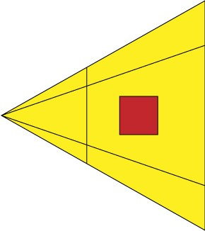

## 简单的场景

```javascript
export default {
    data() {
        return {
            scene: null, // 场景
            camera: null, // 相机
            renderer: null, // 渲染器

            controls:null
        }
    },
    computed: {

    },
    methods: {
        init() {
            this.renderer = new THREE.WebGLRenderer({
                alpha: true,
                canvas: document.getElementById('mainCanvas')
            });
            this.renderer.setClearColor(0x000000);
            this.scene = new THREE.Scene();

            // camera
            // 正交投影相机（平视相机）
            this.camera = new THREE.OrthographicCamera(-2, 2, 1.5, -1.5, 1, 10);
            // 透视相机（更像人眼）
            // let camera = new THREE.PerspectiveCamera(35, window.innerWidth / window.innerHeight, 1, 10000);
            //正方形。现在，我们想尝试一下仰望这个正方体。我们已经学会设置照相机的位置，不妨将其设置在
            this.camera.position.set(4, -3, 5);
            //lookAt函数指定它看着原点方向：
            this.camera.lookAt(new THREE.Vector3(0, 0, 0));
            this.scene.add(this.camera);

            //相机控件OrbitControls.js可以对Threejs的三维场景进行缩放、平移、旋转操作
            this.controls = new THREE.OrbitControls(this.camera, this.renderer.domElement);
            this.controls.enableDamping = true;

            // a cube in the scene
            let cube = new THREE.Mesh(new THREE.CubeGeometry(1, 1, 1),
                new THREE.MeshBasicMaterial({
                    color: 0xff0000,
                    wireframe: true
                })
            );
            this.scene.add(cube);
            // render
            this.renderer.render(this.scene, this.camera);
        },
        //必须要动态递归渲染，使用orbitcontrol之后
        animate() {
            requestAnimationFrame( this.animate );
            // required if controls.enableDamping or controls.autoRotate are set to true
            this.controls.update();
            this.renderer.render( this.scene, this.camera );
        }
    },
    mounted() {
        this.init()
        this.animate()
    }
}
```


## 照相机

### 正交投影vs透视投影

举个简单的例子来说明正交投影与透视投影照相机的区别。使用透视投影照相机获得的结果是类似人眼在真实世界中看到的有“近大远小”的效果（如下图中的(a)）；而使用正交投影照相机获得的结果就像我们在数学几何学课上老师教我们画的效果，对于在三维空间内平行的线，投影到二维空间中也一定是平行的（如下图中的(b)）。


*(a)透视投影，(b)正交投影*

那么，你的程序需要正交投影还是透视投影的照相机呢？

一般说来，对于制图、建模软件通常使用正交投影，这样不会因为投影而改变物体比例；而对于其他大多数应用，通常使用透视投影，因为这更接近人眼的观察效果。当然，照相机的选择并没有对错之分，你可以更具应用的特性，选择一个效果更佳的照相机。

------

### 正交投影照相机

正交投影照相机（Orthographic Camera）设置起来较为直观，它的构造函数是：

```
THREE.OrthographicCamera(left, right, top, bottom, near, far)
```

#### 基本设置

设置照相机：

```
var camera = new THREE.OrthographicCamera(-2, 2, 1.5, -1.5, 1, 10);
camera.position.set(0, 0, 5);
scene.add(camera);
```

在原点处创建一个边长为`1`的正方体，为了和透视效果做对比，这里我们使用`wireframe`而不是实心的材质，以便看到正方体后方的边：

```
var cube = new THREE.Mesh(new THREE.CubeGeometry(1, 1, 1),
        new THREE.MeshBasicMaterial({
            color: 0xff0000,
            wireframe: true
        })
);
scene.add(cube);
```

### 2.4 透视投影照相机

------

透视投影照相机（Perspective Camera）的构造函数是：

```
THREE.PerspectiveCamera(fov, aspect, near, far)
```

让我们通过一张透视照相机投影的图来了解这些参数。

透视图中，灰色的部分是视景体，是可能被渲染的物体所在的区域。`fov`是视景体竖直方向上的张角（是角度制而非弧度制），如侧视图所示。

`aspect`等于`width / height`，是照相机水平方向和竖直方向长度的比值，通常设为Canvas的横纵比例。

`near`和`far`分别是照相机到视景体最近、最远的距离，均为正值，且`far`应大于`near`。

#### 实例说明

------

下面，我们从一个最简单的例子学习设置透视投影照相机。

[**例2.4.1**](https://github.com/Ovilia/ThreeExample.js/blob/master/Chapter2/2.4.1.html)

设置透视投影照相机，这里Canvas长`400px`，宽`300px`，所以aspect设为`400 / 300`：

```
var camera = new THREE.PerspectiveCamera(45, 400 / 300, 1, 10);
camera.position.set(0, 0, 5);
scene.add(camera);
```

和[**例2.3.1**](https://github.com/Ovilia/ThreeExample.js/blob/master/Chapter2/2.3.1.html)一样，设置一个在原点处的边长为1的正方体：

```
// a cube in the scene
var cube = new THREE.Mesh(new THREE.CubeGeometry(1, 1, 1),
        new THREE.MeshBasicMaterial({
            color: 0xff0000,
            wireframe: true
        })
);
scene.add(cube);
```

得到的结果是：


对比[**例2.3.1**](https://github.com/Ovilia/ThreeExample.js/blob/master/Chapter2/2.3.1.html)正方形的效果，透视投影可以看到全部的12条边，而且有近大远小的效果，这也就是与正交投影的区别。

#### 竖直张角

接下来，我们来看下`fov`的改变对渲染效果的影响。我们将原来的`45`改为`60`，得到这样的效果：


为什么正方体显得更小了呢？我们从下面的侧视图来看，虽然正方体的实际大小并未改变，但是将照相机的竖直张角设置得更大时，视景体变大了，因而正方体相对于整个视景体的大小就变小了，看起来正方形就显得变小了。



注意，改变`fov`并不会引起画面横竖比例的变化，而改变`aspect`则会改变横竖比例。这一效果类似2.3节，此处不再重复说明。

### 相机控制器

常用的好用的**相机控制器**
[OrbitControls.js](https://link.jianshu.com/?t=https%3A%2F%2Fgithub.com%2Fmrdoob%2Fthree.js%2Fblob%2Fdev%2Fexamples%2Fjs%2Fcontrols%2FOrbitControls.js)，效果就是可以通过鼠标来控制相机视野


# BabylonJs

## 最基础场景

```typescript
export class Game {

    private _canvas: HTMLCanvasElement;
    private _engine: BABYLON.Engine;


    private _scene: BABYLON.Scene;

    private _camera: BABYLON.ArcRotateCamera;
    private _light: BABYLON.Light;
    private _earthMesh: BABYLON.AbstractMesh;

    private _txtCoordinates: { txtX: GUI.TextBlock, txtY: GUI.TextBlock, txtZ: GUI.TextBlock } = null;

    constructor(canvasElement: string) {
        // Create canvas and engine
        this._canvas = <HTMLCanvasElement>document.getElementById(canvasElement);
        this._engine = new BABYLON.Engine(this._canvas, true);
    }

    /**
     * Creates the BABYLONJS Scene
     */
    createScene(): void {
        // This creates a basic Babylon Scene object (non-mesh)
        this._scene = new BABYLON.Scene(this._engine);

        // This creates and positions a free camera (non-mesh)
        var camera = new BABYLON.FreeCamera("camera1", new BABYLON.Vector3(0, 5, -10), this._scene);
        // This targets the camera to scene origin
        camera.setTarget(BABYLON.Vector3.Zero());
        // This attaches the camera to the canvas
        camera.attachControl(this._canvas, true);

        // This creates a light, aiming 0,1,0 - to the sky (non-mesh)
        var light = new BABYLON.HemisphericLight("light", new BABYLON.Vector3(0, 1, 0), this._scene);
        // Default intensity is 1. Let's dim the light a small amount
        light.intensity = 0.7;

        // Our built-in 'sphere' shape.
        var sphere = BABYLON.MeshBuilder.CreateSphere("sphere", {diameter: 2, segments: 32}, this._scene);
        // Move the sphere upward 1/2 its height
        sphere.position.y = 1;
        // Our built-in 'ground' shape.
        var ground = BABYLON.MeshBuilder.CreateGround("ground", {width: 6, height: 6}, this._scene);
    }


    /**
     * Starts the animation loop.
     */
    animate(): void {
        this._engine.runRenderLoop(() => {
            this._scene.render();
        });
    }
}
```

