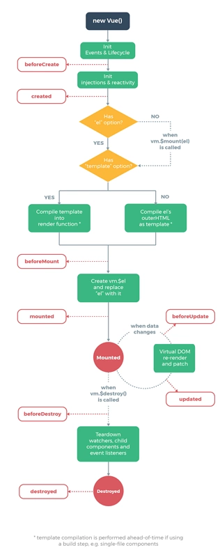

# Vue生命周期

首先，每个Vue实例在被**创建**之前都要经过一系列的初始化过程,这个过程就是vue的生命周期。首先看一张图吧~这是官方文档上的图片相信大家一定都会很熟悉：




可以看到在vue一整个的生命周期中会有很多**钩子函数**提供给我们在vue生命周期不同的时刻进行操作, 那么先列出所有的钩子函数，然后我们再一一详解:

- **beforeCreate**
- **created**

** 在mounted之前h1中还是通过**{{message}}**进行占位的，因为此时还有挂在到页面上，还是JavaScript中的虚拟DOM形式存在的。在mounted之后可以看到h1中的内容发生了变化。

- **beforeMount**
- **mounted** 挂载后

当vue发现data中的数据发生了改变，会**触发对应组件的重新渲染**，先后调用**beforeUpdate**和**updated**钩子函数。我们在console中输入：

- **beforeUpdate**
- **updated**
- **beforeDestroy** 钩子函数在实例销毁之前调用。在这一步，实例仍然完全可用。
- **destroyed** 钩子函数在Vue 实例销毁后调用。调用后，Vue 实例指示的所有东西都会解绑定，所有的事件监听器会被移除，所有的子实例也会被销毁。

# vue数据双向绑定原理
```
1.vue数据双向绑定的原理。

2.实现简单版vue的过程，主要实现{{}}、v-model和事件指令的功能。
```

vue数据双向绑定是通过数据劫持结合发布者-订阅者模式的方式来实现的，那么vue是如果进行数据劫持的，我们可以先来看一下通过控制台输出一个定义在vue初始化数据上的对象是个什么东西。

- 输入框内容变化时，data 中的数据同步变化。即 view => model 的变化。
- data 中的数据变化时，文本节点的内容同步变化。即 model => view 的变化。

### 原理

vue数据双向绑定通过‘数据劫持’ + 订阅发布模式实现

### 数据劫持

　　通过上面对Object.defineProperty的介绍，我们不难发现，**当我们访问或设置对象的属性的时候，都会触发相对应的函数**，然后在这个函数里**返回或设置属性的值**。

　　既然如此，我们当然可以在**触发函数的时候**动一些手脚做点我们自己想做的事情，这也就是**“劫持”操作**。

　　在Vue中其实就是通过**Object.defineProperty来劫持对象属性的setter和getter操作**，并**“种下”一个监听器**，当数据发生变化的时候发出通知。

典型的有
 1.Object.**defineProperty**(obj,prop,descriptor)

obj:目标对象

prop:需要定义的属性或方法的名称

descriptor:目标属性所拥有的特性


 2.es6中Proxy对象

vue2.x使用Object.defineProperty();
 vue3.x使用Proxy;

### 订阅发布模式

定义：对象间的一种一对多的依赖关系，当一个对象的状态发生改变时，所有依赖于它的对象都将得到通知
 订阅发布模式中事件统一由处理中心处理，订阅者发布者互不干扰。
 优点：实现更多的控制，做权限处理，节流控制之类，例如：发布了很多消息，但是不是所有订阅者都要接收


```js
// 实现一个处理中心
let event = {
  clientList: {}, // 订阅事件列表
  // 订阅
  on(key, fn){
    // 如果这个事件没有被订阅，那么创建一个列表用来存放事件
    if(!this.clientList[key]) {
      this.clientList[key] = []
    }
    // 将事件放入已有的事件列表中
    this.clientList[key].push(fn);
  },
  // 发布
  trigger(type, args){
    let fns = this.clientList[type] // 拿到这个事件的所有监听
    if(!fns || fns.length === 0){  // 如果没有这条消息的订阅者
      return false
    }
    // 如果存在这个事件的订阅，那么遍历事件列表，触发对应监听
    fns.forEach(fn => {
      // 可以在此处添加过滤等处理
      fn(args)
    })
  }
}
```

### vue中如何实现

利用Object.defineProperty();把内部解耦为三部分
 Observer: 递归的监听对象上的所有属性，当属性改变时触发对应的watcher
 watcher(观察者):当蒋婷的数据值修改时，执行相应的回调函数，更新模板内容
 dep：链接observer和watcher，每一个observer对应一个dep,内部维护一个数组，保存与该observer相关的watcher

### proxy实现观察者模式

观察者模式（Observer mode）指的是函数自动观察数据对象，一旦对象有变化，函数就会自动执行


```js
const person = observable({
  name: '张三',
  age: 20
});

function print() {
  console.log(`${person.name}, ${person.age}`)
}

observe(print);
person.name = '李四';
// 输出
// 李四, 20
```

代码中。对象person是观察目标，函数print是观察者。一旦数据发生变化，print就会自动执行

使用proxy实现一个最简单观察者模式，即实现observable和observe这两个函数。
 思路是observable函数返回一个原始对象的proxy代理，拦截复制操作。触发充当观察者的各个函数


```js
const queue = new Set();

const observe = fn => queue.add(fn);
const observable = obj => new Proxy(obj, {set});

function set(target, key, value, receiver) {
  const result = Reflect.set(target, key, value, receiver);
  queue.forEach(observer => observer());
  return result;
} 
```

上面代码中，先定义了一个Set集合，所有观察者函数都放进这个集合，然后，observable函数返回原始对象的代理，拦截赋值操作。


## 其他知识点

## [计算属性](https://cn.vuejs.org/v2/guide/computed.html#计算属性)

模板内的表达式非常便利，但是设计它们的初衷是用于简单运算的。在模板中放入太多的逻辑会让模板过重且难以维护。例如：

```
<div id="example">
  {{ message.split('').reverse().join('') }}
</div>
```

在这个地方，模板不再是简单的声明式逻辑。你必须看一段时间才能意识到，这里是想要显示变量 `message` 的翻转字符串。当你想要在模板中多次引用此处的翻转字符串时，就会更加难以处理。

所以，对于任何复杂逻辑，你都应当使用**计算属性**。

### [基础例子](https://cn.vuejs.org/v2/guide/computed.html#基础例子)

```
<div id="example">
  <p>Original message: "{{ message }}"</p>
  <p>Computed reversed message: "{{ reversedMessage }}"</p>
</div>
var vm = new Vue({
  el: '#example',
  data: {
    message: 'Hello'
  },
  computed: {
    // 计算属性的 getter
    reversedMessage: function () {
      // `this` 指向 vm 实例
      return this.message.split('').reverse().join('')
    }
  }
})
```

结果：

Original message: "Hello"

Computed reversed message: "olleH"

这里我们声明了一个计算属性 `reversedMessage`。我们提供的函数将用作属性 `vm.reversedMessage` 的 getter 函数：

```
console.log(vm.reversedMessage) // => 'olleH'
vm.message = 'Goodbye'
console.log(vm.reversedMessage) // => 'eybdooG'
```

你可以打开浏览器的控制台，自行修改例子中的 vm。`vm.reversedMessage` 的值始终取决于 `vm.message` 的值。

你可以像绑定普通属性一样在模板中绑定计算属性。Vue 知道 `vm.reversedMessage` 依赖于 `vm.message`，因此当 `vm.message` 发生改变时，所有依赖 `vm.reversedMessage` 的绑定也会更新。而且最妙的是我们已经以声明的方式创建了这种依赖关系：计算属性的 getter 函数是没有副作用 (side effect) 的，这使它更易于测试和理解。

### [计算属性缓存 vs 方法](https://cn.vuejs.org/v2/guide/computed.html#计算属性缓存-vs-方法)

你可能已经注意到我们可以通过在表达式中调用方法来达到同样的效果：

```
<p>Reversed message: "{{ reversedMessage() }}"</p>
// 在组件中
methods: {
  reversedMessage: function () {
    return this.message.split('').reverse().join('')
  }
}
```

我们可以将同一函数定义为一个方法而不是一个计算属性。两种方式的最终结果确实是完全相同的。然而，不同的是**计算属性是基于它们的响应式依赖进行缓存的**。只在相关响应式依赖发生改变时它们才会重新求值。这就意味着只要 `message` 还没有发生改变，多次访问 `reversedMessage` 计算属性会立即返回之前的计算结果，而不必再次执行函数。

这也同样意味着下面的计算属性将不再更新，因为 `Date.now()` 不是响应式依赖：

```
computed: {
  now: function () {
    return Date.now()
  }
}
```

相比之下，每当触发重新渲染时，调用方法将**总会**再次执行函数。

我们为什么需要缓存？假设我们有一个性能开销比较大的计算属性 **A**，它需要遍历一个巨大的数组并做大量的计算。然后我们可能有其他的计算属性依赖于 **A**。如果没有缓存，我们将不可避免的多次执行 **A** 的 getter！如果你不希望有缓存，请用方法来替代。

### [计算属性 vs 侦听属性](https://cn.vuejs.org/v2/guide/computed.html#计算属性-vs-侦听属性)

Vue 提供了一种更通用的方式来观察和响应 Vue 实例上的数据变动：**侦听属性**。当你有一些数据需要随着其它数据变动而变动时，你很容易滥用 `watch`——特别是如果你之前使用过 AngularJS。然而，通常更好的做法是使用计算属性而不是命令式的 `watch` 回调。细想一下这个例子：

```
<div id="demo">{{ fullName }}</div>
var vm = new Vue({
  el: '#demo',
  data: {
    firstName: 'Foo',
    lastName: 'Bar',
    fullName: 'Foo Bar'
  },
  watch: {
    firstName: function (val) {
      this.fullName = val + ' ' + this.lastName
    },
    lastName: function (val) {
      this.fullName = this.firstName + ' ' + val
    }
  }
})
```

上面代码是命令式且重复的。将它与计算属性的版本进行比较：

```
var vm = new Vue({
  el: '#demo',
  data: {
    firstName: 'Foo',
    lastName: 'Bar'
  },
  computed: {
    fullName: function () {
      return this.firstName + ' ' + this.lastName
    }
  }
})
```

好得多了，不是吗？

### [计算属性的 setter](https://cn.vuejs.org/v2/guide/computed.html#计算属性的-setter)

计算属性默认只有 getter，不过在需要时你也可以提供一个 setter：

```
// ...
computed: {
  fullName: {
    // getter
    get: function () {
      return this.firstName + ' ' + this.lastName
    },
    // setter
    set: function (newValue) {
      var names = newValue.split(' ')
      this.firstName = names[0]
      this.lastName = names[names.length - 1]
    }
  }
}
// ...
```

现在再运行 `vm.fullName = 'John Doe'` 时，setter 会被调用，`vm.firstName` 和 `vm.lastName` 也会相应地被更新。

## [侦听器](https://cn.vuejs.org/v2/guide/computed.html#侦听器)

虽然计算属性在大多数情况下更合适，但有时也需要一个自定义的侦听器。这就是为什么 Vue 通过 `watch` 选项提供了一个更通用的方法，来响应数据的变化。当需要在数据变化时执行异步或开销较大的操作时，这个方式是最有用的。

例如：

```
<div id="watch-example">
  <p>
    Ask a yes/no question:
    <input v-model="question">
  </p>
  <p>{{ answer }}</p>
</div>
<!-- 因为 AJAX 库和通用工具的生态已经相当丰富，Vue 核心代码没有重复 -->
<!-- 提供这些功能以保持精简。这也可以让你自由选择自己更熟悉的工具。 -->
<script src="https://cdn.jsdelivr.net/npm/axios@0.12.0/dist/axios.min.js"></script>
<script src="https://cdn.jsdelivr.net/npm/lodash@4.13.1/lodash.min.js"></script>
<script>
var watchExampleVM = new Vue({
  el: '#watch-example',
  data: {
    question: '',
    answer: 'I cannot give you an answer until you ask a question!'
  },
  watch: {
    // 如果 `question` 发生改变，这个函数就会运行
    question: function (newQuestion, oldQuestion) {
      this.answer = 'Waiting for you to stop typing...'
      this.debouncedGetAnswer()
    }
  },
  created: function () {
    // `_.debounce` 是一个通过 Lodash 限制操作频率的函数。
    // 在这个例子中，我们希望限制访问 yesno.wtf/api 的频率
    // AJAX 请求直到用户输入完毕才会发出。想要了解更多关于
    // `_.debounce` 函数 (及其近亲 `_.throttle`) 的知识，
    // 请参考：https://lodash.com/docs#debounce
    this.debouncedGetAnswer = _.debounce(this.getAnswer, 500)
  },
  methods: {
    getAnswer: function () {
      if (this.question.indexOf('?') === -1) {
        this.answer = 'Questions usually contain a question mark. ;-)'
        return
      }
      this.answer = 'Thinking...'
      var vm = this
      axios.get('https://yesno.wtf/api')
        .then(function (response) {
          vm.answer = _.capitalize(response.data.answer)
        })
        .catch(function (error) {
          vm.answer = 'Error! Could not reach the API. ' + error
        })
    }
  }
})
</script>
```

结果：

Ask a yes/no question: 

I cannot give you an answer until you ask a question!

在这个示例中，使用 `watch` 选项允许我们执行异步操作 (访问一个 API)，限制我们执行该操作的频率，并在我们得到最终结果前，设置中间状态。这些都是计算属性无法做到的。

除了 `watch` 选项之外，您还可以使用命令式的 [vm.$watch API](https://cn.vuejs.org/v2/api/#vm-watch)。