ebpack的工作方式是：把你的项目当做一个整体，通过一个给定的主文件（如：index.js），Webpack将从这个文件开始找到你的项目的所有依赖文件，使用loaders处理它们，最后打包为一个（或多个）浏览器可识别的JavaScript文件。

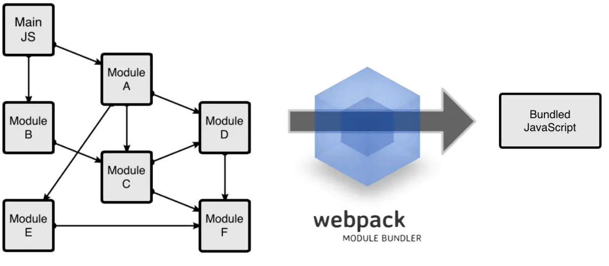


Webpack工作方式

如果实在要把二者进行比较，Webpack的处理速度更快更直接，能打包更多不同类型的文件。

### 开始使用Webpack

初步了解了Webpack工作方式后，我们一步步的开始学习使用Webpack。

#### 安装

Webpack可以使用npm安装，新建一个空的练习文件夹（此处命名为webpack sample project），在终端中转到该文件夹后执行下述指令就可以完成安装。


```js
//全局安装
npm install -g webpack
//安装到你的项目目录
npm install --save-dev webpack
```

#### 正式使用Webpack前的准备

1. 在上述练习文件夹中创建一个package.json文件，这是一个标准的npm说明文件，里面蕴含了丰富的信息，包括当前项目的依赖模块，自定义的脚本任务等等。在终端中使用`npm init`命令可以自动创建这个package.json文件


```kotlin
npm init
```

输入这个命令后，终端会问你一系列诸如项目名称，项目描述，作者等信息，不过不用担心，如果你不准备在npm中发布你的模块，这些问题的答案都不重要，回车默认即可。

1. package.json文件已经就绪，我们在本项目中安装Webpack作为依赖包


```js
// 安装Webpack
npm install --save-dev webpack
```

1. 回到之前的空文件夹，并在里面创建两个文件夹,app文件夹和public文件夹，app文件夹用来存放原始数据和我们将写的JavaScript模块，public文件夹用来存放之后供浏览器读取的文件（包括使用webpack打包生成的js文件以及一个`index.html`文件）。接下来我们再创建三个文件:

- `index.html` --放在public文件夹中;
- `Greeter.js`-- 放在app文件夹中;
- `main.js`-- 放在app文件夹中;

此时项目结构如下图所示

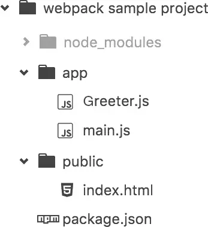


项目结构

我们在**index.html**文件中写入最基础的html代码，它在这里目的在于引入打包后的js文件（这里我们先把之后打包后的js文件命名为`bundle.js`，之后我们还会详细讲述）。

我们在**index.html**文件中写入最基础的html代码，它在这里目的在于引入打包后的js文件（这里我们先把之后打包后的js文件命名为`bundle.js`，之后我们还会详细讲述）。

```html
<html lang="en">
  <head>
    <meta charset="utf-8">
    <title>Webpack Sample Project</title>
  </head>
  <body>
    <div id='root'>
    </div>
    <script src="bundle.js"></script>
  </body>
</html>
```

我们在`Greeter.js`中定义一个返回包含问候信息的`html`元素的函数,并依据CommonJS规范导出这个函数为一个模块：

```js
module.exports = function() {
  var greet = document.createElement('div');
  greet.textContent = "Hi there and greetings!";
  return greet;
};
```

`main.js`文件中我们写入下述代码，用以把`Greeter模块`返回的节点插入页面。

```js
//main.js 
const greeter = require('./Greeter.js');
document.querySelector("#root").appendChild(greeter());
```

#### 正式使用Webpack

webpack可以在终端中使用，在基本的使用方法如下：


```bash
# {extry file}出填写入口文件的路径，本文中就是上述main.js的路径，
# {destination for bundled file}处填写打包文件的存放路径
# 填写路径的时候不用添加{}
webpack {entry file} {destination for bundled file}
```

指定入口文件后，webpack将自动识别项目所依赖的其它文件，不过需要注意的是如果你的webpack不是全局安装的，那么当你在终端中使用此命令时，需要额外指定其在node_modules中的地址，继续上面的例子，在终端中输入如下命令


```bash
# webpack非全局安装的情况
node_modules/.bin/webpack app/main.js public/bundle.js
```

结果如下

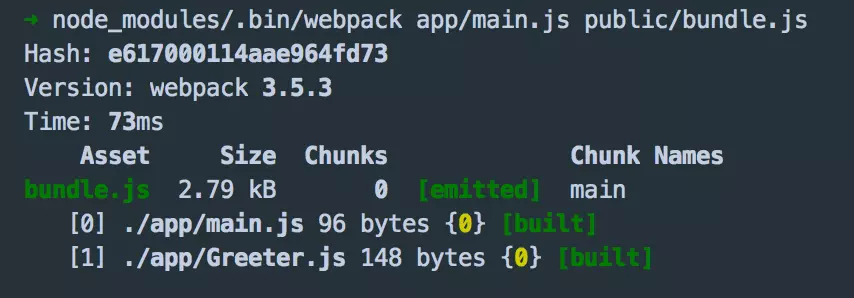

使用命令行打包

可以看出`webpack`同时编译了`main.js` 和`Greeter,js`,现在打开`index.html`,可以看到如下结果

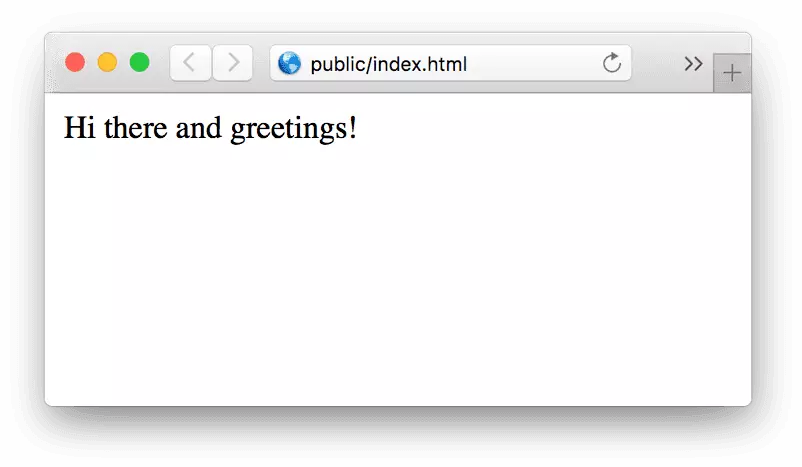

有没有很激动，已经成功的使用`Webpack`打包了一个文件了。不过在终端中进行复杂的操作，其实是不太方便且容易出错的，接下来看看Webpack的另一种更常见的使用方法。

#### 通过配置文件来使用`Webpack`

Webpack拥有很多其它的比较高级的功能（比如说本文后面会介绍的`loaders`和`plugins`），这些功能其实都可以通过命令行模式实现，但是正如前面提到的，这样不太方便且容易出错的，更好的办法是定义一个配置文件，这个配置文件其实也是一个简单的JavaScript模块，我们可以把所有的与打包相关的信息放在里面。

继续上面的例子来说明如何写这个配置文件，在当前练习文件夹的根目录下新建一个名为`webpack.config.js`的文件，我们在其中写入如下所示的简单配置代码，目前的配置主要涉及到的内容是入口文件路径和打包后文件的存放路径。


```js
module.exports = {
  entry:  __dirname + "/app/main.js",//已多次提及的唯一入口文件
  output: {
    path: __dirname + "/public",//打包后的文件存放的地方
    filename: "bundle.js"//打包后输出文件的文件名
  }
}
```

> **注**：“__dirname”是node.js中的一个全局变量，它指向当前执行脚本所在的目录。

#### 更快捷的执行打包任务

在命令行中输入命令需要代码类似于`node_modules/.bin/webpack`这样的路径其实是比较烦人的，不过值得庆幸的是`npm`可以引导任务执行，对`npm`进行配置后可以在命令行中使用简单的`npm start`命令来替代上面略微繁琐的命令。在`package.json`中对`scripts`对象进行相关设置即可，设置方法如下。

```json
{
  "name": "webpack-sample-project",
  "version": "1.0.0",
  "description": "Sample webpack project",
  "scripts": {
    "start": "webpack" // 修改的是这里，JSON文件不支持注释，引用时请清除
  },
  "author": "zhang",
  "license": "ISC",
  "devDependencies": {
    "webpack": "3.10.0"
  }
}
```

npm的`start`命令是一个特殊的脚本名称，其特殊性表现在，在命令行中使用`npm start`就可以执行其对于的命令，如果对应的此脚本名称不是`start`，想要在命令行中运行时，需要这样用`npm run {script name}`如`npm run build`

### Webpack的强大功能

#### 生成Source Maps（使调试更容易）

开发总是离不开调试，方便的调试能极大的提高开发效率，不过有时候通过打包后的文件，你是不容易找到出错了的地方，对应的你写的代码的位置的，`Source Maps`就是来帮我们解决这个问题的。

通过简单的配置，`webpack`就可以在打包时为我们生成的`source maps`，这为我们提供了一种对应编译文件和源文件的方法，使得编译后的代码可读性更高，也更容易调试。

在`webpack`的配置文件中配置`source maps`，需要配置`devtool`，它有以下四种不同的配置选项，各具优缺点，描述如下：

| devtool选项                    | 配置结果                                                     |
| ------------------------------ | ------------------------------------------------------------ |
| `source-map`                   | 在一个单独的文件中产生一个完整且功能完全的文件。这个文件具有最好的`source map`，但是它会减慢打包速度； |
| `cheap-module-source-map`      | 在一个单独的文件中生成一个不带列映射的`map`，不带列映射提高了打包速度，但是也使得浏览器开发者工具只能对应到具体的行，不能对应到具体的列（符号），会对调试造成不便； |
| `eval-source-map`              | 使用`eval`打包源文件模块，在同一个文件中生成干净的完整的`source map`。这个选项可以在不影响构建速度的前提下生成完整的`sourcemap`，但是对打包后输出的JS文件的执行具有性能和安全的隐患。在开发阶段这是一个非常好的选项，在生产阶段则一定不要启用这个选项； |
| `cheap-module-eval-source-map` | 这是在打包文件时最快的生成`source map`的方法，生成的`Source Map` 会和打包后的`JavaScript`文件同行显示，没有列映射，和`eval-source-map`选项具有相似的缺点； |

正如上表所述，上述选项由上到下打包速度越来越快，不过同时也具有越来越多的负面作用，较快的打包速度的后果就是对打包后的文件的的执行有一定影响。

对小到中型的项目中，`eval-source-map`是一个很好的选项，再次强调你只应该开发阶段使用它，我们继续对上文新建的`webpack.config.js`，进行如下配置:

```js
module.exports = {
    //source-map
  devtool: 'eval-source-map',
  entry:  __dirname + "/app/main.js",
  output: {
    path: __dirname + "/public",
    filename: "bundle.js"
  }
}
```

> `cheap-module-eval-source-map`方法构建速度更快，但是不利于调试，推荐在大型项目考虑时间成本时使用。

#### 使用webpack构建本地服务器

想不想让你的浏览器监听你的代码的修改，并自动刷新显示修改后的结果，其实`Webpack`提供一个可选的本地开发服务器，这个本地服务器基于node.js构建，可以实现你想要的这些功能，不过它是一个单独的组件，在webpack中进行配置之前需要单独安装它作为项目依赖

```bash
npm install --save-dev webpack-dev-server
```

devserver作为webpack配置选项中的一项，以下是它的一些配置选项，更多配置可参考[这里](https://webpack.js.org/configuration/dev-server/)

| devserver的配置选项 | 功能描述                                                     |
| ------------------- | ------------------------------------------------------------ |
| contentBase         | 默认webpack-dev-server会为根文件夹提供本地服务器，如果想为另外一个目录下的文件提供本地服务器，应该在这里设置其所在目录（本例设置到“public"目录） |
| port                | 设置默认监听端口，如果省略，默认为”8080“                     |
| inline              | 设置为`true`，当源文件改变时会自动刷新页面                   |
| historyApiFallback  | 在开发单页应用时非常有用，它依赖于HTML5 history API，如果设置为`true`，所有的跳转将指向index.html |

把这些命令加到webpack的配置文件中，现在的配置文件`webpack.config.js`如下所示


```js
module.exports = {
  devtool: 'eval-source-map',

  entry:  __dirname + "/app/main.js",
  output: {
    path: __dirname + "/public",
    filename: "bundle.js"
  },

  devServer: {
    contentBase: "./public",//本地服务器所加载的页面所在的目录
    historyApiFallback: true,//不跳转
    inline: true//实时刷新
  } 
}
```

在`package.json`中的`scripts`对象中添加如下命令，用以开启本地服务器：


```json
  "scripts": {
    "test": "echo \"Error: no test specified\" && exit 1",
    "start": "webpack",
    "server": "webpack-dev-server --open"
  },
```

在终端中输入`npm run server`即可在本地的`8080`端口查看结果


#### Loaders

**鼎鼎大名的Loaders登场了！**

`Loaders`是`webpack`提供的最激动人心的功能之一了。通过使用不同的`loader`，`webpack`有能力调用外部的脚本或工具，实现对不同格式的文件的处理，比如说分析转换scss为css，或者把下一代的JS文件（ES6，ES7)转换为现代浏览器兼容的JS文件，对React的开发而言，合适的Loaders可以把React的中用到的JSX文件转换为JS文件。

Loaders需要单独安装并且需要在`webpack.config.js`中的`modules`关键字下进行配置，Loaders的配置包括以下几方面：

- `test`：一个用以匹配loaders所处理文件的拓展名的正则表达式（必须）
- `loader`：loader的名称（必须）
- `include/exclude`:手动添加必须处理的文件（文件夹）或屏蔽不需要处理的文件（文件夹）（可选）；
- `query`：为loaders提供额外的设置选项（可选）

不过在配置loader之前，我们把`Greeter.js`里的问候消息放在一个单独的JSON文件里,并通过合适的配置使`Greeter.js`可以读取该JSON文件的值，各文件修改后的代码如下：

在app文件夹中创建带有问候信息的JSON文件(命名为`config.json`)

```json
{
  "greetText": "Hi there and greetings from JSON!"
}
```

更新后的Greeter.js

```js
var config = require('./config.json');

module.exports = function() {
  var greet = document.createElement('div');
  greet.textContent = config.greetText;
  return greet;
};
```

#### Babel的安装与配置

Babel其实是几个模块化的包，其核心功能位于称为`babel-core`的npm包中，webpack可以把其不同的包整合在一起使用，对于每一个你需要的功能或拓展，你都需要安装单独的包（用得最多的是解析Es6的`babel-env-preset`包和解析JSX的`babel-preset-react`包）。

我们先来一次性安装这些依赖包

```bash
// npm一次性安装多个依赖模块，模块之间用空格隔开
npm install --save-dev babel-core babel-loader babel-preset-env babel-preset-react
```

在`webpack`中配置Babel的方法如下:

```js
module.exports = {
    entry: __dirname + "/app/main.js",//已多次提及的唯一入口文件
    output: {
        path: __dirname + "/public",//打包后的文件存放的地方
        filename: "bundle.js"//打包后输出文件的文件名
    },
    devtool: 'eval-source-map',
    devServer: {
        contentBase: "./public",//本地服务器所加载的页面所在的目录
        historyApiFallback: true,//不跳转
        inline: true//实时刷新
    },
    module: {
        rules: [
            {
                test: /(\.jsx|\.js)$/,
                use: {
                    loader: "babel-loader",
                    options: {
                        presets: [
                            "env", "react"
                        ]
                    }
                },
                exclude: /node_modules/
            }
        ]
    }
};
```

现在你的webpack的配置已经允许你使用ES6以及JSX的语法了。继续用上面的例子进行测试，不过这次我们会使用React，记得先安装 React 和 React-DOM

```bash
npm install --save react react-dom
```

接下来我们使用ES6的语法，更新`Greeter.js`并返回一个React组件

```js
//Greeter,js
import React, {Component} from 'react'
import config from './config.json';

class Greeter extends Component{
  render() {
    return (
      <div>
        {config.greetText}
      </div>
    );
  }
}

export default Greeter
```

修改`main.js`如下，使用ES6的模块定义和渲染Greeter模块

```js
// main.js
import React from 'react';
import {render} from 'react-dom';
import Greeter from './Greeter';

render(<Greeter />, document.getElementById('root'));
```

重新使用`npm start`打包，如果之前打开的本地服务器没有关闭，你应该可以在`localhost:8080`下看到与之前一样的内容，这说明`react`和`es6`被正常打包了。

#### Babel的配置

Babel其实可以完全在 `webpack.config.js` 中进行配置，但是考虑到babel具有非常多的配置选项，在单一的`webpack.config.js`文件中进行配置往往使得这个文件显得太复杂，因此一些开发者支持把babel的配置选项放在一个单独的名为 ".babelrc" 的配置文件中。我们现在的babel的配置并不算复杂，不过之后我们会再加一些东西，因此现在我们就提取出相关部分，分两个配置文件进行配置（webpack会自动调用`.babelrc`里的babel配置选项），如下：

```js
module.exports = {
    entry: __dirname + "/app/main.js",//已多次提及的唯一入口文件
    output: {
        path: __dirname + "/public",//打包后的文件存放的地方
        filename: "bundle.js"//打包后输出文件的文件名
    },
    devtool: 'eval-source-map',
    devServer: {
        contentBase: "./public",//本地服务器所加载的页面所在的目录
        historyApiFallback: true,//不跳转
        inline: true//实时刷新
    },
    module: {
        rules: [
            {
                test: /(\.jsx|\.js)$/,
                use: {
                    loader: "babel-loader"
                },
                exclude: /node_modules/
            }
        ]
    }
};
```


```js
//.babelrc
{
  "presets": ["react", "env"]
}
```

到目前为止，我们已经知道了，对于模块，Webpack能提供非常强大的处理功能，那那些是模块呢。

### 一切皆模块

Webpack有一个不可不说的优点，它把所有的文件都都当做模块处理，JavaScript代码，CSS和fonts以及图片等等通过合适的loader都可以被处理。

#### CSS

webpack提供两个工具处理样式表，`css-loader` 和 `style-loader`，二者处理的任务不同，`css-loader`使你能够使用类似`@import` 和 `url(...)`的方法实现 `require()`的功能,`style-loader`将所有的计算后的样式加入页面中，二者组合在一起使你能够把样式表嵌入webpack打包后的JS文件中。

继续上面的例子

```bash
//安装
npm install --save-dev style-loader css-loader
```


```js
//使用
module.exports = {

   ...
    module: {
        rules: [
            {
                test: /(\.jsx|\.js)$/,
                use: {
                    loader: "babel-loader"
                },
                exclude: /node_modules/
            },
            {
                test: /\.css$/,
                use: [
                    {
                        loader: "style-loader"
                    }, {
                        loader: "css-loader"
                    }
                ]
            }
        ]
    }
};
```

> 请注意这里对同一个文件引入多个loader的方法。

接下来，在app文件夹里创建一个名字为"main.css"的文件，对一些元素设置样式


```css
/* main.css */
html {
  box-sizing: border-box;
  -ms-text-size-adjust: 100%;
  -webkit-text-size-adjust: 100%;
}

*, *:before, *:after {
  box-sizing: inherit;
}

body {
  margin: 0;
  font-family: 'Helvetica Neue', Helvetica, Arial, sans-serif;
}

h1, h2, h3, h4, h5, h6, p, ul {
  margin: 0;
  padding: 0;
}
```

我们这里例子中用到的`webpack`只有单一的入口，其它的模块需要通过 `import`, `require`, `url`等与入口文件建立其关联，为了让webpack能找到”main.css“文件，我们把它导入”main.js “中，如下

```js
//main.js
import React from 'react';
import {render} from 'react-dom';
import Greeter from './Greeter';

import './main.css';//使用require导入css文件

render(<Greeter />, document.getElementById('root'));
```

> 通常情况下，css会和js打包到同一个文件中，并不会打包为一个单独的css文件，不过通过合适的配置webpack也可以把css打包为单独的文件的。

上面的代码说明webpack是怎么把css当做模块看待的，咱们继续看一个更加真实的css模块实践。

#### CSS module

在过去的一些年里，JavaScript通过一些新的语言特性，更好的工具以及更好的实践方法（比如说模块化）发展得非常迅速。模块使得开发者把复杂的代码转化为小的，干净的，依赖声明明确的单元，配合优化工具，依赖管理和加载管理可以自动完成。

不过前端的另外一部分，CSS发展就相对慢一些，大多的样式表却依旧巨大且充满了全局类名，维护和修改都非常困难。

被称为`CSS modules`的技术意在把JS的模块化思想带入CSS中来，通过CSS模块，所有的类名，动画名默认都只作用于当前模块。Webpack对CSS模块化提供了非常好的支持，只需要在CSS loader中进行简单配置即可，然后就可以直接把CSS的类名传递到组件的代码中，这样做有效避免了全局污染。具体的代码如下

```js
module.exports = {

    ...

    module: {
        rules: [
            {
                test: /(\.jsx|\.js)$/,
                use: {
                    loader: "babel-loader"
                },
                exclude: /node_modules/
            },
            {
                test: /\.css$/,
                use: [
                    {
                        loader: "style-loader"
                    }, {
                        loader: "css-loader",
                        options: {
                            modules: true, // 指定启用css modules
                            localIdentName: '[name]__[local]--[hash:base64:5]' // 指定css的类名格式
                        }
                    }
                ]
            }
        ]
    }
};
```

我们在app文件夹下创建一个`Greeter.css`文件来进行一下测试

```css
/* Greeter.css */
.root {
  background-color: #eee;
  padding: 10px;
  border: 3px solid #ccc;
}
```

导入`.root`到Greeter.js中

```js
import React, {Component} from 'react';
import config from './config.json';
import styles from './Greeter.css';//导入

class Greeter extends Component{
  render() {
    return (
      <div className={styles.root}> //使用cssModule添加类名的方法
        {config.greetText}
      </div>
    );
  }
}

export default Greeter
```

放心使用把，相同的类名也不会造成不同组件之间的污染。


应用了css module后的样式

CSS modules 也是一个很大的主题，有兴趣的话可以去其[官方文档](https://github.com/css-modules/css-modules)了解更多。

#### CSS预处理器

`Sass` 和 `Less` 之类的预处理器是对原生CSS的拓展，它们允许你使用类似于`variables`, `nesting`, `mixins`, `inheritance`等不存在于CSS中的特性来写CSS，CSS预处理器可以这些特殊类型的语句转化为浏览器可识别的CSS语句，

你现在可能都已经熟悉了，在webpack里使用相关loaders进行配置就可以使用了，以下是常用的CSS 处理`loaders`:

- `Less Loader`
- `Sass Loader`
- `Stylus Loader`

不过其实也存在一个CSS的处理平台`-PostCSS`，它可以帮助你的CSS实现更多的功能，在其[官方文档](https://github.com/postcss/postcss)可了解更多相关知识。

举例来说如何使用PostCSS，我们使用PostCSS来为CSS代码自动添加适应不同浏览器的CSS前缀。

首先安装`postcss-loader` 和 `autoprefixer`（自动添加前缀的插件）


```undefined
npm install --save-dev postcss-loader autoprefixer
```

接下来，在webpack配置文件中添加`postcss-loader`，在根目录新建`postcss.config.js`,并添加如下代码之后，重新使用`npm start`打包时，你写的css会自动根据Can i use里的数据添加不同前缀了。

```js
//webpack.config.js
module.exports = {
    ...
    module: {
        rules: [
            {
                test: /(\.jsx|\.js)$/,
                use: {
                    loader: "babel-loader"
                },
                exclude: /node_modules/
            },
            {
                test: /\.css$/,
                use: [
                    {
                        loader: "style-loader"
                    }, {
                        loader: "css-loader",
                        options: {
                            modules: true
                        }
                    }, {
                        loader: "postcss-loader"
                    }
                ]
            }
        ]
    }
}
```


```js
// postcss.config.js
module.exports = {
    plugins: [
        require('autoprefixer')
    ]
}
```

至此，本文已经谈论了处理JS的Babel和处理CSS的PostCSS的基本用法，它们其实也是两个单独的平台，配合`webpack`可以很好的发挥它们的作用。接下来介绍Webpack中另一个非常重要的功能-`Plugins`

### 插件（Plugins）

插件（Plugins）是用来拓展Webpack功能的，它们会在整个构建过程中生效，执行相关的任务。
 Loaders和Plugins常常被弄混，但是他们其实是完全不同的东西，可以这么来说，loaders是在打包构建过程中用来处理源文件的（JSX，Scss，Less..），一次处理一个，插件并不直接操作单个文件，它直接对整个构建过程其作用。

Webpack有很多内置插件，同时也有很多第三方插件，可以让我们完成更加丰富的功能。

#### 使用插件的方法

要使用某个插件，我们需要通过`npm`安装它，然后要做的就是在webpack配置中的plugins关键字部分添加该插件的一个实例（plugins是一个数组）继续上面的例子，我们添加了一个给打包后代码[添加版权声明的插件](https://webpack.js.org/plugins/banner-plugin/)。


```js
const webpack = require('webpack');

module.exports = {
...
    module: {
        rules: [
            {
                test: /(\.jsx|\.js)$/,
                use: {
                    loader: "babel-loader"
                },
                exclude: /node_modules/
            },
            {
                test: /\.css$/,
                use: [
                    {
                        loader: "style-loader"
                    }, {
                        loader: "css-loader",
                        options: {
                            modules: true
                        }
                    }, {
                        loader: "postcss-loader"
                    }
                ]
            }
        ]
    },
    plugins: [
        new webpack.BannerPlugin('版权所有，翻版必究')
    ],
};
```

通过这个插件，打包后的JS文件显示如下


版权所有，翻版必究

这就是webpack插件的基础用法了，下面给大家推荐几个常用的插件

#### HtmlWebpackPlugin

这个插件的作用是依据一个简单的`index.html`模板，生成一个自动引用你打包后的JS文件的新`index.html`。这在每次生成的js文件名称不同时非常有用（比如添加了`hash`值）。

**安装**


```bash
npm install --save-dev html-webpack-plugin
```

这个插件自动完成了我们之前手动做的一些事情，在正式使用之前需要对一直以来的项目结构做一些更改：

1. 移除public文件夹，利用此插件，`index.html`文件会自动生成，此外CSS已经通过前面的操作打包到JS中了。
2. 在app目录下，创建一个`index.tmpl.html`文件模板，这个模板包含`title`等必须元素，在编译过程中，插件会依据此模板生成最终的html页面，会自动添加所依赖的 css, js，favicon等文件，`index.tmpl.html`中的模板源代码如下：


```html
<!DOCTYPE html>
<html lang="en">
  <head>
    <meta charset="utf-8">
    <title>Webpack Sample Project</title>
  </head>
  <body>
    <div id='root'>
    </div>
  </body>
</html>
```

3.更新`webpack`的配置文件，方法同上,新建一个`build`文件夹用来存放最终的输出文件


```js
const webpack = require('webpack');
const HtmlWebpackPlugin = require('html-webpack-plugin');

module.exports = {
    entry: __dirname + "/app/main.js",//已多次提及的唯一入口文件
    output: {
        path: __dirname + "/build",
        filename: "bundle.js"
    },
    devtool: 'eval-source-map',
    devServer: {
        contentBase: "./public",//本地服务器所加载的页面所在的目录
        historyApiFallback: true,//不跳转
        inline: true//实时刷新
    },
    module: {
        rules: [
            {
                test: /(\.jsx|\.js)$/,
                use: {
                    loader: "babel-loader"
                },
                exclude: /node_modules/
            },
            {
                test: /\.css$/,
                use: [
                    {
                        loader: "style-loader"
                    }, {
                        loader: "css-loader",
                        options: {
                            modules: true
                        }
                    }, {
                        loader: "postcss-loader"
                    }
                ]
            }
        ]
    },
    plugins: [
        new webpack.BannerPlugin('版权所有，翻版必究'),
        new HtmlWebpackPlugin({
            template: __dirname + "/app/index.tmpl.html"//new 一个这个插件的实例，并传入相关的参数
        })
    ],
};
```

再次执行`npm start`你会发现，build文件夹下面生成了`bundle.js`和`index.html`。

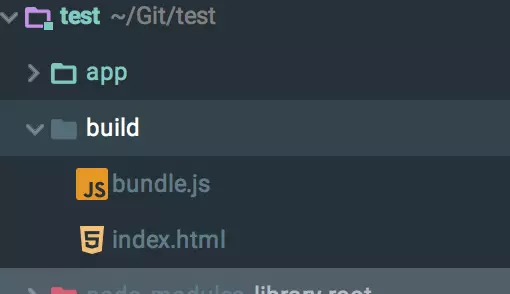

build文件夹

#### Hot Module Replacement

`Hot Module Replacement`（HMR）也是webpack里很有用的一个插件，它允许你在修改组件代码后，自动刷新实时预览修改后的效果。

在webpack中实现HMR也很简单，只需要做两项配置

1. 在webpack配置文件中添加HMR插件；
2. 在Webpack Dev Server中添加“hot”参数；

不过配置完这些后，JS模块其实还是不能自动热加载的，还需要在你的JS模块中执行一个Webpack提供的API才能实现热加载，虽然这个API不难使用，但是如果是React模块，使用我们已经熟悉的Babel可以更方便的实现功能热加载。

整理下我们的思路，具体实现方法如下

- `Babel`和`webpack`是独立的工具
- 二者可以一起工作
- 二者都可以通过插件拓展功能
- HMR是一个webpack插件，它让你能浏览器中实时观察模块修改后的效果，但是如果你想让它工作，需要对模块进行额外的配额；
- Babel有一个叫做`react-transform-hrm`的插件，可以在不对React模块进行额外的配置的前提下让HMR正常工作；

还是继续上例来实际看看如何配置

```js
const webpack = require('webpack');
const HtmlWebpackPlugin = require('html-webpack-plugin');

module.exports = {
    entry: __dirname + "/app/main.js",//已多次提及的唯一入口文件
    output: {
        path: __dirname + "/build",
        filename: "bundle.js"
    },
    devtool: 'eval-source-map',
    devServer: {
        contentBase: "./public",//本地服务器所加载的页面所在的目录
        historyApiFallback: true,//不跳转
        inline: true,
        hot: true
    },
    module: {
        rules: [
            {
                test: /(\.jsx|\.js)$/,
                use: {
                    loader: "babel-loader"
                },
                exclude: /node_modules/
            },
            {
                test: /\.css$/,
                use: [
                    {
                        loader: "style-loader"
                    }, {
                        loader: "css-loader",
                        options: {
                            modules: true
                        }
                    }, {
                        loader: "postcss-loader"
                    }
                ]
            }
        ]
    },
    plugins: [
        new webpack.BannerPlugin('版权所有，翻版必究'),
        new HtmlWebpackPlugin({
            template: __dirname + "/app/index.tmpl.html"//new 一个这个插件的实例，并传入相关的参数
        }),
        new webpack.HotModuleReplacementPlugin()//热加载插件
    ],
};
   
```

安装`react-transform-hmr`

```bash
npm install --save-dev babel-plugin-react-transform react-transform-hmr
```

配置Babel

```js
// .babelrc
{
  "presets": ["react", "env"],
  "env": {
    "development": {
    "plugins": [["react-transform", {
       "transforms": [{
         "transform": "react-transform-hmr",
         
         "imports": ["react"],
         
         "locals": ["module"]
       }]
     }]]
    }
  }
}
```

现在当你使用React时，可以热加载模块了,每次保存就能在浏览器上看到更新内容。

### 产品阶段的构建

目前为止，我们已经使用webpack构建了一个完整的开发环境。但是在产品阶段，可能还需要对打包的文件进行额外的处理，比如说优化，压缩，缓存以及分离CSS和JS。

对于复杂的项目来说，需要复杂的配置，这时候分解配置文件为多个小的文件可以使得事情井井有条，以上面的例子来说，我们创建一个`webpack.production.config.js`的文件，在里面加上基本的配置,它和原始的webpack.config.js很像，如下


```js
// webpack.production.config.js
const webpack = require('webpack');
const HtmlWebpackPlugin = require('html-webpack-plugin');

module.exports = {
    entry: __dirname + "/app/main.js", //已多次提及的唯一入口文件
    output: {
        path: __dirname + "/build",
        filename: "bundle.js"
    },
    devtool: 'null', //注意修改了这里，这能大大压缩我们的打包代码
    devServer: {
        contentBase: "./public", //本地服务器所加载的页面所在的目录
        historyApiFallback: true, //不跳转
        inline: true,
        hot: true
    },
    module: {
        rules: [{
            test: /(\.jsx|\.js)$/,
            use: {
                loader: "babel-loader"
            },
            exclude: /node_modules/
        }, {
            test: /\.css$/,
            use: ExtractTextPlugin.extract({
                fallback: "style-loader",
                use: [{
                    loader: "css-loader",
                    options: {
                        modules: true
                    }
                }, {
                    loader: "postcss-loader"
                }],
            })
        }]
    },
    plugins: [
        new webpack.BannerPlugin('版权所有，翻版必究'),
        new HtmlWebpackPlugin({
            template: __dirname + "/app/index.tmpl.html" //new 一个这个插件的实例，并传入相关的参数
        }),
        new webpack.HotModuleReplacementPlugin() //热加载插件
    ],
};
```


```js
//package.json
{
  "name": "test",
  "version": "1.0.0",
  "description": "",
  "main": "index.js",
  "scripts": {
    "test": "echo \"Error: no test specified\" && exit 1",
    "start": "webpack",
    "server": "webpack-dev-server --open",
    "build": "NODE_ENV=production webpack --config ./webpack.production.config.js --progress"
  },
  "author": "",
  "license": "ISC",
  "devDependencies": {
...
  },
  "dependencies": {
    "react": "^15.6.1",
    "react-dom": "^15.6.1"
  }
}
```

> **注意:**如果是window电脑，`build`需要配置为`"build": "set NODE_ENV=production && webpack --config ./webpack.production.config.js --progress"`.谢谢评论区简友提醒。

#### 优化插件

webpack提供了一些在发布阶段非常有用的优化插件，它们大多来自于webpack社区，可以通过npm安装，通过以下插件可以完成产品发布阶段所需的功能

- `OccurenceOrderPlugin` :为组件分配ID，通过这个插件webpack可以分析和优先考虑使用最多的模块，并为它们分配最小的ID
- `UglifyJsPlugin`：压缩JS代码；
- `ExtractTextPlugin`：分离CSS和JS文件

**我们继续用例子来看看如何添加它们，OccurenceOrder 和 UglifyJS plugins 都是内置插件，你需要做的只是安装其它非内置插件**

```bash
npm install --save-dev extract-text-webpack-plugin
```

在配置文件的plugins后引用它们

```js
// webpack.production.config.js
const webpack = require('webpack');
const HtmlWebpackPlugin = require('html-webpack-plugin');
const ExtractTextPlugin = require('extract-text-webpack-plugin');

module.exports = {
    entry: __dirname + "/app/main.js",//已多次提及的唯一入口文件
    output: {
        path: __dirname + "/build",
        filename: "bundle.js"
    },
    devtool: 'none',
    devServer: {
        contentBase: "./public",//本地服务器所加载的页面所在的目录
        historyApiFallback: true,//不跳转
        inline: true,
        hot: true
    },
    module: {
        rules: [
            {
                test: /(\.jsx|\.js)$/,
                use: {
                    loader: "babel-loader"
                },
                exclude: /node_modules/
            },
            {
                test: /\.css$/,
                use: [
                    {
                        loader: "style-loader"
                    }, {
                        loader: "css-loader",
                        options: {
                            modules: true
                        }
                    }, {
                        loader: "postcss-loader"
                    }
                ]
            }
        ]
    },
    plugins: [
        new webpack.BannerPlugin('版权所有，翻版必究'),
        new HtmlWebpackPlugin({
            template: __dirname + "/app/index.tmpl.html"
        }),
        new webpack.optimize.OccurrenceOrderPlugin(),
        new webpack.optimize.UglifyJsPlugin(),
        new ExtractTextPlugin("style.css")
    ],
};
```

此时执行`npm run build`可以看见代码是被压缩后的

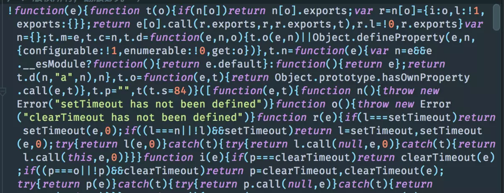

压缩后的代码

#### 缓存 hash

缓存无处不在，使用缓存的最好方法是保证你的文件名和文件内容是匹配的（内容改变，名称相应改变）

webpack可以把一个哈希值添加到打包的文件名中，使用方法如下,添加特殊的字符串混合体（[name], [id] and [hash]）到输出文件名前

我们都知道，webpack有各种hash值，包括每次项目构建`hash`，不同入口的`chunkhash`、文件的内容`contenthash`，这么多hash，它们有什么区别呢？

hash

hash是跟整个webpack构建项目相关的，每次项目构建hash对应的值都是不同的，即使项目文件没有做**“任何修改”**。

> 其实是有修改的，因为每次webpack打包编译都会注入webpack的运行时代码，导致整个项目有变化，所以每次hash值都会变化的。

以本人项目代码为例，代码两次构建前后没有做任何修改的对比图

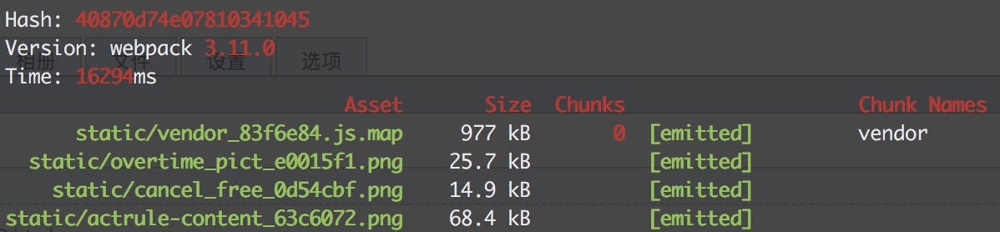

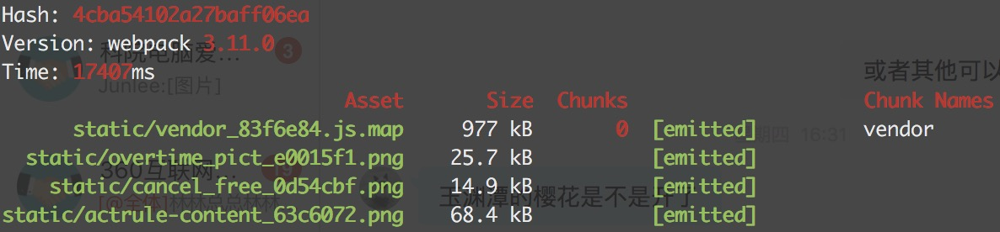

可以看出，前后两次对应项目构建hash改变了。由此推断使用该方式是无法达到缓存的，因为每次hash都会变化。

#### chunkhash

chunkhash，从字面上就能猜出它是跟webpack打包的chunk相关的。具体来说webpack是根据入口entry配置文件来分析其依赖项并由此来构建该entry的chunk，并生成对应的hash值。不同的chunk会有不同的hash值。一般在项目中把公共的依赖库和程序入口文件隔离并进行单独打包构建，用chunkhash来生成hash值，只要依赖公共库不变，那么其对应的chunkhash就不会变，从而达到缓存的目的。

一般在项目中对webpack的entry使用chunkhash，具体表现在output配置项上：

```javascript
moudule.exports = {
  entry: {
   app: './src/main.js',
   vendor: ['react', 'redux', 'react-dom', 'react-redux', 'react-router-redux']
  },
  output: {
    path:path.join(__dirname, '/dist/js'),
    filename: '[name].[chunkhash].js'
  }
 ...
}
```

最后**app**和**vendor**的chunkhash编译结果如下图

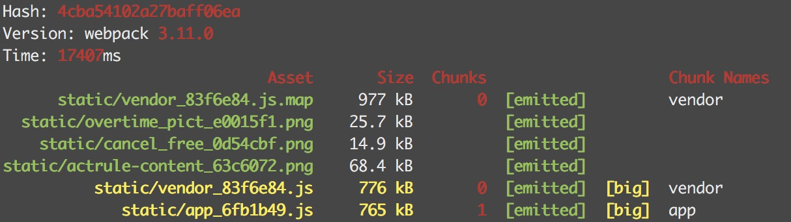

#### contenthash

contenthash表示由文件内容产生的hash值，内容不同产生的contenthash值也不一样。在项目中，通常做法是把项目中css都抽离出对应的css文件来加以引用。比方在webpack配置这样来用：

```javascript
module.exports = {
  ...
  plugins: [
     new ExtractTextPlugin({
	filename: 'static/[name]_[chunkhash:7].css',
	disable: false,
	allChunks: true
     })
  ...
  ]
```

上面配置有一个问题，因为使用了chunkhash，它与依赖它的chunk共用chunkhash。

比方在上面app chunk例子中依赖一个index.css文件，index.css的hash是跟着app的chunkhash走的，只要app文件变更的话，那么即使index.css文件没有变化，它的hash值也是会跟着变化的，导致缓存失效。

那么这时我们可以使用extra-text-webpack-plugin里的`contenthash`值，保证即使css文件所处的模块里就算其他文件内容改变，只要css文件内容不变，它的hash值就不会变。

```js
const webpack = require('webpack');
const HtmlWebpackPlugin = require('html-webpack-plugin');
const ExtractTextPlugin = require('extract-text-webpack-plugin');

module.exports = {
..
    output: {
        path: __dirname + "/build",
        filename: "bundle-[hash].js"
    },
   ...
};
```

现在用户会有合理的缓存了。

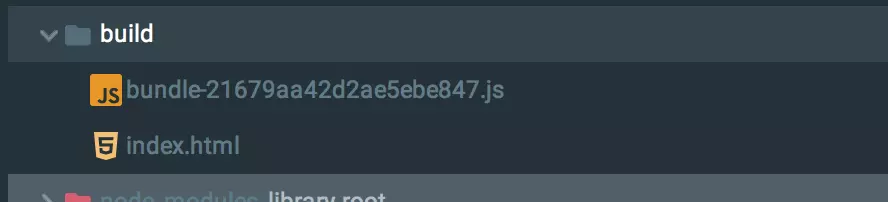

带hash值的js名

#### *实现js缓存 CommonsChunkPlugin

webpack插件`CommonsChunkPlugin`的主要作用是抽取webpack项目入口**chunk**的公共部分，具体的用法就不做过多介绍，不太了解可以参考[webpack官网](https://webpack.js.org/plugins/commons-chunk-plugin/)介绍；

该插件是webpack项目常用的一个优化功能，几乎在每个webpack项目中都会用到。使用该插件带来的好处：

- **提升webpack打包速度和项目体积**：将webpack入口的chunk文件中所有公共的代码提取出来，减少代码体积；同时提升webpack打包速度。
- **利用缓存机制**：依赖的公共模块文件一般很少更改或者不会更改，这样独立模块文件提取出可以长期缓存。

但是在项目中，若插件打开方式不正确的话，上面的第二点其实是无法实现，因为这种情况下：

> 没有被修改过的公有代码或库代码打包出的Entry Chunk，会随着其他业务代码的变化而变化，导致页面上的长缓存机制失效。

那么，下面就来开启`CommonsChunkPlugin`正确的打开方式。

##### CommonsChunkPlugin不正确用法

假如将我们项目的公共库如react、react-dom、react-router与业务代码隔离，将其提取为vendor chunk，webpack配置如下：

```javascript
const webpack = require("webpack");
const path = require('path');
module.exports = {
  entry: {
    app: "./src/main.js",
    vendor: ["react","react-dom", "redux", "react-redux", "react-router-redux"]
  },
  output: {
    path: path.resolve(__dirname, 'output'),
    filename: "[name].[chunkhash].js"
  },
  plugins: [
    new webpack.optimize.CommonsChunkPlugin({names: ["vendor"]})
  ]
};
```

上面将项目一些基础库打包成一个名为**vendor**的chunk中，并将业务相关的代码打包到一个名为app的chunk中；

webpack打包编译后的结果如下：


我们对其中的业务代码app.js进行修改后，重新编译结果如下：


可以发现，在CommonsChunkPlugin这种配置下，当业务代码app发生变化，而库代码也跟着变化，vender的chunkhash也跟着变化，这样vendor的引用的名称跟着变化，导致浏览器端的长缓存机制失效。

##### 引起问题的原因

引起webpack每次打包编译时vendor跟着变化的原因：

> webpack每次build的时候都会生成一些运行时代码。当只有一个文件时，运行时代码直接塞到这个文件中。当有多个文件时，运行时代码会被提取到公共文件中，也就是上面CommonsChunkPlugin配置的vendor chunk中。

webpack每次编译时产生的运行时代码，包括全局**webpackJsonp**方法的定义和维护模块依赖关系，具体可以参考[这里>>](https://gist.github.com/blade254353074/4a591d559065383adbdc3946e515158c)。

所以，上面webpack的CommonsChunkPlugin配置中，每次编译时这些代码都会打包到vendor中，导致每次vendor的**chunkhash**每次都会变化。

那么，我们可以在对vendor chunk进行配置，抽取其中的公共代码，即webpack运行时代码，这样就可以将项目依赖的基础库模块与业务模块隔离开来，因为不会对这些文件进行修改，所以这些文件可达到长缓存的作用。具体配置如下：

```javascript
module.exports = {
  entry: {
    app: "./app.js",
    vendor: ["react","react-dom", "redux", "react-redux", "react-router-redux"]
  },
  ....
  plugins: [
    new webpack.optimize.CommonsChunkPlugin({names: ["vendor"]}),
    new webpack.optimize.CommonsChunkPlugin({
        name: 'manifest',
        chunks: ['vendor']
    })
  ]
};
```

这样，即使修改业务app代码，项目依赖的基础库vendor chunk也不会发生变化；只是抽取的manifest chunk每次还会变化，但是这个文件体积非常小，相比vendor来说这种方式的收益更大。如下图：


修改app代码后的打包编译结果如下，可以看到vendor的chunkhash没有变化


**在webpack中配置CommonsChunkPlugin时需要注意几点：**

> 1、 配置webpack的output项时，其`filename`和`chunkFilename`必须使用**chunkhash**。不要使用**hash**，否则即使按照上面的配置也不能达到预期的效果。至于hash与chunkhash的区别，可参考[github的回答](https://github.com/webpack-contrib/extract-text-webpack-plugin/issues/153#issuecomment-225017219)

> 2、对于图片、字体等静态资源抽离使用的`file-loader`，其配置的**hash**表示的是静态文件的内容[hash](https://doc.webpack-china.org/loaders/file-loader/#placeholders)值，不是webpack每次打包编译生成的hash值, **切记！！！**

> 3、对于抽取的css样式文件，需要使用[`contenthash`](https://github.com/webpack-contrib/extract-text-webpack-plugin), 与`file-loader`中的**hash**意义相同。此处不能为chunkhash，否则其与抽取该样式文件的entry chunk的chunkhash保持一致，打不到缓存的目的。

#### 实现css的缓存

webpack实现css的缓存，就是使用上面介绍过的contenthash，该hash属性值其实是`extra-text-webpack-plugin`计算的。具体实现css的缓存，其实就像下面一样使用contenthash即可

```javascript
module.exports = {
  ...
  plugins: [
     new ExtractTextPlugin({
	filename: 'static/[name]_[contenthash:7].css',
	disable: false,
	allChunks: true
     })
  ...
  ]
```

#### 实现图片/字体的缓存

对于图片、字体等静态资源，在使用webpack构建提取时，其实是使用了`file-loader`来完成的，生成对应的文件hash值也就是由对应的`file-loader`来计算的。那么这些静态文件的hash值使用的是什么hash值呢，其实就是`hash`属性值。如下面代码所示：

```javascript
module.exports = {
 ...
 rules: [
   ...
    {
      test: /\.(gif|png|jpe?g)(\?\S*)?$/,
      loader: require.resolve('url-loader'),
      options: {
        limit: 10000,
        name: path.posix.join('static',  '[name]_[hash:7].[ext]')
      }
    },
    font: {
      test: /\.otf|ttf|woff2?|eot(\?\S*)?$/,
      loader: require.resolve('url-loader'),
      options: {
        limit: 10000,
        name: path.posix.join('static', '[name]_[hash:7].[ext]')
      }
    }
 ]
}
```

可以看到上面使用的是**hash**属性值，此hash非webpack每次项目构建的hash，它是由file-loader根据文件内容计算出来的，不要误认为是webpack构建的hash。


**1、核心概念**

（1）entry：一个可执行模块或者库的入口。

（2）chunk：多个文件组成一个代码块。可以将可执行的模块和他所依赖的模块组合成一个chunk，这是打包。

（3）loader：文件转换器。例如把es6转为es5，scss转为css等,webpack 默认只能打包Js类型的文件,如果想要打包处理css 文件 需要安装 cnpm i style-loader css-loader -D

（4）plugin：扩展webpack功能的插件。在webpack构建的生命周期节点上加入扩展hook，添加功能。

（5）babel:在 webpack 中，默认只能处理 一部分 ES6 的新语法，一些更高级的ES6语法或者 ES7 语法，webpack 是处理不了的；这时候，就需要 借助于第三方的 loader，来帮助webpack 处理这些高级的语法，当第三方loader 把 高级语法转为 低级的语法之后，会把结果交给 webpack 去打包到 bundle.js 中


首先不要被webpack做的复杂花哨的工作所迷惑，到底webpack是个啥？一句话，webpack是一个module bundler(模块打包器)。多一句话，webpack通过将多个js文件或者其他assets整合进一个大的bundle.js文件中，允许我们在浏览器中使用javascript module功能。而所有类似翻译es6/es7为es5，或者使用css module功能仅仅为webpack提供的一些额外功能。但是我们永远不要忘记其核心功能：**一个允许在浏览器中使用js模块的打包器**。

# 1.基本概念

以下，罗列了整个webpack生态系统中常用的术语。

**A**

- Asset: 这个术语主要是用来描述我们通常在web应用或者其他应用中用到的图片、字体文件、音视频，以及其他类型的一些文件。这些资源通常为一个个单独的文件，但在webpack中，我们借助style-loader或者css-loader也能进行适当的管理。

**B**

- Bundle: bundle通常是由多个不同的模块产生，它是已经加载完毕和被编译后的源代码的最终版本。
- Bundle Splitting: 这是webpack优化代码的一种方法，即将一个单独的应用拆解为多个bundle。通过将多个bundle中公共引入的模块拆解出来，我们可以减少项目的代码量，从而减小应用的体积，并且通过浏览器缓存，我们可以将代码进一步优化。

**C**

- Chunk: 这个webpack中专用的术语用于管理webpack内部的打包进程。bundle由许多chunk组成，chunk有几种类型，比如说“入口”和“子块”。通常chunk和输出的bundle一一对应，但是，有些是一对多的关系。
- Code Splitting: 它表示将你的代码拆分成多个bundle或chunk，之后你可以按需加载它们，而不是简单地加载一个单独的文件。
- Configration: webpack的配置文件是一段非常普通的javascript代码，它会输出一个对象，然后webpack将会基于对象中的每个属性开始运行。

**D**

- Dependency Graph: 只要一个文件依赖另一个文件才能有所作为，webpack把这个文件定义为依赖项。webpack会从一个入口点开始，通过递归的方式构建出一个依赖关系图，这里面包括每一个被拆分的小模块，每一个asset。

**E**

- Entry Point: 入口点告诉webpack从哪里开始解析，根据构建出来的依赖关系图，从而知道哪些部分将会输出为bundle。

**H**

- Hot Module Replacement (HMR): 即热更新，当项目在运行时发生变更、文件新增、文件删除时，整个项目无需全部全局加载。

**L**

- Loaders: 应用于项目模块源代码的转换，它将按需对文件进行预处理或“加载”。它类似于一个“task-runner”。

**M**

- Module: 相比于一个完整的项目，项目中分散的一个个功能性模块能够提供一个对于程序员来说更加专注的视角。一个编写良好的模块能够形成一个很清晰的抽象结构，保证之后的维护基于此能够变得规范化和开发具有明确性。
- Module Resolution（模块解析）: 一个模块可以作为另一个模块的依赖项，即在另一个模块中通过import或者require的方式进行引入。模块解析器是一个代码库，通过这个代码库对引入的模块进行解析。我们可以在resolve.modules自定义设置自己的解析路径，以更好地方便个人脚本在项目中的引入，比如如下代码：

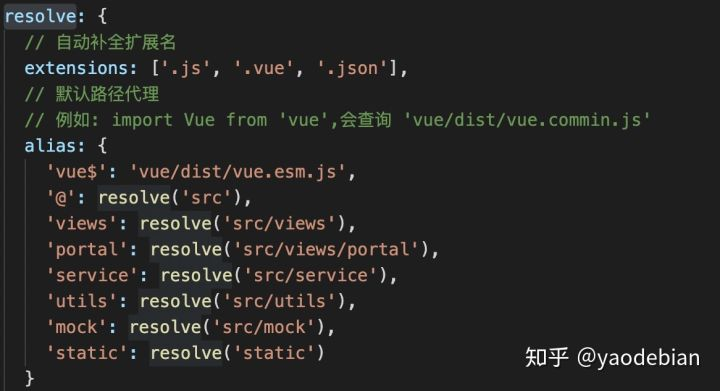


**O**

- Output: 指定输出编译后代码的位置。

注意：即使指定了多个入口点（entry points），Ouput配置项也只能设置一个。

**P**

- Plugin: 一个具有apply属性的javascript对象。apply属性通过webpack编译器被调用，以访问整个整个编译生命周期。这些Plugins通常以一种或另一种方式扩展webpack的编译功能。

**T**

- Target: 该配置用于指定项目的运行环境（browser、nodejs、electron等），以使webpack编译器以不同的方式进行编译。
- TreeShaking: 消除未使用/多余的代码，或更准确地说，是实时代码导入。webpack编译器通过分析代码中使用的import语句、引入的代码块的使用情况来判断哪些依赖部分被使用，以及哪些依赖部分没有被使用需要丢弃掉

# webpack优化

## 13、优化总结

#### 侧重优化开发体验的配置文件 webpack.config.js：

```js
const path = require('path');
const CommonsChunkPlugin = require('webpack/lib/optimize/CommonsChunkPlugin');
const {AutoWebPlugin} = require('web-webpack-plugin');
const HappyPack = require('happypack');
// 自动寻找 pages 目录下的所有目录，把每一个目录看成一个单页应用
const autoWebPlugin = new AutoWebPlugin('./src/pages', {
  // HTML 模版文件所在的文件路径
  template: './template.html',
  // 提取出所有页面公共的代码
  commonsChunk: {
    // 提取出公共代码 Chunk 的名称
    name: 'common',
  },
});
module.exports = {
  // AutoWebPlugin 会找为寻找到的所有单页应用，生成对应的入口配置，
  // autoWebPlugin.entry 方法可以获取到生成入口配置
  entry: autoWebPlugin.entry({
    // 这里可以加入你额外需要的 Chunk 入口
    base: './src/base.js',
  }),
  output: {
    filename: '[name].js',
  },
  resolve: {
    // 使用绝对路径指明第三方模块存放的位置，以减少搜索步骤
    // 其中 __dirname 表示当前工作目录，也就是项目根目录
    modules: [path.resolve(__dirname, 'node_modules')],
    // 针对 Npm 中的第三方模块优先采用 jsnext:main 中指向的 ES6 模块化语法的文件，使用 Tree Shaking 优化
    // 只采用 main 字段作为入口文件描述字段，以减少搜索步骤
    mainFields: ['jsnext:main', 'main'],
  },
  module: {
    rules: [
      {
        // 如果项目源码中只有 js 文件就不要写成 /\.jsx?$/，提升正则表达式性能
        test: /\.js$/,
        // 使用 HappyPack 加速构建
        use: ['happypack/loader?id=babel'],
        // 只对项目根目录下的 src 目录中的文件采用 babel-loader
        include: path.resolve(__dirname, 'src'),
      },
      {
        test: /\.js$/,
        use: ['happypack/loader?id=ui-component'],
        include: path.resolve(__dirname, 'src'),
      },
      {
        // 增加对 CSS 文件的支持
        test: /\.css$/,
        use: ['happypack/loader?id=css'],
      },
    ]
  },
  plugins: [
    autoWebPlugin,
    // 使用 HappyPack 加速构建
    new HappyPack({
      id: 'babel',
      // babel-loader 支持缓存转换出的结果，通过 cacheDirectory 选项开启
      loaders: ['babel-loader?cacheDirectory'],
    }),
    new HappyPack({
      // UI 组件加载拆分
      id: 'ui-component',
      loaders: [{
        loader: 'ui-component-loader',
        options: {
          lib: 'antd',
          style: 'style/index.css',
          camel2: '-'
        }
      }],
    }),
    new HappyPack({
      id: 'css',
      // 如何处理 .css 文件，用法和 Loader 配置中一样
      loaders: ['style-loader', 'css-loader'],
    }),
    // 4-11提取公共代码
    new CommonsChunkPlugin({
      // 从 common 和 base 两个现成的 Chunk 中提取公共的部分
      chunks: ['common', 'base'],
      // 把公共的部分放到 base 中
      name: 'base'
    }),
  ],
  watchOptions: {
    // 4-5使用自动刷新：不监听的 node_modules 目录下的文件
    ignored: /node_modules/,
  }
};
```


 


#### 侧重优化输出质量的配置文件 webpack-dist.config.js：


```js
const path = require('path');
const DefinePlugin = require('webpack/lib/DefinePlugin');
const ModuleConcatenationPlugin = require('webpack/lib/optimize/ModuleConcatenationPlugin');
const CommonsChunkPlugin = require('webpack/lib/optimize/CommonsChunkPlugin');
const ExtractTextPlugin = require('extract-text-webpack-plugin');
const {AutoWebPlugin} = require('web-webpack-plugin');
const HappyPack = require('happypack');
const ParallelUglifyPlugin = require('webpack-parallel-uglify-plugin');
// 自动寻找 pages 目录下的所有目录，把每一个目录看成一个单页应用
const autoWebPlugin = new AutoWebPlugin('./src/pages', {
  // HTML 模版文件所在的文件路径
  template: './template.html',
  // 提取出所有页面公共的代码
  commonsChunk: {
    // 提取出公共代码 Chunk 的名称
    name: 'common',
  },
  // 指定存放 CSS 文件的 CDN 目录 URL
  stylePublicPath: '//css.cdn.com/id/',
});
module.exports = {
  // AutoWebPlugin 会找为寻找到的所有单页应用，生成对应的入口配置，
  // autoWebPlugin.entry 方法可以获取到生成入口配置
  entry: autoWebPlugin.entry({
    // 这里可以加入你额外需要的 Chunk 入口
    base: './src/base.js',
  }),
  output: {
    // 给输出的文件名称加上 Hash 值
    filename: '[name]_[chunkhash:8].js',
    path: path.resolve(__dirname, './dist'),
    // 指定存放 JavaScript 文件的 CDN 目录 URL
    publicPath: '//js.cdn.com/id/',
  },
  resolve: {
    // 使用绝对路径指明第三方模块存放的位置，以减少搜索步骤
    // 其中 __dirname 表示当前工作目录，也就是项目根目录
    modules: [path.resolve(__dirname, 'node_modules')],
    // 只采用 main 字段作为入口文件描述字段，以减少搜索步骤
    mainFields: ['jsnext:main', 'main'],
  },
  module: {
    rules: [
      {
        // 如果项目源码中只有 js 文件就不要写成 /\.jsx?$/，提升正则表达式性能
        test: /\.js$/,
        // 使用 HappyPack 加速构建
        use: ['happypack/loader?id=babel'],
        // 只对项目根目录下的 src 目录中的文件采用 babel-loader
        include: path.resolve(__dirname, 'src'),
      },
      {
        test: /\.js$/,
        use: ['happypack/loader?id=ui-component'],
        include: path.resolve(__dirname, 'src'),
      },
      {
        // 增加对 CSS 文件的支持
        test: /\.css$/,
        // 提取出 Chunk 中的 CSS 代码到单独的文件中
        use: ExtractTextPlugin.extract({
          use: ['happypack/loader?id=css'],
          // 指定存放 CSS 中导入的资源（例如图片）的 CDN 目录 URL
          publicPath: '//img.cdn.com/id/'
        }),
      },
    ]
  },
  plugins: [
    autoWebPlugin,
    // 4-14开启ScopeHoisting
    new ModuleConcatenationPlugin(),
    // 4-3使用HappyPack
    new HappyPack({
      // 用唯一的标识符 id 来代表当前的 HappyPack 是用来处理一类特定的文件
      id: 'babel',
      // babel-loader 支持缓存转换出的结果，通过 cacheDirectory 选项开启
      loaders: ['babel-loader?cacheDirectory'],
    }),
    new HappyPack({
      // UI 组件加载拆分
      id: 'ui-component',
      loaders: [{
        loader: 'ui-component-loader',
        options: {
          lib: 'antd',
          style: 'style/index.css',
          camel2: '-'
        }
      }],
    }),
    new HappyPack({
      id: 'css',
      // 如何处理 .css 文件，用法和 Loader 配置中一样
      // 通过 minimize 选项压缩 CSS 代码
      loaders: ['css-loader?minimize'],
    }),
    new ExtractTextPlugin({
      // 给输出的 CSS 文件名称加上 Hash 值
      filename: `[name]_[contenthash:8].css`,
    }),
    // 4-11提取公共代码
    new CommonsChunkPlugin({
      // 从 common 和 base 两个现成的 Chunk 中提取公共的部分
      chunks: ['common', 'base'],
      // 把公共的部分放到 base 中
      name: 'base'
    }),
    new DefinePlugin({
      // 定义 NODE_ENV 环境变量为 production 去除 react 代码中的开发时才需要的部分
      'process.env': {
        NODE_ENV: JSON.stringify('production')
      }
    }),
    // 使用 ParallelUglifyPlugin 并行压缩输出的 JS 代码
    new ParallelUglifyPlugin({
      // 传递给 UglifyJS 的参数
      uglifyJS: {
        output: {
          // 最紧凑的输出
          beautify: false,
          // 删除所有的注释
          comments: false,
        },
        compress: {
          // 在UglifyJs删除没有用到的代码时不输出警告
          warnings: false,
          // 删除所有的 `console` 语句，可以兼容ie浏览器
          drop_console: true,
          // 内嵌定义了但是只用到一次的变量
          collapse_vars: true,
          // 提取出出现多次但是没有定义成变量去引用的静态值
          reduce_vars: true,
        }
      },
    }),
  ]
};
```


 

## 缩小文件搜索的范围

尽量精确使用 include 只命中需要的文件。

```js
   module.exports = {
    module: {
     rules: [
      {
       // 如果项目源码中只有 js 文件就不要写成 /\.jsx?$/，提升正则表达式性能
       test: /\.js$/,
       // babel-loader 支持缓存转换出的结果，通过 cacheDirectory 选项开启
       use: ['babel-loader?cacheDirectory'],
       // 只对项目根目录下的 src 目录中的文件采用 babel-loader
       include: path.resolve(__dirname, 'src'),
      },
     ]
    },
   };
```

## 优化 resolve配置

Webpack 在启动后会从配置的入口模块出发找出所有依赖的模块，Resolve 配置 Webpack 如何寻找模块所对应的文件。 Webpack 内置 JavaScript 模块化语法解析功能，默认会采用模块化标准里约定好的规则去寻找，但你也可以根据自己的需要修改默认的规则。

  如果能明确第三方模块是在本项目下，那么避免递归向上查询。

```js
   module.exports = {
    resolve: {
     // 使用绝对路径指明第三方模块存放的位置，以减少搜索步骤
     // 其中 __dirname 表示当前工作目录，也就是项目根目录
     modules: [path.resolve(__dirname, 'node_modules')]
    },
   };   
```

  如果能明确第三方入口文件 描述字段，尽可能设置的少，
   由于大多数第三方模块都采用 main 字段去描述入口文件的位置，可以这样配置 Webpack：

```
   module.exports = {
    resolve: {
     // 只采用 main 字段作为入口文件描述字段，以减少搜索步骤
     mainFields: ['main'],
    },
   }
```

### resolve.alias 

 对于一些完整性较强的库采用直接 定义路径 配置。如 react 库，vue库等。

```
   module.exports = {
 resolve: {
  // 使用 alias 把导入 react 的语句换成直接使用单独完整的 react.min.js 文件，
  // 减少耗时的递归解析操作
  alias: {
   'react': path.resolve(__dirname, './node_modules/react/dist/react.min.js'),
  }
 },
};
```

### resolve.extension 

 代码书写时，尽量带上文件后缀。该项列表尽可能短，且高频的放在最前面，不可能的情况不要写。

```js
   module.exports = {
    resolve: {
     // 尽可能的减少后缀尝试的可能性
     extensions: ['.ts', '.js', '.json'],
    },
   };   
```

###   module.noParse对没有采用模块化的文件 直接进行忽略设置，如 jQuery 、ChartJS

```js
   const path = require('path');

   module.exports = {
    module: {
     // 独完整的 `react.min.js` 文件就没有采用模块化，忽略对 `react.min.js` 文件的递归解析处理
     noParse: [/react\.min\.js$/],
    },
   };   
```

## 提取公共代码

使用场景：
多个页面时，每个页面都是一个独立的单页应用。会有很多相同资源 被重复加载。
如何提取：
1、多页面使用的技术栈一致的，此时将 基础库和 基础样式提取 作为基础库文件：base.js。
以react 举例，所有页面会依赖 react、react-dom等库。
2、与业务相关的 通用js 可提取到 业务基础文件：common.js。

场景：
作为基础库文件，基本不会变动；业务基础文件 可能变动性稍微大一些，做到了 最优缓存。

webpck实现
所用插件：
CommonsChunkPlugin   

webpack4 里用他俩替代
   optimization.splitChunks and optimization.runtimeChunk)

   

示例-common提取：

```js
const CommonsChunkPlugin = require('webpack/lib/optimize/CommonsChunkPlugin');
new CommonsChunkPlugin({
 // 从哪些 Chunk 中提取
 chunks: ['a', 'b'],
 // 提取出的公共部分形成一个新的 Chunk，这个新 Chunk 的名称
 name: 'common'
})
```

示例-base提取：
   base.js

```js
// 所有页面都依赖的基础库
import 'react';
import 'react-dom';
// 所有页面都使用的样式
import './base.css';
```

   base配置

```js
module.exports = {
 entry: {
  base: './base.js'
 },
};

   从common中提取base
new CommonsChunkPlugin({
 // 从 common 和 base 两个现成的 Chunk 中提取公共的部分
 chunks: ['common', 'base'],
 // 把公共的部分放到 base 中
 name: 'base'
})
```

示例-引用：

```
<script src="base.js"></script>
<script src="common.js"></script>
<script src="a.js"></script>
```

其他情形：
除了基础库 内容，一些常用内容提取到 common.js 里。用到了 插件选项
minChunks：指定的代码块中出现的最小次数。
假如 minChunks=2、chunks=['a','b','c','d']，任何一个文件只要在 ['a','b','c','d'] 中任意两个以上的 Chunk 中都出现过，这个文件就会被提取出来


## 压缩代码

压缩js：
最优配置如下（1版本可用）

```
const UglifyJSPlugin = require('webpack/lib/optimize/UglifyJsPlugin');

module.exports = {
 plugins: [
  // 压缩输出的 JS 代码
  new UglifyJSPlugin({
   compress: {
    // 在UglifyJs删除没有用到的代码时不输出警告
    warnings: false,
    // 删除所有的 `console` 语句，可以兼容ie浏览器
    drop_console: true,
    // 内嵌定义了但是只用到一次的变量
    collapse_vars: true,
    // 提取出出现多次但是没有定义成变量去引用的静态值
    reduce_vars: true,
   },
   output: {
    // 最紧凑的输出
    beautify: false,
    // 删除所有的注释
    comments: false,
   }
  }),
 ],
};
```

注意事项：
uglifyjsplugin 插件版本不一致，可能配置项也不一样，注意区分。目前有1和2。vue-cli 目前依赖的是 1 版本。

注意事项：
uglifyjsplugin 插件版本不一致，可能配置项也不一样，注意区分。目前有1和2。vue-cli 目前依赖的是 1 版本。

压缩ES6:
npm i -D uglifyjs-webpack-plugin@beta

场景：
支持es6环境的系统。如最新版Chrome等。暂时用处不大。

```
const UglifyESPlugin = require('uglifyjs-webpack-plugin')

module.exports = {
 plugins: [
  new UglifyESPlugin({
   // 多嵌套了一层
   uglifyOptions: {
    compress: {
     // 在UglifyJs删除没有用到的代码时不输出警告
     warnings: false,
     // 删除所有的 `console` 语句，可以兼容ie浏览器
     drop_console: true,
     // 内嵌定义了但是只用到一次的变量
     collapse_vars: true,
     // 提取出出现多次但是没有定义成变量去引用的静态值
     reduce_vars: true,
    },
    output: {
     // 最紧凑的输出
     beautify: false,
     // 删除所有的注释
     comments: false,
    }
   }
  })
 ]
}
```

压缩css：
css-loader 选项 minimize 支持压缩。可用性 待测试

```
use: ['css-loader?minimize']
```

## 使用DLLPlugin插件--对于一些大量复用的基础模块，只编译一次

使用动态链接库：对于一些大量复用的基础模块，只编译一次，放置到 动态链接库里。常用于包含第三方模块，如 react、react-dom。
涉及问题：
打包成动态链接库；如何使用。
涉及插件：
• DllPlugin 插件：用于打包出一个个单独的动态链接库文件。
• DllReferencePlugin 插件：用于在主要配置文件中去引入 DllPlugin 插件打包好的动态链接库文件

构建：
构建输出的以下这四个文件
├── polyfill.dll.js
├── polyfill.manifest.json
├── react.dll.js
└── react.manifest.json
和以下这一个文件
├── main.js
是由两份不同的构建分别输出的。
动态链接库文件相关的文件需要由一份独立的构建输出，用于给主构建使用。新建一个 Webpack 配置文件 webpack_dll.config.js 专门用于构建它们，文件内容如下：

```js
const path = require('path');
const DllPlugin = require('webpack/lib/DllPlugin');
module.exports = {
 // JS 执行入口文件
 entry: {
  // 把 React 相关模块的放到一个单独的动态链接库
  react: ['react', 'react-dom'],
  // 把项目需要所有的 polyfill 放到一个单独的动态链接库
  polyfill: ['core-js/fn/object/assign', 'core-js/fn/promise', 'whatwg-fetch'],
 },
 output: {
  // 输出的动态链接库的文件名称，[name] 代表当前动态链接库的名称，
  // 也就是 entry 中配置的 react 和 polyfill
  filename: '[name].dll.js',
  // 输出的文件都放到 dist 目录下
  path: path.resolve(__dirname, 'dist'),
  // 存放动态链接库的全局变量名称，例如对应 react 来说就是 _dll_react
  // 之所以在前面加上 _dll_ 是为了防止全局变量冲突
  library: '_dll_[name]',
 },
 plugins: [
  // 接入 DllPlugin
  new DllPlugin({
   // 动态链接库的全局变量名称，需要和 output.library 中保持一致
   // 该字段的值也就是输出的 manifest.json 文件 中 name 字段的值
   // 例如 react.manifest.json 中就有 "name": "_dll_react"
   name: '_dll_[name]',
   // 描述动态链接库的 manifest.json 文件输出时的文件名称
   path: path.join(__dirname, 'dist', '[name].manifest.json'),
  }),
 ],
};
```

使用动态链接库文件

使用动态链接库文件

构建出的动态链接库文件用于给其它地方使用，在这里也就是给执行入口使用。

用于输出 main.js 的主 Webpack 配置文件内容如下：

```js
const path = require('path');
const DllReferencePlugin = require('webpack/lib/DllReferencePlugin');

module.exports = {
 entry: {
  // 定义入口 Chunk
  main: './main.js'
 },
 output: {
  // 输出文件的名称
  filename: '[name].js',
  // 输出文件都放到 dist 目录下
  path: path.resolve(__dirname, 'dist'),
 },
 module: {
  rules: [
   {
    // 项目源码使用了 ES6 和 JSX 语法，需要使用 babel-loader 转换
    test: /\.js$/,
    use: ['babel-loader'],
    exclude: path.resolve(__dirname, 'node_modules'),
   },
  ]
 },
 plugins: [
  // 告诉 Webpack 使用了哪些动态链接库
  new DllReferencePlugin({
   // 描述 react 动态链接库的文件内容
   manifest: require('./dist/react.manifest.json'),
  }),
  new DllReferencePlugin({
   // 描述 polyfill 动态链接库的文件内容
   manifest: require('./dist/polyfill.manifest.json'),
  }),
 ],
 devtool: 'source-map'
};
```

  注意：在 webpack_dll.config.js 文件中，DllPlugin 中的 name 参数必须和 output.library 中保持一致。 原因在于 DllPlugin 中的 name 参数会影响输出的 manifest.json 文件中 name 字段的值， 而在 webpack.config.js 文件中 DllReferencePlugin 会去 manifest.json 文件读取 name 字段的值， 把值的内容作为在从全局变量中获取动态链接库中内容时的全局变量名。

执行构建

在修改好以上两个 Webpack 配置文件后，需要重新执行构建。 重新执行构建时要注意的是需要先把动态链接库相关的文件编译出来，因为主 Webpack 配置文件中定义的 DllReferencePlugin 依赖这些文件。

执行构建时流程如下：

  如果动态链接库相关的文件还没有编译出来，就需要先把它们编译出来。方法是执行 webpack --config webpack_dll.config.js 命令。
  在确保动态链接库存在时，才能正常的编译出入口执行文件。方法是执行 webpack 命令。这时你会发现构建速度有了非常大的提升。

## 3、happyPack 插件 多进程 进行文件转换

使用多进程 进行文件转换操作，提高转换效率。
场景：
文件特别多，时长不能忍时，尝试。普通项目效果不明显。

涉及插件：
HappyPack。
npm i -D happypack

分解工作 和 管理工作由插件负责
实例：

```js
const path = require('path');
const ExtractTextPlugin = require('extract-text-webpack-plugin');
const HappyPack = require('happypack');
module.exports = {
  module: {
    rules: [
      {
        test: /\.js$/,
        // 把对 .js 文件的处理转交给 id 为 babel 的 HappyPack 实例
        use: ['happypack/loader?id=babel'],
        // 排除 node_modules 目录下的文件，node_modules 目录下的文件都是采用的 ES5 语法，没必要再通过 Babel 去转换
        exclude: path.resolve(__dirname, 'node_modules'),
      },
      {
        // 把对 .css 文件的处理转交给 id 为 css 的 HappyPack 实例
        test: /\.css$/,
        use: ExtractTextPlugin.extract({
          use: ['happypack/loader?id=css'],
        }),
      },
    ]
  },
  plugins: [
    new HappyPack({
      // 用唯一的标识符 id 来代表当前的 HappyPack 是用来处理一类特定的文件
      id: 'babel',
      // 如何处理 .js 文件，用法和 Loader 配置中一样
      loaders: ['babel-loader?cacheDirectory'],
      // ... 其它配置项
    }),
    new HappyPack({
      id: 'css',
      // 如何处理 .css 文件，用法和 Loader 配置中一样
      loaders: ['css-loader'],
    }),
    new ExtractTextPlugin({
      filename: `[name].css`,
    }),
  ],
};
```

以上代码有两点重要的修改：
   • 在 Loader 配置中，所有文件的处理都交给了 happypack/loader 去处理，使用紧跟其后的 querystring ?id=babel 去告诉 happypack/loader 去选择哪个 HappyPack 实例去处理文件。
   • 在 Plugin 配置中，新增了两个 HappyPack 实例分别用于告诉 happypack/loader 去如何处理 .js 和 .css 文件。选项中的 id 属性的值和上面 querystring 中的 ?id=babel 相对应，选项中的 loaders 属性和 Loader 配置中一样。
在实例化 HappyPack 插件的时候，除了可以传入 id 和 loaders 两个参数外，HappyPack 还支持如下参数：
   • threads 代表开启几个子进程去处理这一类型的文件，默认是3个，类型必须是整数。
   • verbose 是否允许 HappyPack 输出日志，默认是 true。
   • threadPool 代表共享进程池，即多个 HappyPack 实例都使用同一个共享进程池中的子进程去处理任务，以防止资源占用过多，相关代码如下：

```js
const HappyPack = require('happypack');
// 构造出共享进程池，进程池中包含5个子进程
const happyThreadPool = HappyPack.ThreadPool({ size: 5 });
module.exports = {
 plugins: [
  new HappyPack({
   // 用唯一的标识符 id 来代表当前的 HappyPack 是用来处理一类特定的文件
   id: 'babel',
   // 如何处理 .js 文件，用法和 Loader 配置中一样
   loaders: ['babel-loader?cacheDirectory'],
   // 使用共享进程池中的子进程去处理任务
   threadPool: happyThreadPool,
  }),
  new HappyPack({
   id: 'css',
   // 如何处理 .css 文件，用法和 Loader 配置中一样
   loaders: ['css-loader'],
   // 使用共享进程池中的子进程去处理任务
   threadPool: happyThreadPool,
  }),
  new ExtractTextPlugin({
   filename: `[name].css`,
  }),
 ],
};

```

## 4、使用parallelUglifyPlugin

多进程 进行文件混淆压缩。每个子进程还是通过内置的UglifyJS 去压缩代码。
场景：
普通可用，有提升。

涉及插件：
npm i -D webpack-parallel-uglify-plugin

实例：

```
const path = require('path');
const DefinePlugin = require('webpack/lib/DefinePlugin');
const ParallelUglifyPlugin = require('webpack-parallel-uglify-plugin');
module.exports = {
 plugins: [
  // 使用 ParallelUglifyPlugin 并行压缩输出的 JS 代码
  new ParallelUglifyPlugin({
   // 传递给 UglifyJS 的参数
   uglifyJS: {
    output: {
     // 最紧凑的输出
     beautify: false,
     // 删除所有的注释
     comments: false,
    },
    compress: {
     // 在UglifyJs删除没有用到的代码时不输出警告
     warnings: false,
     // 删除所有的 console 语句，可以兼容ie浏览器
     drop_console: true,
     // 内嵌定义了但是只用到一次的变量
     collapse_vars: true,
     // 提取出出现多次但是没有定义成变量去引用的静态值
     reduce_vars: true,
    }
   },
  }),
 ],
};
```

在通过 new ParallelUglifyPlugin() 实例化时，支持以下参数：
   • test：使用正则去匹配哪些文件需要被 ParallelUglifyPlugin 压缩，默认是 /.js$/，也就是默认压缩所有的 .js 文件。
   • include：使用正则去命中需要被 ParallelUglifyPlugin 压缩的文件。默认为 []。
   • exclude：使用正则去命中不需要被 ParallelUglifyPlugin 压缩的文件。默认为 []。
   • cacheDir：缓存压缩后的结果，下次遇到一样的输入时直接从缓存中获取压缩后的结果并返回。cacheDir 用于配置缓存存放的目录路径。默认不会缓存，想开启缓存请设置一个目录路径。
   • workerCount：开启几个子进程去并发的执行压缩。默认是当前运行电脑的 CPU 核数减去1。
   • sourceMap：是否输出 Source Map，这会导致压缩过程变慢。
   • uglifyJS：用于压缩 ES5 代码时的配置，Object 类型，直接透传给 UglifyJS 的参数。
   • uglifyES：用于压缩 ES6 代码时的配置，Object 类型，直接透传给 UglifyES 的参数


## 7、Tree Shaking 去除无用代码（没有用到的

去除无用代码（没有用到的）。得是 基于es6模块化规范的，才会被摇除。
举例：

配置：
1、关闭es6 模块转换功能，保留es6 语法。此时用不到 es6 转换器。
{
 "presets": [
  [
   "env",
   {
    "modules": false
   }
  ]
 ]
}
2、使用uglifyPlugin 插件来压缩，或者 启动 Webpack 时带上 --optimize-minimize 参数

## 9、按需加载

支持异步加载。

在给单页应用做按需加载优化时，一般采用以下原则：

- 把整个网站划分成一个个小功能，再按照每个功能的相关程度把它们分成几类。
- 把每一类合并为一个 Chunk，按需加载对应的 Chunk。
- 对于用户首次打开你的网站时需要看到的画面所对应的功能，不要对它们做按需加载，而是放到执行入口所在的 Chunk 中，以降低用户能感知的网页加载时间。
- 对于个别依赖大量代码的功能点，例如依赖 Chart.js 去画图表、依赖 flv.js 去播放视频的功能点，可再对其进行按需加载。

被分割出去的代码的加载需要一定的时机去触发，也就是当用户操作到了或者即将操作到对应的功能时再去加载对应的代码。 被分割出去的代码的加载时机需要开发者自己去根据网页的需求去衡量和确定。

由于被分割出去进行按需加载的代码在加载的过程中也需要耗时，你可以预言用户接下来可能会进行的操作，并提前加载好对应的代码，从而让用户感知不到网络加载时间。


Webpack 内置了强大的分割代码的功能去实现按需加载，实现起来非常简单。

举个例子，现在需要做这样一个进行了按需加载优化的网页：

- 网页首次加载时只加载 main.js 文件，网页会展示一个按钮， main.js 文件中只包含监听按钮事件和加载按需加载的代码。
- 当按钮被点击时才去加载被分割出去的 show.js 文件，加载成功后再执行 show.js 里的函数。

其中 main.js 文件内容如下：

```
window.document.getElementById('btn').addEventListener('click', function () {
  // 当按钮被点击后才去加载 show.js 文件，文件加载成功后执行文件导出的函数
  import(/* webpackChunkName: "show" */ './show').then((show) => {
    show('Webpack');
  })
});
show.js 文件内容如下：
module.exports = function (content) {
  window.alert('Hello ' + content);
};
```

代码中最关键的一句是 import(/* webpackChunkName: "show" */ './show') ，Webpack 内置了对 import(*) 语句的支持，当 Webpack 遇到了类似的语句时会这样处理：

- 以 ./show.js 为入口新生成一个 Chunk；
- 当代码执行到 import 所在语句时才会去加载由 Chunk 对应生成的文件。
- `import` 返回一个 Promise，当文件加载成功时可以在 Promise 的 then 方法中获取到 show.js 导出的内容。
- 在使用 `import()` 分割代码后，你的浏览器并且要支持 [Promise API](https://developer.mozilla.org/en-US/docs/Web/JavaScript/Reference/Global_Objects/Promise) 才能让代码正常运行， 因为 `import()` 返回一个 Promise，它依赖 Promise。对于不原生支持 Promise 的浏览器，你可以注入 Promise polyfill。

 /* webpackChunkName: "show" */ 的含义是为动态生成的 Chunk 赋予一个名称，以方便我们追踪和调试代码。 如果不指定动态生成的 Chunk 的名称，默认名称将会是 [id].js。 /* webpackChunkName: "show" */ 是在 Webpack3 中引入的新特性，在 Webpack3 之前是无法为动态生成的 Chunk 赋予名称的。

为了正确的输出在 /* webpackChunkName: "show" */ 中配置的 ChunkName，还需要配置下 Webpack，配置如下：

```js
module.exports = {
  // JS 执行入口文件
  entry: {
    main: './main.js',
  },
  output: {
    // 为从 entry 中配置生成的 Chunk 配置输出文件的名称
    filename: '[name].js',
    // 为动态加载的 Chunk 配置输出文件的名称
    chunkFilename: '[name].js',
  }
};
```

### 按需加载与 ReactRouter

在实战中，不可能会有上面那么简单的场景，接下来举一个实战中的例子：对采用了 [ReactRouter](https://reacttraining.com/react-router/web) 的应用进行按需加载优化。 这个例子由一个单页应用构成，这个单页应用由两个子页面构成，通过 ReactRouter 在两个子页面之间切换和管理路由。

这个单页应用的入口文件 main.js 如下：

```js
import React, {PureComponent, createElement} from 'react';
import {render} from 'react-dom';
import {HashRouter, Route, Link} from 'react-router-dom';
import PageHome from './pages/home';

/**
 * 异步加载组件
 * @param load 组件加载函数，load 函数会返回一个 Promise，在文件加载完成时 resolve
 * @returns {AsyncComponent} 返回一个高阶组件用于封装需要异步加载的组件
 */
function getAsyncComponent(load) {
  return class AsyncComponent extends PureComponent {

    componentDidMount() {
      // 在高阶组件 DidMount 时才去执行网络加载步骤
      load().then(({default: component}) => {
        // 代码加载成功，获取到了代码导出的值，调用 setState 通知高阶组件重新渲染子组件
        this.setState({
          component,
        })
      });
    }

    render() {
      const {component} = this.state || {};
      // component 是 React.Component 类型，需要通过 React.createElement 生产一个组件实例
      return component ? createElement(component) : null;
    }
  }
}

// 根组件
function App() {
  return (
    <HashRouter>
      <div>
        <nav>
          <Link to='/'>Home</Link> | <Link to='/about'>About</Link> | <Link to='/login'>Login</Link>
        </nav>
        <hr/>
        <Route exact path='/' component={PageHome}/>
        <Route path='/about' component={getAsyncComponent(
          // 异步加载函数，异步地加载 PageAbout 组件
          () => import(/* webpackChunkName: 'page-about' */'./pages/about')
        )}
        />
        <Route path='/login' component={getAsyncComponent(
          // 异步加载函数，异步地加载 PageAbout 组件
          () => import(/* webpackChunkName: 'page-login' */'./pages/login')
        )}
        />
      </div>
    </HashRouter>
  )
}

// 渲染根组件
render(<App/>, window.document.getElementById('app'));
```

以上代码中最关键的部分是 getAsyncComponent 函数，它的作用是配合 ReactRouter 去按需加载组件，具体含义请看代码中的注释。

由于以上源码需要通过 Babel 去转换后才能在浏览器中正常运行，需要在 Webpack 中配置好对应的 babel-loader，源码先交给 babel-loader 处理后再交给 Webpack 去处理其中的 `import(*)` 语句。 但这样做后你很快会发现一个问题：Babel 报出错误说不认识 `import(*)` 语法。 导致这个问题的原因是 `import(*)` 语法还没有被加入到在 [3-1使用ES6语言](http://webpack.wuhaolin.cn/3实战/3-1使用ES6语言.html#Presets)中提到的 ECMAScript 标准中去， 为此我们需要安装一个 Babel 插件 babel-plugin-syntax-dynamic-import ，并且将其加入到 `. babelrc `中去：

```js
{
  "presets": [
    "env",
    "react"
  ],
  "plugins": [
    "syntax-dynamic-import"
  ]
}
```

## 10、prepack

求值器，编译时 提前将结果就编译进代码里，而不是 运行时才求值。
涉及插件：
prepack-webpack-plugin   目前只能运行在 webpack 4.0之上

## 11、scope hoisiting 作用域提升

文件内容合并，压缩 优化。仅用于 es6 语法。
涉及插件：
webpack.optimize.ModuleConcatenationPlugin

最优配置：
module.exports = {
 resolve: {
  // 针对 Npm 中的第三方模块优先采用 jsnext:main 中指向的 ES6 模块化语法的文件
  mainFields: ['jsnext:main', 'browser', 'main']
 },
 plugins: [
  // 开启 Scope Hoisting
  new ModuleConcatenationPlugin(),
 ],
};

# 12、输出分析用以 特定优化

使用命令：
webpack --profile --json > stats.json
会在项目下生成 stats.json文件，里面包含了所有的 输出信息。

可视化工具：
1、在线可视，非常全。   http://webpack.github.io/analyse/
2、插件   webpack-bundle-analyzer；全局安装，使用：先生成 stats.json文件，然后在项目下使用命令webpack-bundle-analyzer stats.json

# 不使用cli搭建angular项目

本文将从一个空目录开始搭建一个最小化可运行的完整angular项目。并且不依赖`@angular/cli`，纯手工配置`webpack`来实现。即花费巨大力气完成`@angular/cli`中的如下命令：


```shell
ng new angulectron
ng build --prod
```

## 初始化

初始化项目使用`yarn init`(或`npm init`)完成，最终得到包含单个`package.json`的项目。像这样：


```shell
mkdir angulectron && cd angulectron
yarn init
// 一路回车或细心输入配置
```

得到类似如下内容的`package.json`文件：


```json
{
  "name": "angulectron",
  "version": "1.0.0",
  "main": "index.js",
  "license": "MIT"
}
```

为了防止第一步太过简单，顺便我们再往里面添加一波依赖：


```shell
yarn add @angular/core @angular/common @angular/platform-browser @angular/platform-browser-dynamic @angular/compiler rxjs zone.js core-js

yarn add --dev @angular/compiler-cli webpack webpack-cli webpack-dev-server typescript@2.9.2

yarn add --dev html-webpack-plugin to-string-loader css-loader sass-loader raw-loader file-loader @ngtools/webpack @angular-devkit/build-optimizer uglifyjs-webpack-plugin mini-css-extract-plugin node-sass rimraf http-server
```

- 第一波依赖是angular相关的几个依赖，已经足够最简单运行了
- 第二波是大哥webpack还有干爹typescript。其中typescript必须指定2版本(目前最新已经到3以上了)。
- 第三波是webpack家族的一些loader和plugin，以及`rimraf`用于删除生成的文件，`http-server`用于运行小服务器来访问生成的资源。

再添加一些脚本来帮助运行打包，这一步最终得到一个只包含单个`package.json`文件的项目，内容像这样：


```json
{
    "name": "angulectron",
    "version": "1.0.0",
    "description": "Starter for electron app with angular(v6+)",
    "main": "main.js",
    "scripts": {
        "http": "http-server ./wwwroot",
        "prod": "rimraf wwwroot && yarn webpack -- --config ./webpack.config.js --open --progress --profile --content-base src/",
        "dev": "yarn webpack-dev-server -- --config ./webpack.config.dev.js --open --progress --profile --watch --content-base src/",
        "webpack": "node --max_old_space_size=4096 node_modules/webpack/bin/webpack.js",
        "webpack-dev-server": "node --max_old_space_size=4096 node_modules/webpack-dev-server/bin/webpack-dev-server.js"
    },
    "repository": {
        "type": "git",
        "url": "git+https://github.com/yitimo/angulectron.git"
    },
    "keywords": [
        "angular",
        "electron"
    ],
    "author": "yitimo <admin@yitimo.com>",
    "license": "MIT",
    "bugs": {
        "url": "https://github.com/yitimo/angulectron/issues"
    },
    "homepage": "https://github.com/yitimo/angulectron#readme",
    "devDependencies": {
        "@angular-devkit/build-optimizer": "^0.8.4",
        "@angular/cli": "^6.2.4",
        "@angular/compiler-cli": "^6.1.9",
        "@angular/language-service": "^6.1.9",
        "@ngtools/webpack": "^6.2.4",
        "@types/hammerjs": "^2.0.36",
        "@types/node": "^10.11.5",
        "@types/uglify-js": "^3.0.3",
        "@types/webpack": "^4.4.14",
        "codelyzer": "^4.5.0",
        "copy-webpack-plugin": "^4.5.2",
        "css-loader": "^1.0.0",
        "file-loader": "^2.0.0",
        "html-loader": "^0.5.5",
        "html-webpack-plugin": "^3.2.0",
        "http-server": "^0.11.1",
        "mini-css-extract-plugin": "^0.4.2",
        "node-sass": "^4.9.3",
        "raw-loader": "^0.5.1",
        "rimraf": "^2.6.2",
        "sass-loader": "^7.1.0",
        "script-ext-html-webpack-plugin": "^2.0.1",
        "style-loader": "^0.23.0",
        "to-string-loader": "^1.1.5",
        "ts-loader": "^5.2.1",
        "tslint": "^5.11.0",
        "typescript": "^2.7.2",
        "webpack": "^4.19.0",
        "webpack-cli": "^3.1.0",
        "webpack-dev-server": "^3.1.8",
        "webpack-inline-manifest-plugin": "^4.0.1"
    },
    "dependencies": {
        "@angular/animations": "^6.1.9",
        "@angular/common": "^6.1.9",
        "@angular/compiler": "^6.1.9",
        "@angular/core": "^6.1.9",
        "@angular/forms": "^6.1.9",
        "@angular/platform-browser": "^6.1.9",
        "@angular/platform-browser-dynamic": "^6.1.9",
        "@angular/platform-server": "^6.1.9",
        "@angular/router": "^6.1.9",
        "core-js": "^2.5.7",
        "rxjs": "^6.3.3",
        "zone.js": "^0.8.26"
    }
}
```

## 最简单源代码

抛开脚手架，项目真正的源代码要放到一个`src`目录下，本文重点不在此，所以除了入口文件外只创建最简单的源代码，只有一个根模块，根组件，以及外联的模板和样式文件，像这样：


目录结构

**polyfills.ts：**


```typescript
import 'core-js/es7/reflect';
import 'zone.js/dist/zone';
```

**main.ts：**


```typescript
import { platformBrowserDynamic } from '@angular/platform-browser-dynamic';
import { enableProdMode } from '@angular/core';
import { AppModule } from './app/app.module';

// webpack DefinePlugin 注入的变量，需要声明，否则编辑器会报错
declare var ENV: string;

if (ENV === 'production') {
    enableProdMode();
}
platformBrowserDynamic().bootstrapModule(AppModule);
```

**index.html：**


```html
<!DOCTYPE html>
<html lang="en">
<head>
    <meta charset="UTF-8">
    <meta name="viewport" content="width=device-width, initial-scale=1.0">
    <meta http-equiv="X-UA-Compatible" content="ie=edge">
    <title>My App</title>
</head>
<body>
    <angulectron>Loading...</angulectron>
    <% if (isDevServer) { %><script src="/webpack-dev-server.js"></script><% } %>
</body>
</html>
```

**app.module.ts：**


```typescript
import { NgModule } from '@angular/core';
import { BrowserModule } from '@angular/platform-browser';

import { AppComponent } from './app.component';

@NgModule({
    imports: [
        BrowserModule
    ],
    declarations: [AppComponent],
    providers: [],
    bootstrap: [AppComponent],
})
export class AppModule { }
```

**app.component.ts：**


```typescript
import { Component } from '@angular/core';

@Component({
    selector: 'angulectron',
    templateUrl: 'app.component.html',
    styleUrls: ['app.component.css', 'app.component.scss']
})
export class AppComponent { }
```

**app.component.html：**


```html
<h2>Hello !!!</h2>
```

**app.component.css：**


```css
h2 {
    color: #CD5C5C;
}
```

**app.component.scss：**


```css
h2 {
    font-size: 32px;
}
```

其中报错是因为未配置`tsconfig.json`，编辑器报了`es7`装饰器新特性的警告，所以在项目根目录新建一个`tsconfig.json`：


```json
{
    "compilerOptions": {
        "target": "es5",
        "module": "esnext", // 重要 可以明显减小最终打包的体积
        "moduleResolution": "node",
        "emitDecoratorMetadata": true,
        "experimentalDecorators": true,
        "allowSyntheticDefaultImports": true,
        "sourceMap": true,
        "noEmitHelpers": true,
        "importHelpers": true,
        "strictNullChecks": false,
        "lib": ["dom", "es2015"],
        "baseUrl": "./src",
        "paths": {
            "@angular/*": ["../node_modules/@angular/*"]
        }
    },
    "exclude": [
        "node_modules",
        "wwwroot"
    ]
}
```

## **webpack

`webpack`配置是重头戏，实际上`@angular/cli`生成的项目内部也使用了`webpack`，不过已经被封装好了使用时完全不用去关心。

基本的`webpack`配置为一个名为`webpack.config.js`的文件，文件导出一个`object`，这个`object`至少包含以下几部分：

1. **entry** 指定入口文件，我们这里是`main.ts`和`polyfills.ts`这两个
2. **output** 指定输出的目录、名字等
3. **module.rules** 配置各种`loader`
4. **plugins** 配置各种额外规则
5. **optimization** 配置资源压缩以及分包
6. **devServer** 配置开发服务器

针对`angular`项目特有的配置项是两个`loader`和一个`plugin`，均来自于`@ngtools/webpack`这个包，实际上`@angular/cli`内部也使用了这个东西，依靠这个包才让手动配置`angular`项目的`webpack`变得简单(对比angular2刚发布的年代)。

最终一个完整的webpack配置像这样：


```javascript
const path = require('path');

const DefinePlugin = require('webpack/lib/DefinePlugin');
const HtmlWebpackPlugin = require('html-webpack-plugin');
const MiniCssExtractPlugin = require('mini-css-extract-plugin');
const AngularCompilerPlugin = require('@ngtools/webpack').AngularCompilerPlugin;
const UglifyJsPlugin = require('uglifyjs-webpack-plugin');
const ENV = 'production';

module.exports = {
    mode: ENV,
    devtool: 'source-map',

    entry: {
        polyfills: path.resolve(__dirname, './src/polyfills.ts'),
        main: path.resolve(__dirname, './src/main.ts')
    },
    output: {
        path: path.resolve(__dirname, 'wwwroot'),
        filename: '[name].[chunkhash].bundle.js',
        sourceMapFilename: '[file].map',
        chunkFilename: '[name].[chunkhash].chunk.js'
    },
    resolve: {
        extensions: ['.ts', '.js', '.json']
    },
    module: {
        rules: [
            {
                test: /\.css$/,
                use: ['to-string-loader', 'css-loader'],
                exclude: [path.resolve(__dirname, './src/styles')]
            },
            {
                test: /\.scss$/,
                use: ['to-string-loader', 'css-loader', 'sass-loader'],
                exclude: [path.resolve(__dirname, './src/styles')]
            },
            {
                test: /\.css$/,
                use: [MiniCssExtractPlugin.loader, 'css-loader'],
                include: [path.resolve(__dirname, './src/styles')]
            },
            {
                test: /\.scss$/,
                use: [MiniCssExtractPlugin.loader, 'css-loader', 'sass-loader'],
                include: [path.resolve(__dirname, './src/styles')]
            },
            {
                test: /\.html$/,
                use: ['raw-loader'],
                exclude: [path.resolve(__dirname, './src/index.html')]
            },
            {
                test: /\.(jpg|png|gif|pdf|eot|woff2?|svg|ttf)$/,
                use: 'file-loader'
            },
            {
                test: /(?:\.ngfactory\.js|\.ngstyle\.js|\.ts)$/,
                use: [{
                    loader: '@angular-devkit/build-optimizer/webpack-loader',
                    options: {
                        sourceMap: false
                    }
                }, '@ngtools/webpack']
            },
            {
                test: /\.js$/,
                use: [{
                    loader: '@angular-devkit/build-optimizer/webpack-loader',
                    options: {
                        sourceMap: false
                    }
                }]
            }
        ]
    },
    plugins: [
        new HtmlWebpackPlugin({
            template: './src/index.html',
            inject: 'body',
            xhtml: true,
            minify: true
        }),
        new DefinePlugin({
            'isDevServer': 'false',
            'ENV': JSON.stringify(ENV)
        }),
        new AngularCompilerPlugin({
            tsConfigPath: './tsconfig.json',
            entryModule: './src/app/app.module#AppModule'
        }),
        new MiniCssExtractPlugin({ filename: '[name]-[hash].css', chunkFilename: '[name]-[chunkhash].css' })
    ],
    optimization: {
        minimizer: [
            new UglifyJsPlugin({
                sourceMap: false,
                parallel: true,
                cache: path.resolve(__dirname, 'webpack-cache/uglify-cache'),
                uglifyOptions: {
                    compress: {
                        pure_getters: true,
                        passes: 2
                    },
                    output: {
                        ascii_only: true,
                        comments: false
                    }
                }
            })
        ],
        splitChunks: {
            chunks: 'all'
        }
    },
    devServer: {
        port: 4201,
        host: '127.0.0.1',
        historyApiFallback: true,
        watchOptions: {
          ignored: /node_modules/
        }
    },
    node: {
        global: true,
        crypto: 'empty',
        process: false,
        module: false,
        clearImmediate: false,
        setImmediate: false,
        fs: 'empty'
    }
}
```

现在执行命令`yarn prod`，以上配置将生成生产模式加AOT模式下的输出，并且最终代码都会压缩至最小体积，像这样：


输出

执行`yarn http`运行一下看看：

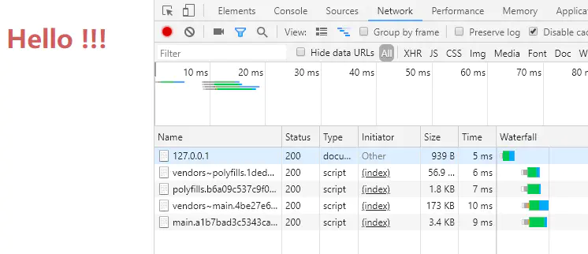

运行

至此纯手工最简单的angular项目就完成了。对这个小项目做几个总结：

1. 其中的配置只针对`prod + AOT`模式，即不是`JIT`模式
2. 对于开发环境可以再新增一个`webpack.config.dev.js`来配置生产环境下的webpack规则，并搭配`webpack-dev-server`使用(本文未完成这一步)。对于生产环境就像文中这样先`yarn prod`，然后扔到服务器上。
3. `@ngtools/webpack`与`MiniCssExtractPlugin`不兼容，所以注意配置`exclude`规则。
4. `tsconfig.json`中的`"module": "esnext"`这一配置相比`"module": "commonjs"`能减少不少体积


作者：Yitimo
链接：https://www.jianshu.com/p/8c09f26251a9
来源：简书
著作权归作者所有。商业转载请联系作者获得授权，非商业转载请注明出处。

# 面试题

### 1. webpack与grunt、gulp的不同？

三者都是前端构建工具，grunt和gulp在早期比较流行，现在webpack相对来说比较主流，不过一些轻量化的任务还是会用gulp来处理，比如单独打包CSS文件等。

grunt和gulp是基于任务和流（Task、Stream）的。类似jQuery，找到一个（或一类）文件，对其做一系列链式操作，更新流上的数据， 整条链式操作构成了一个任务，多个任务就构成了整个web的构建流程。

webpack是基于入口的。webpack会自动地递归解析入口所需要加载的所有资源文件，然后用不同的Loader来处理不同的文件，用Plugin来扩展webpack功能。

所以总结一下：

- 从构建思路来说

gulp和grunt需要开发者将整个前端构建过程拆分成多个`Task`，并合理控制所有`Task`的调用关系 webpack需要开发者找到入口，并需要清楚对于不同的资源应该使用什么Loader做何种解析和加工

- 对于知识背景来说

gulp更像后端开发者的思路，需要对于整个流程了如指掌 webpack更倾向于前端开发者的思路

### 2. 与webpack类似的工具还有哪些？谈谈你为什么最终选择（或放弃）使用webpack？

同样是基于入口的打包工具还有以下几个主流的：

- webpack
- rollup
- parcel

**从应用场景上来看：**

- webpack适用于大型复杂的前端站点构建
- rollup适用于基础库的打包，如vue、react
- parcel适用于简单的实验性项目，他可以满足低门槛的快速看到效果

由于parcel在打包过程中给出的调试信息十分有限，所以一旦打包出错难以调试，所以不建议复杂的项目使用parcel

### 3.有哪些常见的Loader？他们是解决什么问题的？

- file-loader：把文件输出到一个文件夹中，在代码中通过相对 URL 去引用输出的文件
- url-loader：和 file-loader 类似，但是能在文件很小的情况下以 base64 的方式把文件内容注入到代码中去
- source-map-loader：加载额外的 Source Map 文件，以方便断点调试
- image-loader：加载并且压缩图片文件
- babel-loader：把 ES6 转换成 ES5
- css-loader：加载 CSS，支持模块化、压缩、文件导入等特性
- style-loader：把 CSS 代码注入到 JavaScript 中，通过 DOM 操作去加载 CSS。
- eslint-loader：通过 ESLint 检查 JavaScript 代码

### 4.有哪些常见的Plugin？他们是解决什么问题的？

- define-plugin：定义环境变量
- commons-chunk-plugin：提取公共代码
- uglifyjs-webpack-plugin：通过UglifyES压缩ES6代码

### 5.Loader和Plugin的不同？

**不同的作用**

- **Loader**直译为"加载器"。Webpack将一切文件视为模块，但是webpack原生是只能解析js文件，如果想将其他文件也打包的话，就会用到loader。 所以Loader的作用是让webpack拥有了加载和解析非JavaScript文件的能力。
- **Plugin**直译为"插件"。Plugin可以扩展webpack的功能，让webpack具有更多的灵活性。 在 Webpack 运行的生命周期中会广播出许多事件，Plugin 可以监听这些事件，在合适的时机通过 Webpack 提供的 API 改变输出结果。

**不同的用法**

- **Loader**在module.rules中配置，也就是说他作为模块的解析规则而存在。 类型为数组，每一项都是一个Object，里面描述了对于什么类型的文件（test），使用什么加载(loader)和使用的参数（options）
- **Plugin**在plugins中单独配置。 类型为数组，每一项是一个plugin的实例，参数都通过构造函数传入。

### 6.webpack的构建流程是什么?从读取配置到输出文件这个过程尽量说全

Webpack 的运行流程是一个串行的过程，从启动到结束会依次执行以下流程：

1. 初始化参数：从配置文件和 Shell 语句中读取与合并参数，得出最终的参数；
2. 开始编译：用上一步得到的参数初始化 Compiler 对象，加载所有配置的插件，执行对象的 run 方法开始执行编译；
3. 确定入口：根据配置中的 entry 找出所有的入口文件；
4. 编译模块：从入口文件出发，调用所有配置的 Loader 对模块进行翻译，再找出该模块依赖的模块，再递归本步骤直到所有入口依赖的文件都经过了本步骤的处理；
5. 完成模块编译：在经过第4步使用 Loader 翻译完所有模块后，得到了每个模块被翻译后的最终内容以及它们之间的依赖关系；
6. 输出资源：根据入口和模块之间的依赖关系，组装成一个个包含多个模块的 Chunk，再把每个 Chunk 转换成一个单独的文件加入到输出列表，这步是可以修改输出内容的最后机会；
7. 输出完成：在确定好输出内容后，根据配置确定输出的路径和文件名，把文件内容写入到文件系统。

在以上过程中，Webpack 会在特定的时间点广播出特定的事件，插件在监听到感兴趣的事件后会执行特定的逻辑，并且插件可以调用 Webpack 提供的 API 改变 Webpack 的运行结果。

### 7.是否写过Loader和Plugin？描述一下编写loader或plugin的思路？

Loader像一个"翻译官"把读到的源文件内容转义成新的文件内容，并且每个Loader通过链式操作，将源文件一步步翻译成想要的样子。

编写Loader时要遵循单一原则，每个Loader只做一种"转义"工作。 每个Loader的拿到的是源文件内容（source），可以通过返回值的方式将处理后的内容输出，也可以调用this.callback()方法，将内容返回给webpack。 还可以通过 this.async()生成一个callback函数，再用这个callback将处理后的内容输出出去。 此外webpack还为开发者准备了开发loader的工具函数集——loader-utils。

相对于Loader而言，Plugin的编写就灵活了许多。 webpack在运行的生命周期中会广播出许多事件，Plugin 可以监听这些事件，在合适的时机通过 Webpack 提供的 API 改变输出结果。

### 8.webpack的热更新是如何做到的？说明其原理？

webpack的热更新又称热替换（Hot Module Replacement），缩写为HMR。 这个机制可以做到不用刷新浏览器而将新变更的模块替换掉旧的模块。

原理：

[](https://ask.qcloudimg.com/http-save/yehe-1687375/9m5z9odoe6.jpeg?imageView2/2/w/1620)

首先要知道server端和client端都做了处理工作

1. 第一步，在 webpack 的 watch 模式下，文件系统中某一个文件发生修改，webpack 监听到文件变化，根据配置文件对模块重新编译打包，并将打包后的代码通过简单的 JavaScript 对象保存在内存中。
2. 第二步是 webpack-dev-server 和 webpack 之间的接口交互，而在这一步，主要是 dev-server 的中间件 webpack-dev-middleware 和 webpack 之间的交互，webpack-dev-middleware 调用 webpack 暴露的 API对代码变化进行监控，并且告诉 webpack，将代码打包到内存中。
3. 第三步是 webpack-dev-server 对文件变化的一个监控，这一步不同于第一步，并不是监控代码变化重新打包。当我们在配置文件中配置了devServer.watchContentBase 为 true 的时候，Server 会监听这些配置文件夹中静态文件的变化，变化后会通知浏览器端对应用进行 live reload。注意，这儿是浏览器刷新，和 HMR 是两个概念。
4. 第四步也是 webpack-dev-server 代码的工作，该步骤主要是通过 sockjs（webpack-dev-server 的依赖）在浏览器端和服务端之间建立一个 websocket 长连接，将 webpack 编译打包的各个阶段的状态信息告知浏览器端，同时也包括第三步中 Server 监听静态文件变化的信息。浏览器端根据这些 socket 消息进行不同的操作。当然服务端传递的最主要信息还是新模块的 hash 值，后面的步骤根据这一 hash 值来进行模块热替换。
5. webpack-dev-server/client 端并不能够请求更新的代码，也不会执行热更模块操作，而把这些工作又交回给了 webpack，webpack/hot/dev-server 的工作就是根据 webpack-dev-server/client 传给它的信息以及 dev-server 的配置决定是刷新浏览器呢还是进行模块热更新。当然如果仅仅是刷新浏览器，也就没有后面那些步骤了。
6. HotModuleReplacement.runtime 是客户端 HMR 的中枢，它接收到上一步传递给他的新模块的 hash 值，它通过 JsonpMainTemplate.runtime 向 server 端发送 Ajax 请求，服务端返回一个 json，该 json 包含了所有要更新的模块的 hash 值，获取到更新列表后，该模块再次通过 jsonp 请求，获取到最新的模块代码。这就是上图中 7、8、9 步骤。
7. 而第 10 步是决定 HMR 成功与否的关键步骤，在该步骤中，HotModulePlugin 将会对新旧模块进行对比，决定是否更新模块，在决定更新模块后，检查模块之间的依赖关系，更新模块的同时更新模块间的依赖引用。
8. 最后一步，当 HMR 失败后，回退到 live reload 操作，也就是进行浏览器刷新来获取最新打包代码。

### 9.如何利用webpack来优化前端性能？（提高性能和体验）

用webpack优化前端性能是指优化webpack的输出结果，让打包的最终结果在浏览器运行快速高效。

- 压缩代码。删除多余的代码、注释、简化代码的写法等等方式。可以利用webpack的UglifyJsPlugin和ParallelUglifyPlugin来压缩JS文件， 利用cssnano（css-loader?minimize）来压缩css
- 利用[CDN](https://cloud.tencent.com/product/cdn?from=10680)加速。在构建过程中，将引用的静态资源路径修改为CDN上对应的路径。可以利用webpack对于output参数和各loader的publicPath参数来修改资源路径
- 删除死代码（Tree Shaking）。将代码中永远不会走到的片段删除掉。可以通过在启动webpack时追加参数--optimize-minimize来实现
- 提取公共代码。

### 10.如何提高webpack的构建速度？

1. 多入口情况下，使用CommonsChunkPlugin来提取公共代码
2. 通过externals配置来提取常用库
3. 利用DllPlugin和DllReferencePlugin预编译资源模块 通过DllPlugin来对那些我们引用但是绝对不会修改的npm包来进行预编译，再通过DllReferencePlugin将预编译的模块加载进来。
4. 使用Happypack 实现多线程加速编译
5. 使用webpack-uglify-parallel来提升uglifyPlugin的压缩速度。 原理上webpack-uglify-parallel采用了多核并行压缩来提升压缩速度
6. 使用Tree-shaking和Scope Hoisting来剔除多余代码

### 11.怎么配置单页应用？怎么配置多页应用？

单页应用可以理解为webpack的标准模式，直接在entry中指定单页应用的入口即可，这里不再赘述

多页应用的话，可以使用webpack的 AutoWebPlugin来完成简单自动化的构建，但是前提是项目的目录结构必须遵守他预设的规范。 多页应用中要注意的是：

- 每个页面都有公共的代码，可以将这些代码抽离出来，避免重复的加载。比如，每个页面都引用了同一套css样式表
- 随着业务的不断扩展，页面可能会不断的追加，所以一定要让入口的配置足够灵活，避免每次添加新页面还需要修改构建配置

### 12.npm打包时需要注意哪些？如何利用webpack来更好的构建？

Npm是目前最大的 JavaScript 模块仓库，里面有来自全世界开发者上传的可复用模块。你可能只是JS模块的使用者，但是有些情况你也会去选择上传自己开发的模块。 关于NPM模块上传的方法可以去官网上进行学习，这里只讲解如何利用webpack来构建。

NPM模块需要注意以下问题：

1. 要支持CommonJS模块化规范，所以要求打包后的最后结果也遵守该规则。
2. Npm模块使用者的环境是不确定的，很有可能并不支持ES6，所以打包的最后结果应该是采用ES5编写的。并且如果ES5是经过转换的，请最好连同SourceMap一同上传。
3. Npm包大小应该是尽量小（有些仓库会限制包大小）
4. 发布的模块不能将依赖的模块也一同打包，应该让用户选择性的去自行安装。这样可以避免模块应用者再次打包时出现底层模块被重复打包的情况。
5. UI组件类的模块应该将依赖的其它资源文件，例如.css文件也需要包含在发布的模块里。

基于以上需要注意的问题，我们可以对于webpack配置做以下扩展和优化：

1. CommonJS模块化规范的解决方案： 设置output.libraryTarget='commonjs2'使输出的代码符合CommonJS2 模块化规范，以供给其它模块导入使用
2. 输出ES5代码的解决方案：使用babel-loader把 ES6 代码转换成 ES5 的代码。再通过开启devtool: 'source-map'输出SourceMap以发布调试。
3. Npm包大小尽量小的解决方案：Babel 在把 ES6 代码转换成 ES5 代码时会注入一些辅助函数，最终导致每个输出的文件中都包含这段辅助函数的代码，造成了代码的冗余。解决方法是修改.babelrc文件，为其加入transform-runtime插件
4. 不能将依赖模块打包到NPM模块中的解决方案：使用externals配置项来告诉webpack哪些模块不需要打包。
5. 对于依赖的资源文件打包的解决方案：通过css-loader和extract-text-webpack-plugin来实现，配置如下：

[](https://ask.qcloudimg.com/http-save/yehe-1687375/4tkk7st046.jpeg?imageView2/2/w/1620)

### 13.如何在vue项目中实现按需加载？

Vue UI组件库的按需加载 为了快速开发前端项目，经常会引入现成的UI组件库如ElementUI、iView等，但是他们的体积和他们所提供的功能一样，是很庞大的。 而通常情况下，我们仅仅需要少量的几个组件就足够了，但是我们却将庞大的组件库打包到我们的源码中，造成了不必要的开销。

不过很多组件库已经提供了现成的解决方案，如Element出品的babel-plugin-component和AntDesign出品的babel-plugin-import 安装以上插件后，在.babelrc配置中或babel-loader的参数中进行设置，即可实现组件按需加载了。

[](https://ask.qcloudimg.com/http-save/yehe-1687375/61t3g5cxj2.png?imageView2/2/w/1620)

单页应用的按需加载 现在很多前端项目都是通过单页应用的方式开发的，但是随着业务的不断扩展，会面临一个严峻的问题——首次加载的代码量会越来越多，影响用户的体验。

通过import(*)语句来控制加载时机，webpack内置了对于import(*)的解析，会将import(*)中引入的模块作为一个新的入口在生成一个chunk。 当代码执行到import(*)语句时，会去加载Chunk对应生成的文件。import()会返回一个Promise对象，所以为了让浏览器支持，需要事先注入Promise polyfill