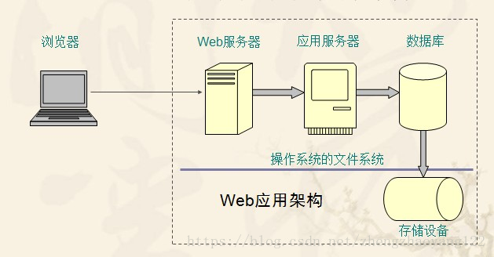
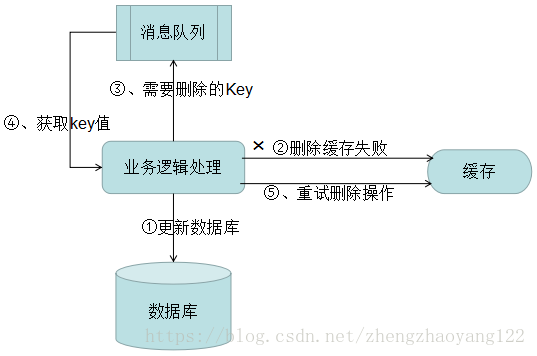
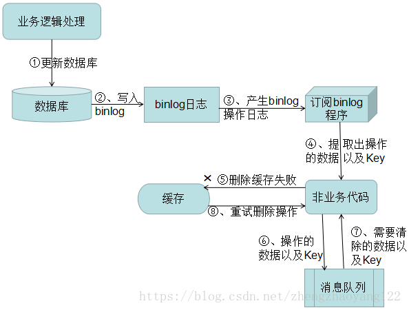

每次请求均会去数据进行相应的操作，当程序访问量大时，耗时必然会更加明显，最简单解决方式是使用：缓存，缓存将一个某个views的返回值保存至内存或者memcache中，

5分钟内再有人来访问时，则不再去执行view中的操作，而是直接从内存或者Redis中之前缓存的内容拿到，并返回。

## 一、什么是缓存

【1】缓存就是数据交换的缓冲区（称作：Cache），当某一硬件要读取数据时，会首先从缓存汇总查询数据，有则直接执行，不存在时从内存中获取。由于缓存的数据比内存快的多，所以缓存的作用就是帮助硬件更快的运行。
【2】缓存往往使用的是RAM（断电既掉的非永久存储），所以在用完后还是会把文件送到硬盘等存储器中永久存储。电脑中最大缓存就是内存条，硬盘上也有16M或者32M的缓存。
【3】高速缓存是用来协调CPU与主存之间存取速度的差异而设置的。一般CPU工作速度高，但内存的工作速度相对较低，为了解决这个问题，通常使用高速缓存，高速缓存的存取速度介于CPU与主存之间。系统将一些CPU在最近几个时间段经常访问的内容存在高速缓存，这样就在一定程度上缓解了由于主存速度低造成的CPU“停工待料”的情况。
【4】缓存就是把一些外存上的数据保存在内存上而已，为什么保存在内存上，我们运行的所有程序里面的变量都是存放在内存中的，所以如果想将值放入内存上，可以通过变量的方式存储。在JAVA中一些缓存一般都是通过Map集合来实现的。
 ▁▂▃▅▆ ：缓存在不同的场景下，作用是不一样的具体举例说明：
         ✔  操作系统磁盘缓存 ——> 减少磁盘机械操作。
         ✔  数据库缓存——>减少文件系统IO。
         ✔  应用程序缓存——>减少对数据库的查询。
         ✔  Web服务器缓存——>减少应用服务器请求。
         ✔  客户端浏览器缓存——>减少对网站的访问。
         

## 一、性能

  由于Redis只使用单核，而Memcached可以使用多核，所以平均每一个核上Redis在存储小数据时比Memcached性能更高。而在100k以上的数据时，Memcached性能要高于Redis，虽然Redis最近也在存储大数据的性能上进行优化，但是比起Memcached，还是稍有逊色。

## 二、内存使用效率

  使用简单的key-value存储的话，Memcached的内存利用率更高，而如果Redis采用hash结构来做key-value存储，由于其组合式的压缩，其内存利用率会高于Memcached。

## 三、Redis支持服务器端的数据操作

  Redis相比Memcached来说，拥有更多的数据结构并支持更丰富的数据操作，通常在Memcached里，你需要将数据拿到客户端来进行类似的修改再set回去，序列化再反序列化，这大大增加了网络IO的次数和数据体积。在Redis中，这些复杂的操作通常和一般的GET/SET一样高效。所以，如果需要缓存能够支持更复杂的结构和操作，那么Redis会是不错的选择。

  与Memcached仅支持简单的key-value结构的数据记录不同，Redis支持的数据类型要丰富得多。最为常用的数据类型主要由五种：String、Hash、List、Set和Sorted Set。Redis内部使用一个redisObject对象来表示所有的key和value。

## 二、**常见的缓存策略有哪些，如何做到缓存(比如redis)与DB里的数据一致性，你们项目中用到了什么缓存系统，如何设计的。**

【1】由于不同系统的数据访问模式不同，同一种缓存策略很难在不同的数据访问模式下取得满意的性能，研究人员提出不同缓存策略以适应不同的需求。缓存策略的分类：
   1）、基于访问的时间：此类算法按各缓存项被访问时间来组织缓存队列，决定替换对象。如 LRU；
   2）、基于访问频率：此类算法用缓存项的被访问频率来组织缓存。如 LFU、LRU2、2Q、LIRS；
   3）、访问时间与频率兼顾：通过兼顾访问时间和频率。使得数据模式在变化时缓存策略仍有较好性能。如 FBR、LRUF、ALRFU。多数此类算法具有一个可调或自适应参数，通过该参数的调节使缓存策略在基于访问时间与频率间取得一个平衡；
   4）、基于访问模式：某些应用有较明确的数据访问特点，进而产生与其相适应的缓存策略。如专用的 VoD 系统设计的A&L缓存策略，同时适应随机、顺序两种访问模式的 SARC策略；
【2】数据不一致性产生的原因： 1）、先操作缓存，再写数据库成功之前，如果有读请求发生，可能导致旧数据入缓存，引发数据不一致。在分布式环境下，数据的读写都是并发的，一个服务多机器部署，对同一个数据进行读写，在数据库层面并不能保证完成顺序，就有可能后读的操作先完成（读取到的是脏数据），如果不采用给缓存设置过期时间策略，该数据永远都是脏数据。
【解决办法】：①、可采用更新前后双删除缓存策略；②、可以通过“串行化”解决，保证同一个数据的读写落在同一个后端服务上；
  2）、先操作数据库，再清除缓存。如果删缓存失败了，就会出现数据不一致问题。
【方案一】：将删除失败的 key 值存入队列中重复删除，如下图：

 

 （1）更新数据库数据。
  （2）缓存因为种种问题删除失败。
  （3）将需要删除的key发送至消息队列。
  （4）自己消费消息，获得需要删除的key。
  （5）继续重试删除操作，直到成功。
【缺点】：对业务线代码造成大量的侵入。于是有了方案二。
【方案二】：通过订阅 binlog 获取需要重新删除的 Key 值数据。在应用程序中，另起一段程序，获得这个订阅程序传来的消息，进行删除缓存操作。

  （1）更新数据库数据
  （2）数据库会将操作信息写入binlog日志当中
  （3）订阅程序提取出所需要的数据以及key
  （4）另起一段非业务代码，获得该信息
  （5）尝试删除缓存操作，发现删除失败
  （6）将这些信息发送至消息队列
  （7）重新从消息队列中获得该数据，重试操作

## 三、如何防止缓存穿透、缓存击穿、缓存雪崩和缓存刷新。

【1】缓存穿透：缓存穿透是说收到一个请求，但是该请求缓存中不存在，只能去数据库中查询，然后放进缓存。但当有好多请求同时访问同一个数据时，业务系统把这些请求全发到了数据库；或者恶意构造一个逻辑上不存在的数据，然后大量发送这个请求，这样每次都会被发送到数据库，最总导致数据库挂掉。
【解决的办法】：对于恶意访问，一种思路是先做校验，对恶意数据直接过滤掉，不要发送至数据库层；第二种思路是缓存空结果，就是对查询不存在的数据也记录在缓存中，这样就可以有效的减少查询数据库的次数。非恶意访问，结合缓存击穿说明。
【2】缓存击穿：上面提到的某个数据没有，然后好多请求查询数据库，可以归为缓存击穿的范畴：对于热点数据，当缓存失效的一瞬间，所有的请求都被下放到数据库去请求更新缓存，数据库被压垮。
【解决的办法】：防范此类问题，一种思路是加全局锁，就是所有访问某个数据的请求都共享一个锁，获得锁的那个才有资格去访问数据库，其他线程必须等待。但现在大部分系统都是分布式的，本地锁无法控制其他服务器也等待，所以要用到全局锁，比如 Redis的 setnx实现全局锁。另一种思想是对即将过期的数据进行主动刷新，比如新起一个线程轮询数据，或者比如把所有的数据划分为不同的缓存区间，定期分区间刷新数据。第二个思路与缓存雪崩有点关系。
【3】缓存雪崩：缓存雪崩是指当我们给所有的缓存设置了同样的过期时间，当某一时刻，整个缓存的数据全部过期了，然后瞬间所有的请求都被抛向了数据库，数据库就崩掉了。
【解决的办法】：解决思路要么是分治，划分更小的缓存区间，按区间过期；要么给每个 key的过期时间加一个随机值，避免同时过期，达到错峰刷新缓存的目的。

对于 Redis 挂掉了，请求全部走数据库，也属于缓存雪崩，我们可以有以下思路进行解决：
    事发前：实现 Redis 的高可用（主从架构+Sentinel 或者 Redis Cluster），尽可能避免 Redis 挂掉这种情况。
    事发中：万一 Redis 真的挂了，我们可以设置本地缓存（ehcache）+ 限流（hystrix），尽量避免我们的数据库被干掉。
    事发后：Redis 持久化，重启后自动从磁盘上加载数据，快速恢复缓存数据。

【4】缓存刷新：既清空缓存 ，一般在 Insert、Update、Delete 操作后就需要刷新缓存，如果不执行就会出现脏数据。但当缓存请求的系统蹦掉后，返回给缓存的值为null。

## 四、Redis内存用完会发生什么

如果达到设置的上限，Redis 的写命令会返回错误信息（但是读命令还是可以正常返回），或者将 Redis 当缓存使用，配置缓存淘汰机制，当 Redis 达到内存的上线时会冲掉旧的数据。

## 五、Redis 的 List 结构相关的操作

【1】PUSH操作：是从队列头部和尾部增加节点的操作。
   ①、RPUSH KEY VALUE [VALUE ...] ：从队列的右端入队一个或者多个数据，如果 key值不存在，会自动创建一个空的列表。如果对应的 key不是一个List，则会返回一个错误。
   ②、LPUSH KEY VALUE [VALUE...] ：从队列的左边入队一个或多个元素。复杂度O(1)。
   ③、RPUSHX KEY VALUE：从队列的右边入队一个元素，仅队列存在时有效，当队列不存在时，不进行任何操作。
   ④、LPUSHX KEY VALUE：从队列的左边入队一个元素，仅队列存在时有效。当队列不存在时，不进行任何操作。
【2】POP操作：获取并删除头尾节点的操作。
   ①、LPOP KEY：从队列左边出队一个元素，复杂度O(1)。如果list为空，则返回nil。
   ②、RPOP KEY：从队列的右边出队一个元素，复杂度O(1)。如果list为空，则返回nil。
   ③、BLPOP KEY[KEY...] TIMEOUT：删除&获取KEY中最左边的第一个元素，当队列为空时，阻塞TIMEOUT时间，单位是秒（这个时间内尝试获取KEY中的数据），超过TIMEOUT后如果仍未数据则返回(nil)。

1 redis> BLPOP queue 1
2 (nil)
3 (1.10s)
   ④、BRPOP KEY[KEY...] TIMEOUT：删除&获取KEY中最后一个元素，或阻塞TIMEOUT。如上↑
【3】POP and PUSH
   ①、RPOPLPUSH KEY1 KEY2：删除KEY1中最后一个元素，将其追加到KEY2的最左端。
   ②、BRPOPLPUSH KEY1 KEY2 TIMEOUT：弹出KEY1列表的值，将它推到KEY2列表，并返回它;或阻塞TIMEOUT时间，直到有一个可用。
【4】其他
   ①、LLEN KEY：获取队列（List）的长度。
   ②、LRANG KEY START STOP：从列表中获取指定（START-STOP）长度的元素。负数表示从右向左数。需要注意的是，超出范围的下标不会产生错误：如果start>end，会得到空列表，如果end超过队尾，则Redis会将其当做列表的最后一个元素。

 1 redis> rpush q1 a b c d f e g
 2 (integer) 7
 3 redis> lrange q1 0 -1
 4 1) "a"
 5 2) "b"
 6 3) "c"
 7 4) "d"
 8 5) "f"
 9 6) "e"
10 7) "g"
 ③、 LINDEX KEY INDEX：获取一个元素，通过其索引列表。我们之前介绍的操作都是对 list的两端进行的，所以算法复杂度都只有O(1)。而这个操作是指定位置来进行的，每次操作，list都得找到对应的位置，因此算法复杂度为O(N)。list的下表是从0开始的，index为负的时候是从右向左数。-1表示最后一个元素。当下标超出的时候，会返回nul。所以不用像操作数组一样担心范围越界的情况。
 ④、LSET KEY INDEX：重置队列中 INDEX位置的值。当 index越界的时候，这里会报异常。
 ⑤、LREM KEY COUNT VALUE：从列表中删除COUNT个VALUE元素。COUNT参数有三种情况：
          ☛ count > 0: 表示从头向尾（左到右）移除值为value的元素。
          ☛ count < 0: 表示从尾向头（右向左）移除值为value的元素。
          ☛ count = 0: 表示移除所有值为value的元素。
  ⑥、LTRIM KEY START STOP：修剪到指定范围内的清单，相当与截取，只保留START-STOP之间的数据。

 1 redis> rpush q a b c d e f g
 2 (integer) 7
 3 redis> lrange q 0 -1
 4 1) "a"
 5 2) "b"
 6 3) "c"
 7 4) "d"
 8 5) "e"
 9 6) "f"
10 7) "g"
11 redis> ltrim q 1 4
12 OK
13 redis> lrange q 0 -1
14 1) "b"
15 2) "c"
16 3) "d"
17 4) "e"
  ⑦、LINSERT KEY BEFORE|AFTER 元素 VALUE：在列表中的另一个元素之前或之后插入VAULE。当 key 不存在时，这个List被视为空列表，任何操作都不会发生。当key存在，但保存的不是 List，则会报 error。该命令会返回修改之后的 List的长度，如果找不到元素，则会返回 -1。
