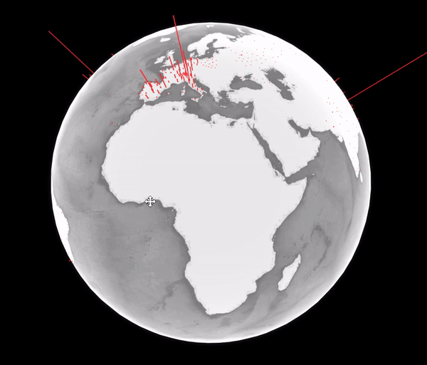
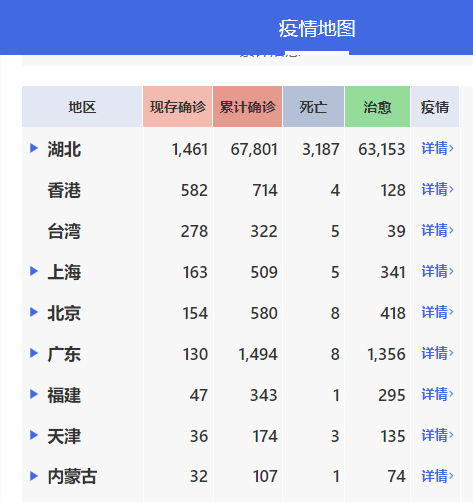
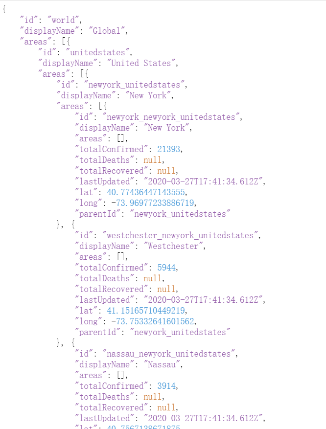

Github:https://github.com/cansijyun/ncov-globe

My site for the project:http://pyact.com/ncov-globe/by-state.html


## What’s Web Scraping?

*Web scraping* consists of gathering data available on websites. This can be done manually by a human or by using a bot.

A *bot* is a program you build that helps you extract the data you need much quicker than a human’s hand and eyes can.

## Look for the URL needed

Let's think what kind of data we need to make a 3d COVID data globe. 

1. For a globe, latitude and longitude is necessary to show where the data is.
2. Total confirmed count by state is needed affiliated with latitude and longitude data. A higher data resolution is better so I use the data by state 

I find [Bing COVID](https://www.bing.com/covid)  is suitable for these commands


Chinese data isn't in this site and I find anther site [Dingxiangyuan](https://3g.dxy.cn/newh5/view/pneumonia) to show Chinese data



## The HTML

HTML stands for *hypertext markup language,* and most web pages are written using it. Essentially, HTML is *how* two computers speak to each other over the internet, and websites are *what* they say.

When you access an URL, your computer sends a request to the server that hosts the site. Any technology can be running on that server (JavaScript, Ruby, Java, etc.) to process your request. Eventually, the server returns a response to your browser; oftentimes, that response will be in the form of an HTML page for your browser to display.

HTML describes the structure of a web page semantically, and originally included cues for the appearance of the document.

## Inspect  the site

Chrome, Firefox, and Safari users can examine the HTML structure of any page by right-clicking your mouse and pressing the Inspect option.


I find the api https://www.bing.com/covid/data includes all my expected data.

Let's send a request in python. 



The responded Json Structure is

```
├─globaldata.areas             
   └─nation.areas
       ├─state.areas      
       └─state.areas      
   └─nation.areas
       └─state.areas      
```


## Python  Scraper Source Code 

This the scraper for Bing COVID:

```python
#Request whole data
def get_oversea():
    resp = requests.get(url='https://www.bing.com/covid/data')
    resp=resp.json()
    with open('static/overseas.json', 'w', encoding="UTF-8") as result_file:
        json.dump(resp, result_file)
        
#Get data we need and parse a new list        
def parse_global_by_state():
    with open('static/overseas.json', encoding="UTF-8") as json_file:
        data = json.load(json_file)
        new_state_list = []

        for item in data['areas']:
            print(item)
            for item_state in item['areas']:
                print(item_state)
                name = item_state['id']
                lat = item_state['lat']
                lng = item_state['long']
                comfirmed = item_state['totalConfirmed']
                recovered= item_state['totalRecovered']
                death = item_state['totalDeaths']
                current=0
                try:
                    current = comfirmed-recovered-death
                except:
                    kes=0
                new_state_list.append({'name': name, 'lat': lat, 'lng': lng, 'confirmed': comfirmed, 'current': current})
    print(new_state_list)
    with open('mid/byState.json', 'w', encoding="UTF-8") as result_file:
        json.dump(new_state_list, result_file)

        
#Parser the list to adjust with webGl Globe
def get_final_by_state(type):
    with open('mid/twoList.json', 'r', encoding="UTF-8") as result_file_one:
        twoList = json.load(result_file_one)
        data_state=[]
        max_num=get_max_num_from_dict(twoList,'confirmed')
        print(max_num)
        for item in twoList:
            data_state.append(item['lat'])
            data_state.append(item['lng'])
            item_num = item[type] / max_num
            data_state.append(item_num)
            data_state.append(0)
    with open('final/'+type+'ByState.json', 'w', encoding="UTF-8") as result_file:
        json.dump(data_state, result_file,ensure_ascii=False)
```

## Flask Source Code

I  design 2 api to be used for this web app

```
@app.route('/nation')
@cross_origin()
def get_ncov_data_nation():
    with open('final/confirmedByNation.json', encoding="UTF-8") as json_file:
        data = json.load(json_file)
    return jsonify(data)


@app.route('/state')
@cross_origin()
def get_ncov_data_state():
    with open('final/confirmedByState.json', encoding="UTF-8") as json_file:
        data = json.load(json_file)
    return jsonify(data)
```


