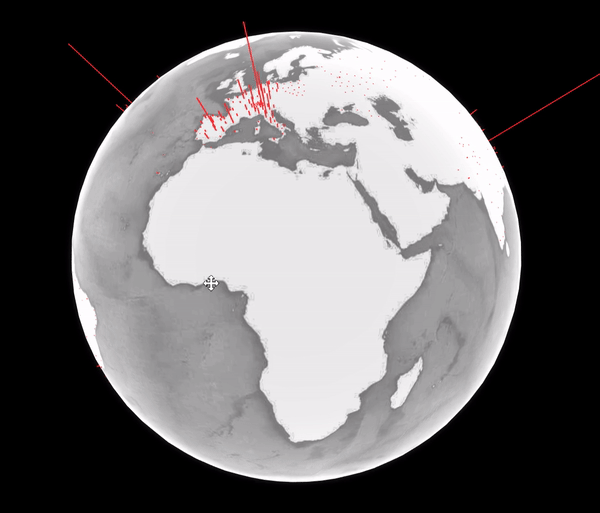
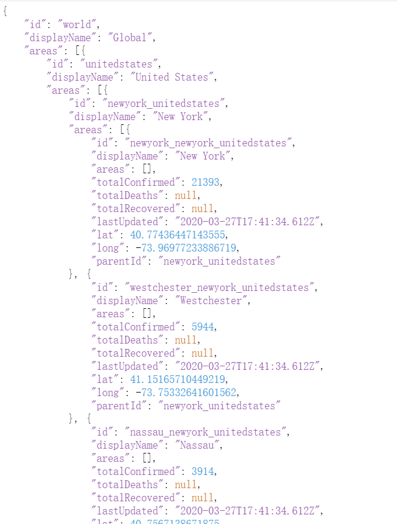

Github:https://github.com/cansijyun/ncov-globe

本项目展示网页:http://pyact.com/ncov-globe/by-state.html



## 寻找合适的API

制作一个3d疫情地球我们需要以下数据

1. 经纬度数据
2. 疫情分地区数据最好是具体到省级的

搜索了好几个疫情网站最后发现 [Bing COVID](https://www.bing.com/covid) 满足要求


国内的数据是通过丁香园爬取的


## 检视 

以下我使用Chrome来检视Bing疫情网站


 https://www.bing.com/covid/data这个接口满足我所有的数据要求
返回的json值如下图



这个接口返回的Json结构

```
├─globaldata.areas             
   └─nation.areas
       ├─state.areas      
       └─state.areas      
   └─nation.areas
       └─state.areas      
```


## Python  爬虫源码

这是我爬取 Bing COVID的源码:

```python
#Request whole data
def get_oversea():
    resp = requests.get(url='https://www.bing.com/covid/data')
    resp=resp.json()
    with open('static/overseas.json', 'w', encoding="UTF-8") as result_file:
        json.dump(resp, result_file)
        
#Get data we need and parse a new list        
def parse_global_by_state():
    with open('static/overseas.json', encoding="UTF-8") as json_file:
        data = json.load(json_file)
        new_state_list = []

        for item in data['areas']:
            print(item)
            for item_state in item['areas']:
                print(item_state)
                name = item_state['id']
                lat = item_state['lat']
                lng = item_state['long']
                comfirmed = item_state['totalConfirmed']
                recovered= item_state['totalRecovered']
                death = item_state['totalDeaths']
                current=0
                try:
                    current = comfirmed-recovered-death
                except:
                    kes=0
                new_state_list.append({'name': name, 'lat': lat, 'lng': lng, 'confirmed': comfirmed, 'current': current})
    print(new_state_list)
    with open('mid/byState.json', 'w', encoding="UTF-8") as result_file:
        json.dump(new_state_list, result_file)

        
#Parser the list to adjust with webGl Globe
def get_final_by_state(type):
    with open('mid/twoList.json', 'r', encoding="UTF-8") as result_file_one:
        twoList = json.load(result_file_one)
        data_state=[]
        max_num=get_max_num_from_dict(twoList,'confirmed')
        print(max_num)
        for item in twoList:
            data_state.append(item['lat'])
            data_state.append(item['lng'])
            item_num = item[type] / max_num
            data_state.append(item_num)
            data_state.append(0)
    with open('final/'+type+'ByState.json', 'w', encoding="UTF-8") as result_file:
        json.dump(data_state, result_file,ensure_ascii=False)
```

## Flask 源码

我设计了两个Api接口给这两个应用

```
@app.route('/nation')
@cross_origin()
def get_ncov_data_nation():
    with open('final/confirmedByNation.json', encoding="UTF-8") as json_file:
        data = json.load(json_file)
    return jsonify(data)


@app.route('/state')
@cross_origin()
def get_ncov_data_state():
    with open('final/confirmedByState.json', encoding="UTF-8") as json_file:
        data = json.load(json_file)
    return jsonify(data)
```


