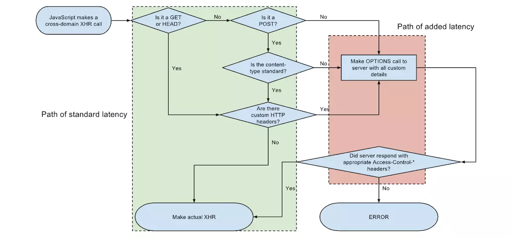

如果两个 URL 的 protocol、port (如果有指定的话)和 host 都相同的话，则这两个 URL 是同源。这个方案也被称为“协议/主机/端口元组”，或者直接是 “元组”。（“元组” 是指一组项目构成的整体，双重/三重/四重/五重/等的通用形式）。

下表给出了与 URL `http://store.company.com/dir/page.html` 的源进行对比的示例:

| URL                                               | 结果 | 原因                               |
| :------------------------------------------------ | :--- | :--------------------------------- |
| `http://store.company.com/dir2/other.html`        | 同源 | 只有路径不同                       |
| `http://store.company.com/dir/inner/another.html` | 同源 | 只有路径不同                       |
| `https://store.company.com/secure.html`           | 失败 | 协议不同                           |
| `http://store.company.com:81/dir/etc.html`        | 失败 | 端口不同 ( `http://` 默认端口是80) |
| `http://news.company.com/dir/other.html`          | 失败 | 主机不同                           |

## 同源策略的目的

> 同源政策的目的，是为了保证用户信息的安全，防止恶意的网站窃取数据。

## 同源策略的限制范围

随着互联网的发展，“同源策略”越来越严格，目前，如果非同源，以下三种行为都将收到限制。

- Cookie、LocalStorage、IndexedDB 等存储性内容
- DOM 节点
- AJAX 请求发送后，结果被浏览器拦截了

但是有三个标签是允许跨域加载资源：

- ``
- `<link href=XXX>`
- `<script src=XXX>`

虽然这些限制是很有必要的，但是也给我们日常开发带来不好的影响。比如实际开发过程中，往往都会把**服务器端架设到一台甚至是一个集群的服务器中**，把**客户端页面放到另外一个单独的服务器**。那么这时候就会出现**不同源的情况，如果我们知道两个网站都是安全的**话，我们是希望两个不同源的网站之间可以相互请求数据的。这就需要使用到**跨域** 。

跨域资源共享(CORS) 是一种机制，**它使用额外的 HTTP 头来告诉浏览器**  让运行在一个 origin (domain) 上的**Web应用被准许访问来自不同源服务器**上的指定的资源。当一个资源从与该资源本身所在的服务器不同的域、协议或端口请求一个资源时，资源会发起一个跨域 HTTP 请求。
比如，站点 http://domain-a.com 的某 HTML 页面通过  的 src 请求 http://domain-b.com/image.jpg。网络上的许多页面都会加载来自不同域的CSS样式表，图像和脚本等资源。

出于安全原因，浏览器限制从脚本内发起的跨源HTTP请求。 例如，**XMLHttpRequest**和Fetch API遵循同源策略。 这意味着使用这些API的Web应用程序只能从加载应用程序的同一个域请求HTTP资源，除非响应报文包含了正确CORS响应头。

出于安全原因，浏览器限制从脚本内发起的跨源HTTP请求。 例如，XMLHttpRequest和Fetch API遵循同源策略。 这意味着使用这些API的Web应用程序只能从加载应用程序的同一个域请求HTTP资源，除非响应报文包含了正确CORS响应头。


## **2、解决跨域问题的三种思路**

- **1、客户端浏览器解除跨域限制**（理论上可以但是不现实）
- **2、发送JSONP请求替代XHR请求**（并不能适用所有的请求方式，不推荐）
- **3、修改服务器端**（包括HTTP服务器和应用服务器）（**推荐**）

**2.1.1 浏览器如何判断一个请求是不是跨域请求？**

**浏览器会根据同源策略来判断一个请求是不是跨域请求。**

**非跨域请求**，在请求头中会只包含请求的主机名。


**跨域请求**，在请求头中会既包含要请求的主机名还包括当前的源主机名，如果这两者不一致，那就是跨域请求了。


作者：慕课网


**2.1.2 浏览器对请求的分类**

在HTTP1.1 协议中的，请求方法分为GET、POST、PUT、DELETE、HEAD、TRACE、OPTIONS、CONNECT 八种。浏览器根据这些请求方法和请求类型将请求划分为简单请求和非简单请求。

**简单请求**：浏览器先发送（执行）请求然后再判断是否跨域。

请求方法为 GET、POST、HEAD，请求头header中无自定义的请求头信息，请求类型Content-Type 为 text/plain、multipart/form-data、application/x-www-form-urlencoded 的请求都是简单请求。

**非简单请求**：浏览器先发送预检命令（OPTIONS方法），检查通过后才发送真正的数据请求。



预检命令会发送自定义头为Access-Control-Request-Headers: content-type的请求到服务器，根据响应头的中的 “Access-Control-Allow-Headers”: “Content-Type” 判断服务器是否允许跨域访问。预检命令是可以缓存，服务器端设置 “Access-Control-Max-Age”: “3600”，这样后面发送同样的跨域请求就不需要先发送预检命令了。

请求方法为 PUT、DELETE 的 AJAX 请求、发送 JSON 格式的 AJAX 请求、带自定义头的 AJAX 请求都是非简单请求。  


## 简明解释

Because our frontend is hosted on port 8000, and server is running on port 3000, the request from browser is restricted by the **same-origin policy**. To fix it, simply add a header to the response in our server code:

### 后端修改Response支持跨域 

从上面控制台的输出可以看到，错误原因是请求的资源（接口）的header中没有”Access-Control-Allow-Origin“，那我们可以给它加上。在哪加？既然说是请求的资源没有，那当然是在请求的资源上加，也就是服务端。

(后端加上返回头，允许前端localhost:8000访问)

```
Access-Control-Allow-Origin: http://localhost:8000
```

Now click the button again and you should be able to see the response from server!

从上面控制台的输出可以看到，错误原因是请求的资源（接口）的header中没有”Access-Control-Allow-Origin“，那我们可以给它加上。在哪加？既然说是请求的资源没有，那当然是在请求的资源上加，也就是服务端。

```javascript
@SpringBootApplication
@Configuration
@RestController
public class ApplicationA {

    public static void main(String[] args) {
        SpringApplication.run(ApplicationA.class, args);
    }

    @RequestMapping("/test")
    public Object test(HttpServletRequest request, HttpServletResponse response) {
        // 跨域支持
        response.setHeader("Access-Control-Allow-Origin", "*");
        response.setHeader("Access-Control-Allow-Methods", "POST,GET,PUT,DELETE");
        response.setHeader("Access-Control-Max-Age", "3600");
        response.setHeader("Access-Control-Allow-Headers", "*");
        response.setHeader("Access-Control-Allow-Credentials", "true");
        Map<String, Object> map = new HashMap<>();
        map.put("success", true);
        map.put("msg", "我来自服务端");
        return map;
    }
}
```

再看看浏览器，已经可以正常访问接口了。


浏览器：诶，你小子要跨域是吧，我得问问服务器大哥肯不肯！往请求头添加`origin`亮一下牌面

```
有个奇怪现象，谷歌游览器在非跨域情况下，也会发送origin字段
```


请求头origin字段为当前域

服务器：诶，你是谁，我来看看你的origin，嗯嗯，可以，符合我的要求，放行！顺便告诉你，老夫的规矩！


 其中，最重要的就是，标识允许哪个域的请求。当然，如果服务器不通过，根本没有这个字段，接着触发的，再接着你就看到浏览器的提示

其中，最重要的就是`Access-Control-Allow-Origin``XHR``onerror``xxx的服务器没有响应Access-Control-Allow-Origin字段`


```rust
//指定允许其他域名访问
'Access-Control-Allow-Origin:http://172.20.0.206'//一般用法（*，指定域，动态设置），3是因为*不允许携带认证头和cookies
//是否允许后续请求携带认证信息（cookies）,该值只能是true,否则不返回
'Access-Control-Allow-Credentials:true'
```

上面第一行说到的`Access-Control-Allow-Origin`有多种设置方法：

1. 设置`*`是最简单粗暴的，但是服务器出于安全考虑，肯定不会这么干，而且，如果是*的话，游览器将不会发送`cookies`，即使你的`XHR`设置了`withCredentials` 
2. 指定域，如上图中的`http://172.20.0.206`，一般的系统中间都有一个`nginx`，所以推荐这种
3. 动态设置为请求域，多人协作时，多个前端对接一个后台，这样很方便

`withCredentials`：表示`XHR`是否接收cookies和发送cookies，也就是说如果该值是false，响应头的`Set-Cookie`，浏览器也不会理，并且即使有目标站点的cookies，浏览器也不会发送。

#### 复杂请求:

最常见的情况，当我们使用`put`和`delete`请求时，浏览器会先发送`option`（预检）请求，不过有时候，你会发现并没有，这是后面我们会讲到缓存。

##### 预检请求

与简单请求不同的是，option请求多了2个字段：
 `Access-Control-Request-Method`：该次请求的请求方式
 `Access-Control-Request-Headers`：该次请求的自定义请求头字段

服务器检查通过后，做出响应：


```csharp
//指定允许其他域名访问
'Access-Control-Allow-Origin:http://172.20.0.206'//一般用法（*，指定域，动态设置），3是因为*不允许携带认证头和cookies
//是否允许后续请求携带认证信息（cookies）,该值只能是true,否则不返回
'Access-Control-Allow-Credentials:true'
//预检结果缓存时间,也就是上面说到的缓存啦
'Access-Control-Max-Age: 1800'
//允许的请求类型
'Access-Control-Allow-Methods:GET,POST,PUT,POST'
//允许的请求头字段
'Access-Control-Allow-Headers:x-requested-with,content-type'
```

这里有个注意点：`Access-Control-Request-Method`，`Access-Control-Request-Headers`返回的是满足服务器要求的所有请求方式，请求头`

## 案例一：spring boot 过滤器

1. 请求过滤器：

   ```java
   /**
   *  OncePerRequestFilter保证在任何Servlet容器中都是一个请求只执行一次的过滤器。
   */
   public class CorsFilter extends OncePerRequestFilter {
   
   @Override
   protected void doFilterInternal(HttpServletRequest req, HttpServletResponse resp, FilterChain chain) throws ServletException, IOException {
   
       Properties props = PropertiesLoaderUtils.loadAllProperties("cors.properties");
       //允许的 客户端域名
       resp.addHeader("Access-Control-Allow-Origin", props.getProperty("cors.allowed-origins"));
       //允许的 方法名
       resp.addHeader("Access-Control-Allow-Methods", props.getProperty("cors.allowed-methods"));
       //允许服务端访问的客户端请求头，多个请求头用逗号分割，例如：Content-Type
       resp.addHeader("Access-Control-Allow-Headers", "Content-Type,X-Requested-With,token");
       //预检验请求时间
       resp.addHeader("Access-Control-Max-Age", props.getProperty("cors.max-age"));//30 min
       resp.addHeader("Access-Control-Allow-Credentials", "true");
   
       chain.doFilter(req, resp);
   }
   }
   ```

   

2. web.xml中配置跨域过滤器：

   ```xml
   <!--配置跨域请求的过滤器-->
   <filter>
   <filter-name>cors</filter-name>
   <filter-class>com.jd.dashboard.cors.CrossFilter</filter-class>
   </filter>
   <filter-mapping>
   <filter-name>cors</filter-name>
   <url-pattern>/*</url-pattern>
   </filter-mapping>
   ```

   ------

3. 过滤器中的属性配置如下：

```shell
#跨域请求CORS全局配置属性值

#允许访问的客户端域名，例如：http://web.xxx.com
cors.allowed-origins=http://front.xx.com

#允许访问的方法名
cors.allowed-methods=POST, GET, OPTIONS, DELETE

#允许服务端访问的客户端请求头，多个请求头用逗号分割，例如：Content-Type
cors.allowed-headers=Content-Type

#允许客户端访问的服务端响应头
cors.exposed-headers=

#是否允许请求带有验证信息，若要获取客户端域下的cookie时，需要将其设置为true
cors.allow-credentials=true

cors.max-age=1800
```


## 案例二：SpringBoot 修饰器（CORS）

### 一、基本介绍

简单来说，CORS是一种访问机制，英文全称是Cross-Origin Resource Sharing，即我们常说的跨域资源共享，通过在服务器端设置响应头，把发起跨域的原始域名添加到Access-Control-Allow-Origin 即可。

### 1. CORS工作原理

CORS实现跨域访问并不是一蹴而就的，需要借助浏览器的支持，从原理题图我们可以清楚看到，简单的请求（通常指GET/POST/HEAD方式，并没有去增加额外的请求头信息）直接创建了跨域请求的XHR对象，而复杂的请求则要求先发送一个"预检"请求，待服务器批准后才能真正发起跨域访问请求。




来自维基百科

根据官方文档[W3C规范-CORS](https://www.w3.org/TR/cors/) 的描述，目前CORS使用了如下头部信息：

### 2. Request Headers（请求头）

> 温馨提示：`Request Headers` 无需人为干预，因为浏览器会自动识别跨域请求并添加对应的请求头。

- `Origin` 表示发起跨域请求的原始域。
- `Access-Control-Request-Method` 表示发起跨域请求的方式，例如GET/POST。
- `Access-Control-Request-Headers`表示发起跨域请求的额外头信息。

### 3. Response headers（响应头 ）

> 温馨提示：`Response Headers` 需要人为干预，通过设置响应头以帮助服务器资源进行跨域授权，例如允许哪些原始域进行跨域请求，是否允许响应信息携带Cookie等认证信息。

- `Access-Control-Allow-Origin` 表示允许哪些原始域进行跨域访问。

- `Access-Control-Allow-Credentials`表示是否允许客户端获取用户凭据。

  使用场景：例如现在需要登录系统后才能发起跨域请求，并且要附带Cookie信息给服务器。则必须具备两个条件：**1. 浏览器端：**发送AJAX请求前需设置通信对象XHR的withCredentials 属性为true。 **2.服务器端：**设置Access-Control-Allow-Credentials为true。两个条件缺一不可，否则即使服务器同意发送Cookie，浏览器也无法获取。正确姿势如下：


```jsx
$.ajax({
    url: 'localhost:8080',
    xhrFields: {
        withCredentials: true //表示发起跨域访问并要求携带Cookie等认证信息
    },
    success: function (r) {
        console.log(r)
    }
});
```

有好奇的小伙伴可能会问为什么在W3C手册中找不到跨域属性xhrFields的描述，因为该属性并不是通信对象XHR的默认属性，而是自定义属性，所以在[jQuery Ajax 参考手册](http://www.w3school.com.cn/jquery/ajax_ajax.asp) 中并没有明确注明，但我们可以在jQuery源码中找到这段蛛丝马迹，那么整体思路就很清晰了。


```jsx
// Cross domain only allowed if supported through XMLHttpRequest
    if ( support.cors || xhrSupported && !options.crossDomain ) {
        return {
            send: function( headers, complete ) {
                var i,
                    xhr = options.xhr();

                xhr.open(
                    options.type,
                    options.url,
                    options.async,
                    options.username,
                    options.password
                );

                // Apply custom fields if provided
                if ( options.xhrFields ) {
                    for ( i in options.xhrFields ) {
                        xhr[ i ] = options.xhrFields[ i ];
                    }
                }
           ...
    }
```

- `Access-Control-Allow-Methods` 表示允许哪些跨域请求的提交方式。（例如GET/POST）

- `Access-Control-Allow-Headers` 表示跨域请求的头部的允许范围。

- `Access-Control-Expose-Headers` 表示允许暴露哪些头部信息给客户端。

  使用说明：基于安全考虑，如果没有设置额外的暴露，跨域的通信对象XMLHttpRequest只能获取标准的头部信息。

- `Access-Control-Max-Age` 表示预检请求 [[Preflight Request](https://www.w3.org/TR/cors/#preflight-request)] 的最大缓存时间。

### 二、CORS实现跨域访问

### 授权方式

- 方式1：返回新的CorsFilter
- 方式2：重写WebMvcConfigurer
- 方式3：使用注解（@CrossOrigin）
- 方式4：手工设置响应头（HttpServletResponse ）

> 注：CorsFilter / WebMvcConfigurer / @CrossOrigin 需要SpringMVC 4.2 以上的版本才支持，对应SpringBoot 1.3 版本以上都支持这些CORS特性。不过，使用SpringMVC4.2 以下版本的小伙伴也不用慌，直接使用方式4通过手工添加响应头来授权CORS跨域访问也是可以的。附：在SpringBoot 1.2.8 + SpringMVC 4.1.9 亲测成功。

> 注：方式1和方式2属于全局CORS配置，方式3和方式4属于局部CORS配置。如果使用了局部跨域是会覆盖全局跨域的规则，所以可以通过@CrossOrigin注解来进行细粒度更高的跨域资源控制。

#### 1. 返回新的CorsFilter（全局跨域）

在任意配置类，返回一个新的CorsFilter Bean，并添加映射路径和具体的CORS配置信息。


```java
package com.hehe.yyweb.config;

@Configuration
public class GlobalCorsConfig {
    @Bean
    public CorsFilter corsFilter() {
        //1.添加CORS配置信息
        CorsConfiguration config = new CorsConfiguration();
          //放行哪些原始域
          config.addAllowedOrigin("*");
          //是否发送Cookie信息
          config.setAllowCredentials(true);
          //放行哪些原始域(请求方式)
          config.addAllowedMethod("*");
          //放行哪些原始域(头部信息)
          config.addAllowedHeader("*");
          //暴露哪些头部信息（因为跨域访问默认不能获取全部头部信息）
          config.addExposedHeader("*");

        //2.添加映射路径
        UrlBasedCorsConfigurationSource configSource = new UrlBasedCorsConfigurationSource();
        configSource.registerCorsConfiguration("/**", config);

        //3.返回新的CorsFilter.
        return new CorsFilter(configSource);
    }
}
```

#### 2. 重写WebMvcConfigurer（全局跨域）

在任意配置类，返回一个新的WebMvcConfigurer Bean，并重写其提供的跨域请求处理的接口，目的是添加映射路径和具体的CORS配置信息。


```java
package com.hehe.yyweb.config;

@Configuration
public class GlobalCorsConfig {
    @Bean
    public WebMvcConfigurer corsConfigurer() {
        return new WebMvcConfigurer() {
            @Override
            //重写父类提供的跨域请求处理的接口
            public void addCorsMappings(CorsRegistry registry) {
                //添加映射路径
                registry.addMapping("/**")
                        //放行哪些原始域
                        .allowedOrigins("*")
                        //是否发送Cookie信息
                        .allowCredentials(true)
                        //放行哪些原始域(请求方式)
                        .allowedMethods("GET","POST", "PUT", "DELETE")
                        //放行哪些原始域(头部信息)
                        .allowedHeaders("*")
                        //暴露哪些头部信息（因为跨域访问默认不能获取全部头部信息）
                        .exposedHeaders("Header1", "Header2");
            }
        };
    }
}
```

#### 3. 使用注解（局部跨域）

在方法上（@RequestMapping）使用注解 **@CrossOrigin** ：


```kotlin
    @RequestMapping("/hello")
    @ResponseBody
    @CrossOrigin("http://localhost:8080") 
    public String index( ){
        return "Hello World";
    }
```

或者在控制器（@Controller）上使用注解 **@CrossOrigin** ：


```kotlin
@Controller
@CrossOrigin(origins = "http://xx-domain.com", maxAge = 3600)
public class AccountController {

    @RequestMapping("/hello")
    @ResponseBody
    public String index( ){
        return "Hello World";
    }
}
```

#### 4. 手工设置响应头（局部跨域 ）

使用HttpServletResponse对象添加响应头（Access-Control-Allow-Origin）来授权原始域，这里Origin的值也可以设置为"*" ，表示全部放行。


```kotlin
    @RequestMapping("/hello")
    @ResponseBody
    public String index(HttpServletResponse response){
        response.addHeader("Access-Control-Allow-Origin", "http://localhost:8080");
        return "Hello World";
    }
```

### 三、测试跨域访问

首先使用[ Spring Initializr ](https://www.jianshu.com/p/d2b08a671e27)快速构建一个Maven工程，什么都不用改，在static目录下，添加一个页面：index.html 来模拟跨域访问。目标地址: http://localhost:8090/hello


```xml
<!DOCTYPE html>
<html lang="en">
<head>
    <meta charset="UTF-8"/>
    <title>Page Index</title>
</head>
<body>
<h2>前台系统</h2>
<p id="info"></p>
</body>
<script src="webjars/jquery/3.2.1/jquery.js"></script>
<script>
    $.ajax({
        url: 'http://localhost:8090/hello',
        type: "POST",
        xhrFields: {
           withCredentials: true //允许跨域认证
        },
        success: function (data) {
            $("#info").html("跨域访问成功:"+data);
        },
        error: function (data) {
            $("#info").html("跨域失败!!");
        }
    })
</script>
</html>
```

然后创建另一个工程，在Root Package添加Config目录并创建配置类来开启全局CORS。


```java
package com.hehe.yyweb.config;

@Configuration
public class GlobalCorsConfig {

    @Bean
    public WebMvcConfigurer corsConfigurer() {
        return new WebMvcConfigurer() {
            @Override
            public void addCorsMappings(CorsRegistry registry) {
                registry.addMapping("/**");
            }
        };
    }
}
```

接着，简单编写一个Rest接口 ，并指定应用端口为8090。


```java
package com.hehe.yyweb;

@SpringBootApplication
@RestController
public class YyWebApplication {

    @Bean
    public TomcatServletWebServerFactory tomcat() {
        TomcatServletWebServerFactory tomcatFactory = new TomcatServletWebServerFactory();
        tomcatFactory.setPort(8090); //默认启动8090端口
        return tomcatFactory;
    }

    @RequestMapping("/hello")
    public String index() {
        return "Hello World";
    }

    public static void main(String[] args) {
        SpringApplication.run(YyWebApplication.class, args);
    }
}
```

最后分别启动两个应用，然后在浏览器访问：http://localhost:8080/index.html ，可以正常接收JSON数据，说明跨域访问成功！！


尝试把全局CORS关闭，或者没有单独在方法或类上授权跨域，再次访问：http://localhost:8080/index.html 时会看到跨域请求失败！！


# 四、源码和文档

源码地址：[SpringBoot-Cross-Orgin](https://github.com/yizhiwazi/springboot-socks/tree/master/springboot-cross-orgin)

专题阅读：[《SpringBoot 布道系列》](https://www.jianshu.com/p/964370d9374e)

官方文档：[W3C规范-CORS](https://www.w3.org/TR/cors/)

传统文档：[SpringMVC-CORS 使用手册](https://docs.spring.io/spring/docs/current/spring-framework-reference/web.html#mvc-cors)

推荐阅读：[跨域资源共享 CORS 详解 - 阮一峰](http://www.ruanyifeng.com/blog/2016/04/cors.html)


**2.2 发送JSONP请求替代XHR请求**

**2.2.1 JSONP 是什么**

JSONP（JSON with Padding）是JSON的一种补充使用方式，不是官方协议，而是利用 Script 标签请求资源可以跨域的特点，来解决跨域问题的，是一种变通的解决方案。

2.2.2 使用 JSONP，服务器后台需要改动吗？

答案是**需要**，这里以Spring Boot为例，在 Spring Boot 1.5 大版本中，添加一个切面来支持JSONP请求，注意在 Spring Boot 2.x 大版本中已经废弃了 AbstractJsonpResponseBodyAdvice 类，不推荐这种方式解决跨域问题。

AJAX代码如下：

```text
$.ajax({
    url: baseUrl + "/get1",
    dataType: "jsonp", // 关键字段
    jsonp: "callback", // 前后端默认的约定
    cache: true, // 表示请求结果可以被缓存，url中不会有下划线参数了
    success: function(json) {
        result = json;
    }
});
```

服务端代码：

```text
@ControllerAdvice
public class JsonpAdvice extends AbstractJsonpResponseBodyAdvice {
	public JsonpAdvice() {
		super("callback");
	}
}
```

2.2.3 JSONP 实现原理

JSONP请求的类型是JavaScript脚本（callback 作为前后端的约定，callback的值做为方法名，json内容作为方法的参数），而XHR请求的类型是json类型。


可以在浏览器中查看 Jquery 源码来验证 JSONP 是否将请求包装成了 script 脚本。


在 Jquery 源码中打断点。


刷新后查看 element 元素，可以看到 Jquery 在 html 源码中添加了 script 标签。


**2.2.4 JSONP 的缺点**

1、只支持 GET 方法请求，不管 AJAX 中实际的请求方法是不是 GET

2、服务端还需要修改代码

3、发送的不是 XHR 请求，无法使用 XHR 对象（但这也是为什么可以解决跨域问题的根本）

总之，并不推荐使用 JSONP 方式来解决跨域问题，因为还有更好的解决方式。